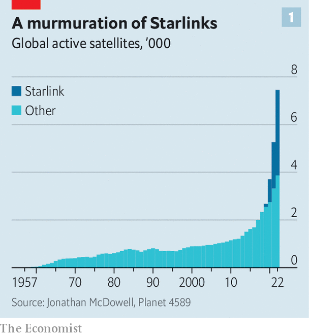
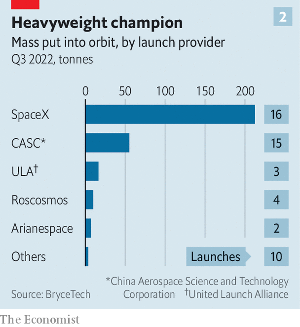
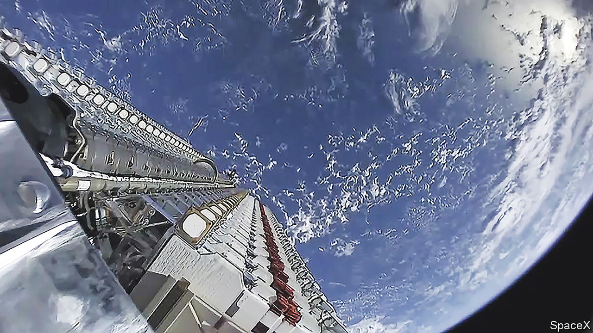

###### A murmuration of Starlinks

# How Elon Musk’s satellites have saved Ukraine and changed warfare 

##### And the worries about what comes next 

 

> Jan 5th 2023 

IT IS ONE of the wonders of the world—or, more accurately, off the world. The Starlink constellation currently consists of 3,335 active satellites; roughly half of all working satellites are Starlinks. In the past six months new satellites have been added at a rate of more than 20 a week, on average. SpaceX, the company which created Starlink, is offering it as a way of providing off-grid high-bandwidth internet access to consumers in 45 countries. A million or so have become subscribers.

And a huge part of the traffic flowing through the system currently comes from Ukraine. Starlink has become an integral part of the country’s military and civil response to Russia’s invasion. Envisaged as a celestial side-hustle that might help pay for the Mars missions dear to the founder of SpaceX, Elon Musk, it is not just allowing Ukraine to fight back; it is shaping how it does so, revealing the military potential of near-ubiquitous communications. “It’s a really new and interesting change,” says John Plumb, America’s assistant secretary of defence for space policy.

Appropriately enough, the story started with a tweet, one sent by Mykhailo Fedorov, Ukraine’s minister of digital transformation, two days after the invasion:

@elonmusk, while you try to colonize Mars —Russia try to occupy Ukraine! While your rockets successfully land from space—Russian rockets attack Ukrainian civil people! We ask you to provide Ukraine with Starlink stations and to address sane Russians to stand.

Mr Musk replied to him within hours, saying that the Starlink service had been turned on over Ukraine and that the hardware would follow. Within days lorries full of the pizza-sized flat dishes used to access the satellites began to arrive in Ukraine. 

By May around 150,000 people were using the system every day. The government quickly grew to rely on it for various communication needs, including, on occasion, the transmission of the nightly broadcast by Volodymyr Zelensky, Ukraine’s president. Because the dishes (some of which are round and some rectangular) and their associated terminals are easily portable and can be rigged to run off a car battery, they are ideal for use in a country where the electricity and communication networks are regularly pounded by Russian missiles. When Kherson was liberated in November Starlink allowed phone and internet services to resume within days. 

Crucially, Starlink has become the linchpin of what military types call C4ISR (command, control, communications, computers, intelligence, surveillance and reconnaissance). Armies have long relied on satellite links for such things. An hour before Russia launched its attack, its hackers sought to disable thousands of modems associated with the terminals which provide access to the main satellite used by Ukraine’s army and government, among many other clients. But the capabilities Russia sought to degrade in that pre-emptive strike were far less advanced than the capabilities Ukraine enjoys today. 

 


Starlink does not just provide Ukraine’s military leaders with a modicum of connectivity. The rank and file are swimming in it. This is because of the singular capacities of the Starlink system. Most satellite communications make use of big satellites which orbit up at 36,000km. Perched at such a height a satellite seems to sit still in the sky, and that vantage allows it to serve users spread across very large areas. But even if such a satellite is big, the amount of bandwidth it can allocate to each user is often quite limited.

The orbits used by Starlink’s much smaller satellites are far lower: around 550km. This means that the time between a given satellite rising above the horizon and setting again is just minutes. To make sure coverage is continuous thus requires a great many satellites, which is a hassle. But because each satellite is serving only a small area the bandwidth per user can be high. And the system’s latency—the time taken for signals to get up to a satellite and back down to Earth—is much lower than for high-flying satellites. High latencies can prevent software from working as it should, says Iain Muirhead, a space researcher at the University of Manchester. With software, rather than just voice links, increasingly used for tasks like controlling artillery fire, avoiding glitches caused by high latency is a big advantage.

Seeker to shooter

Franz-Stefan Gady, of the International Institute for Strategic Studies, a think-tank, recently visited the Ukrainian front lines and saw an example of what cheap, ubiquitous connectivity makes possible: a sort of Uber for howitzers. Ukrainian soldiers upload images of potential targets via a mobile network enabled by Starlink. These are sent to an encrypted group chat full of artillery-battery commanders. Those commanders then decide whether to shell the target and, if so, from where. It is much quicker than the means used to co-ordinate fire used up until now.

The system also makes drone warfare much easier. In September a Ukrainian naval drone washed up in Sevastopol, the Crimean headquarters of Russia’s Black Sea Fleet with what looked like a Starlink terminal attached to its stern. In late October seven similar drones were used to mount a successful attack on the port. Ukraine published a video of the attack shot from the boat’s bow. “Ukrainian military operations are hugely dependent on having access to the internet,” says Mr Gady, “so Starlink is a most critical capability.” A Ukrainian soldier puts it more starkly. “Starlink is our oxygen,” he says. Were it to disappear “Our army would collapse into chaos.” 

 


This kind of connectivity is something no previous army has enjoyed. Western armies fighting in Afghanistan and Iraq had access to some vast flows of data. For the most part, though (with special forces being the notable exceptions) they found it very hard to get that information to where it was needed in a timely manner. 

One former member of the British armed forces recounts an operation he conducted a decade ago to find some explosives. While he flew to the site where they were thought to be, a surveillance drone showed them being moved elsewhere. Brigade headquarters, which could see the drone’s feed, passed on the intelligence to his company command over a satellite channel by voice. The company command then relayed the news to his helicopter by high-frequency radio. Each hop added time and confusion. In today’s Ukraine, he notes, he could simply have accessed the live drone feed himself. 

Such frustrations led the Pentagon to start talking of “Joint All-Domain Command and Control” (JADC2, for those keeping score at home), an approach which would allow information from more or less any drone, plane or soldier to be easily sent to whatever missile, gun or aircraft might be best placed to use it. If that sounds familiar, it should. “What we are seeing with Starlink is where the US wants to be in terms of connectivity,” says Thomas Withington, an expert on battlefield communications. Developing such a capability within the military-industrial complex has been slow; the bureaucracy has proved predictably resistant. Now it seems all but available off the shelf. 

This would be of only theoretical interest if Starlink, conceived as a civilian service, were an easy target in times of war. So far it has not been. Russia’s armed forces have lots of electronic-warfare equipment that can locate, jam or spoof radio emissions. But the Starlink signals are strong compared with those from higher flying satellites, which makes jamming them harder. And the way that the dishes use sophisticated electronics to create narrow, tightly focused beams that follow satellites through the sky like invisible searchlights provides further resistance to interference. “Unless you can get a really good bead on where that beam is coming from, it’s very hard to get a jamming signal into the receiver,” says Mr Withington. 

If its signals cannot be jammed, the system itself could be attacked instead. In September the Russian delegation to a UN working group on space security hinted that, despite its status as a nominally civilian system, Starlink might be considered a legitimate military target under international humanitarian law—which is probably a fair assessment. In May researchers affiliated with the Chinese People’s Liberation Army published a paper calling for the development of “countermeasures” that could be used against Starlink. 

Cyber-attacks like the one aimed at Ukraine’s legacy satellite system on February 24th are one possibility. So far, though, similar sallies against Starlink appear to have been ineffective, in part thanks to SpaceX’s ability to quickly update the system’s software. Dave Tremper, director of electronic warfare for the Office of the Secretary of Defence, has said the speed of the software response he witnessed to one attack was “eye-watering”. 

Physical attacks are also possible. Starlink satellites relay signals they receive to fairly nearby “ground stations”. They in turn send the data on to the internet or back up to another satellite, depending on where the intended recipient is. They thus represent a vulnerability. But with ground stations which handle the traffic to and from Ukraine on NATO soil, a physical attack would be a severe escalation. 

And then there are the satellites themselves. America, China, India and Russia have missiles that can shoot satellites out of the sky. Again, though, using them would seem a severe escalation. It would also be a lot less useful against a constellation like Starlink than against older systems. Knocking out a single Starlink would achieve more or less nothing. If you want to damage the space-based bit of the system, you need to get rid of lots of them.

Scorched orbits

One possibility would be to try to trigger a chain reaction in which the debris from one target goes on to destroy secondary targets, debris from which spreads the destruction yet farther in a sort of scorched-orbit strategy. Such a wholesale attack on a global commons would be a desperate measure. Experts contacted by  were also unconvinced that it would be of military benefit. For one thing, debris clouds would start out mostly confined to particular orbits, and expand only gradually. “It’s not obvious to me that, even if you deliberately set out to create as much debris as possible, that you could deny the use of Starlink on a timescale that was relevant to a war,” says Jonathan McDowell, an astrophysicist at Harvard who keeps a census of objects in orbit

For another, if debris is tracked, smart satellites can dodge it. Debris created by an irresponsible Russian missile test in November 2021 came within 10km of a Starlink satellite some 6,000 times, according to COMSPOC, a firm which monitors satellites and debris. But no harm has been done, partly because Starlink satellites can tweak their orbits to reduce the risks from incoming debris. They did so 7,000 times in the six months from December 2021.

 And when satellites are small and mass-produced, as the Starlink ones are, they can be replaced with much less fuss than would previously have been the case. Brian Weeden of the Secure World Foundation, an ngo, reckons that Starlink’s use in Ukraine marks “the beginning of the end” for the value of anti-satellite missiles. “[It] turns out they’re only useful if your adversary relies on small numbers of really large/expensive satellites.” 

A good indicator that adversaries do not see Starlink as fatally vulnerable is that they are scrambling to develop similar things themselves. In 2020 China filed documents with the International Telecommunication Union, a UN body, for a 13,000-satellite constellation of its own. Russia has ambitions for a 264-satellite constellation designed to operate in higher orbits than Starlink. America’s allies are enthusiastic too. In 2020 Britain’s government, Bharti, an Indian multinational, and Eutelsat, a satellite operator, rescued OneWeb, a firm which had gone bankrupt building a constellation of Starlink-like satellites. In November 2022 the EU agreed to begin developing its own low-orbit communications system, IRIS2. Starlink also has an American would-be competitor in the form of Kuiper, a planned constellation bankrolled by Jeff Bezos, the founder of Amazon and of Blue Origin, a rocket firm.

But Starlink has a huge advantage: SpaceX’s launch capacity. SpaceX has the world’s best satellite-launch system, the partially reusable Falcon 9 rocket. That allows it to launch satellites at an unmatchable rate. There were 61 Falcon-9 launches in 2022. The company is talking of getting its Falcon-9 launch rate up to two rockets a week this year, with one a week devoted to Starlink. Each such launch will add another 50 or so satellites. 

Starships and enterprise

More is to come. The company is working on a much larger, fully reusable spacecraft called Starship which would be capable of launching some 400 Starlinks at a time, and thus taking the constellation from thousands of satellites to tens of thousands. The long-delayed first attempt to get a Starship out into space and back is expected this year. The programme has seen explosive failures in the past and may well do so in the future; among other things Starships will have to re-enter the atmosphere at much higher speeds than the first stage of a Falcon 9 does. But investors in the company, which is privately held, seem confident. SpaceX raised $2bn in 2022; it is said to be in the process of raising more at a price which values the company at $137bn.

Meanwhile other launch systems are either unavailable, undersized or have yet to get up and running. American rules stop Western companies from buying launch services from China, and since the war began launch contracts with Russia have been cancelled. OneWeb, which relied on Russian launchers for its launches until this year, now uses SpaceX’s Falcon 9 and a launcher developed by India.

The United Launch Alliance (ULA), a joint venture between Boeing and Lockheed Martin which is SpaceX’s only direct American competitor in the launch market is retiring its current launchers in favour of a new one, the Vulcan Centaur, which has yet to fly. Much the same is going on at Arianespace in Europe. The first flight of the New Glenn launcher being developed by Mr Bezos’s Blue Origin is not expected to take place until the end of the year, if then.

 


This means that Mr Musk currently has a dominant position in both the launch market and satellite-internet operations. This concentration of power provides three causes of concern. Mr Musk is an unaccountable single individual; Mr Musk’s other business interests may play a role in his decisions; and Mr Musk is Mr Musk. 

In September Ukrainian officials told  that Mr Musk had rejected a Ukrainian request to allow Starlink to be used in Crimea, a part of Ukraine which Russia invaded and annexed in 2014, and where Ukraine has conducted numerous raids on ports and air bases. In October Mr Musk polled his followers on Twitter as to whether Ukraine should cede territory to Russia as part of a peace deal, which provoked outrage from the country’s leaders. Mr Musk replied by suggesting that SpaceX would stop carrying the costs for Ukraine’s use. But he quickly changed course, and relations seem to have settled down since. “I’m super grateful to them for what they’re doing for us,” says Mr Fedorov, the minister for digital transformation. Still, SpaceX has continued to restrict the use of Starlink in Russian-occupied territory, according to Ukrainian officials, a power that is unusual for a commercial company, to say the least. 

Per bellica ad astra

If service is denied in some places, it can be permitted in others, even if it is unwelcome. Some countries do not want Starlink services making the internet uncontrollable, and so do not allow the company to operate within their borders. But this can be circumvented when ground stations in neighbouring countries are close enough. Starlink services are currently being used by protesters in Iran, says Mr Musk, despite the country not officially allowing the technology in. In future, service will be possible even in places with no convenient ground stations nearby; the next generation of satellites is intended to be able to pass messages between themselves, rather than sending them back down to the nearest ground station, creating a network which could be much more unevenly tethered to the Earth.

But that does not mean countries will be forced to accept Starlink; some will have ways to fight back. Given the importance of its Shanghai gigafactory to the fortunes of Tesla, Mr Musk’s car company, for example, it would be something of a surprise to see Starlink being made available to internal opponents of the Chinese state. And could Taiwan, if push came to shove, depend on Starlink in the way that Ukraine has come to? Just conceivably not—which may explain why the island is accelerating efforts to develop its own satellite constellation.

All that said, Mr Musk also has reason to keep on the right side of the government closest to him: America’s. And that might make good business sense. SpaceX already gets a lot of money from government contracts—it is NASA’s biggest commercial supplier, and launches big satellites for the country’s soldiers and spooks. 

And for all Starlink’s impact in Ukraine, it is not as yet a commercial success. Flat antennae which can scan the skies currently cost more than most customers are willing to pay; the company is subsidising them in the hope that, as the market grows, the costs will fall. But military users of the system can be expected to pay full price, and then some, from day one. In December SpaceX revealed the existence of Starshield, a subsidiary aimed explicitly at serving such customers. It is hard to doubt that the decision to help Ukraine was idealistic. But it could well prove to have been a fortuitous loss-leader, too.■


