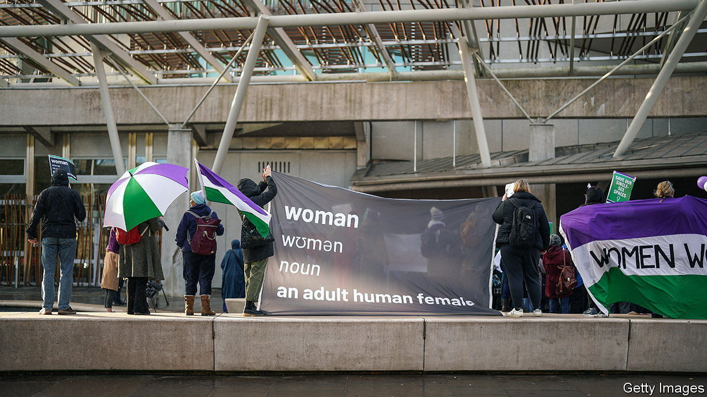

###### The gender wars

# Scotland’s new gender-reform law presents Rishi Sunak with a dilemma 

##### He must decide whether to refer the law to the Supreme Court in London 

 

> Jan 5th 2023 

Two of the more divisive issues in British politics are  and Scottish independence. They have collided in the form of a bill passed by the devolved Scottish Parliament at Holyrood on December 22nd. The new law allows people in Scotland to acquire a gender-recognition certificate (grc) that changes their designated sex in the eyes of the law without, as previously needed and still required in the rest of Britain, a medical diagnosis of gender dysphoria or a long waiting period. 

Debate within Scotland was heated. Although all the main parties, except the Tories, supported the introduction of “self-ID”, there was unusual dissent within the ruling Scottish National Party (SNP). Only 54 of 64 SNP members at Holyrood voted for the bill. The controversy is not over. The British government has a limited time to decide whether it wants to block the law or refer it to the Supreme Court in London. Scotland has long had separate rules over everything from marriage to jury trials. The question in this case is whether enabling a person to be legally recognised as the opposite sex based on self-ID affects other legislation pertaining to sex, such as the Equality Act, which is an issue “reserved” for Parliament in Westminster. 

Start with the content of the law itself. Colin MacFarlane of Stonewall, a lobby group, told  that the new law was “a tremendous step forward for trans rights and for LGBTQ+ people in Scotland”. But many women’s groups worry that dangerous men could exploit an easier process for obtaining a GRC to gain access to vulnerable women and children. “It opens up a process to anyone and everyone, whatever their motivation,” says Susan Smith of For Women Scotland, a feminist group. 

Supporters claim many countries—such as Ireland, Canada and Norway—and American states such as California have passed self-ID laws without problems. But Lisa Mackenzie of MBM, a policy-analysis group based in Edinburgh, points out that in those jurisdictions, male rapists who now identify as women are being moved to women’s prisons. Biological males have accessed domestic-violence and homeless shelters for women. “Self-ID disproportionately affects disadvantaged women,” says Ms Mackenzie. She adds that, under self-ID, crimes committed by natal males are recorded as women’s crimes, making it impossible to gather accurate data. 

Opponents also worry that the new Scottish law could bring self-ID to the rest of Britain through the back door. Other Britons might make their way to Scotland in order to obtain a GRC, since there is no long-term residency requirement for getting one. The lowering of the minimum age from 18 to 16 might mean that a Scottish-born natal male attending an English school could obtain a GRC and ask to be placed in a girls’ dormitory or sports team. 

That in turn raises the question of whether Holyrood has exceeded its authority. The SNP may have inadvertently harmed its own claim that the new law does not affect reserved equality laws. In a decision on December 13th, before the bill was passed, Scotland’s highest court backed the Scottish government’s intention to include trans people with a GRC in its definition of women for the purposes of female representation on public boards. The ruling states that, for the purposes of the 2010 Equality Act, the meaning of sex is “not limited to biological or birth sex”. Opponents say that reserved law is therefore infringed by the new Scottish act. James Mitchell, professor of public policy at Edinburgh University, says that Nicola Sturgeon, the SNP leader and Scotland’s first minister, may have “shot herself in the foot”, and that it is hard to see how the issue will not end up at the Supreme Court. 

A row over the remit of Holyrood comes at a sensitive time. In November the  that Holyrood could not authorise a second independence referendum. Ms Sturgeon says that she will make the next general election, due by January 2025, a de facto vote on independence. Rishi Sunak needs to tread carefully as a result. But Ms Sturgeon is also on shaky ground: polls find that two-thirds of Scots disagree with the core of the new law. ■


