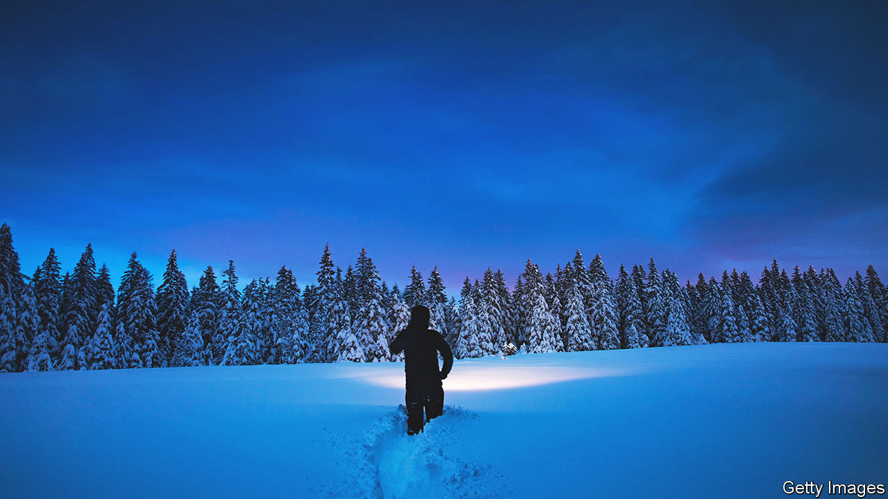

###### Creepy fiction

# “The Thing in the Snow” is a weird but wonderful novel 

##### Sean Adams’s new book is set in a freezing and abandoned research station 

 

> Jan 5th 2023 

By Sean Adams. 

“The Heap”, Sean Adams’s debut novel of 2020, was a darkly comic, richly inventive dystopian tale that followed various lives connected with a huge skyscraper’s miraculous rise and calamitous fall. When the building collapses, a character searches through the rubble for his brother. His senses fail him, starting with smell—less a hindrance than “a defence mechanism to guard against the bouquet of death that hung in the air”.

The American author’s new novel features a beleaguered protagonist in danger of losing his sanity rather than his senses. “The Thing in the Snow” is sparer, with a smaller cast, a bare-bones backdrop and a threadbare plot. Yet the result is by no means insubstantial. Beneath the minimalism is a fiendish mystery and a sharp satire shot through with offbeat charm.

Hart is one of three caretakers at the Northern Institute, an abandoned research facility in the . Every week he receives a fresh supply of provisions along with new assignments which he and his subordinates, Gibbs and Cline, must carry out. They begin each day with “coffee and light socialisation”, then turn to mundane and meaningless tasks, which include checking the noise of doors, measuring the flatness of surfaces and testing the “structural integrity” of chairs.

This routine is interrupted when they spot a small black object in the snowscape outside. Hart reports it to Kay, his distant boss, and waits a week for her response. Meanwhile, the team encounter other disturbances (flickering lights, “autobiographical confessions” scrawled under tables). Hart feels increasingly unmoored from reality, unable to keep track of time or deal with challenges to his authority. When the three caretakers have a showdown about the thing in the snow, he takes matters into his own hands by venturing outdoors, and off-limits, to investigate.

Readers who prefer conventional narratives should look elsewhere. Others will find that Mr Adams’s novel baffles and beguiles in equal measure. Much of it is deliberately opaque, from Hart’s hazy mindset to his undisclosed location, “a remote region where the snow never melts”. There are  undertones in the futility of Hart’s work and the absurdity of his predicament. A pervasive chill contributes to moments of disquiet—offset by the strain of dry humour in the caretakers’ exchanges and their encounters with Gilroy, the last remaining researcher at the institute.

In his acknowledgments, Mr Adams call his book a “weird little project”. Weird it certainly is, but also rather wonderful. ■

