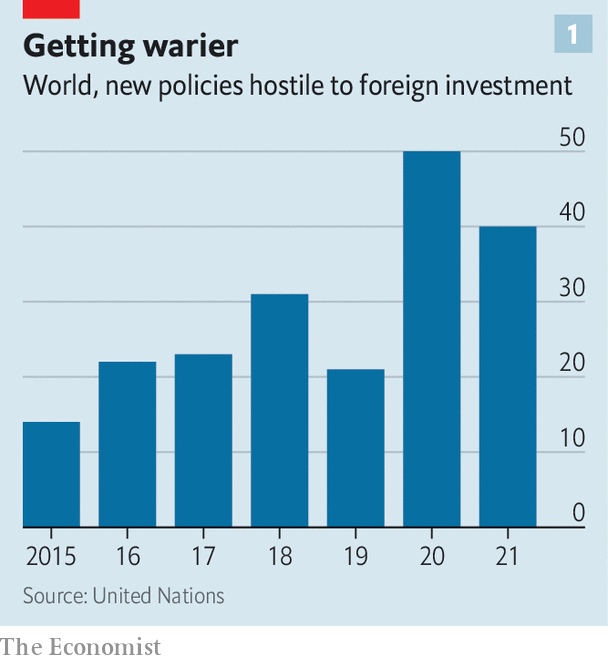
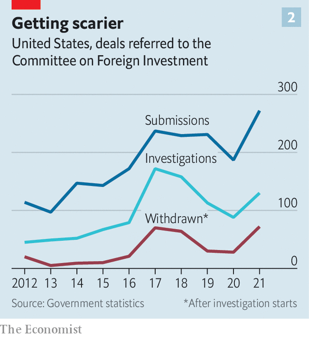

###### Efficiency be damned

# Globalisation, already slowing, is suffering a new assault 

##### Subsidies, export controls and curbs on foreign investment are proliferating 

> Jan 12th 2023 


Trade ministers are not known for histrionics. Yet South Korea’s, Ahn Duk-geun, is alarmed. The world is on the verge of opening Pandora’s box, he warned last month. If the European Union follows through on threats to mimic America’s protectionist industrial policies, “Japan, Korea, China, every country will engage in this very difficult race to ignore global trading rules.” The international system of trade and investment, painstakingly negotiated over decades, will be upended.

William Reinsch, who used to oversee America’s export controls as an undersecretary of commerce, is just as blunt. America has always wanted to maintain a technological edge over other economic powers, he says. These days, however, it is pursuing that goal in a new way: “We have moved from a ‘run faster’ to a ‘run faster and trip the other guy’ policy.” The great powers are coming to see economic advances, at least in the broad swathe of industry they define as strategic, in zero-sum terms. The implications for global prosperity are bleak.

In a speech in September America’s national security adviser, Jake Sullivan, spelled out the basic tenets of this beggar-thy-neighbour approach. Merely retaining a technological lead over China and other rivals was no longer enough, he argued. Instead, he said, America had to pursue “as large of a lead as possible” in chipmaking, quantum computing, artificial intelligence, biotechnology and clean energy. To that end, America needed not only to welcome clever people and foster innovation, but also to impede technological advances in countries like China and Russia.

Mr Sullivan described two main ways to ensure American supremacy: using subsidies and other forms of industrial policy to shift supply chains away from geopolitical rivals, and stricter investment screening and export controls to keep advanced technology out of unfriendly hands. As America, once the world’s loudest advocate of free trade and open economies, adopts and reinforces such policies, other countries are mimicking its approach. The result is a proliferation of obstacles to international trade and investment at a time when both were already stagnating.

The sudden enthusiasm for industrial policy in America and elsewhere epitomises the trend. In 2022 Congress passed two lavish bills aiming to bolster domestic industry, in the name of national security, job creation and decarbonisation. The CHIPS Act, which provides $52bn of incentives for the semiconductor industry, attempts to reverse a multi-decade decline in America’s share of chip manufacturing. The Inflation Reduction Act (IRA) will spend nearly $400bn to boost clean energy and reduce dependence on China in important supply chains, such as for batteries for electric vehicles (EVs).

Handouts be praised

It is not just America which is trying to boost domestic industry at the expense of foreign rivals. According to the UN, more than 100 countries accounting for over 90% of the world’s GDP have adopted formal industrial strategies. Spending on subsidies among G7 countries has risen sharply in recent years, from 0.6% of gdp on average in 2016 to 2% in 2020. In part, this is a response to the pandemic: the European Union, for example, adopted a gargantuan recovery package, involving more than $850bn in spending, including many handouts for business. But although spending on subsidies has fallen from its peak in 2020, it remains well above its pre-covid levels.

Multinationals having second thoughts about manufacturing in China are in some cases being paid to relocate. Japan included incentives for such relocations in its budget in 2020. India is trying to lure footloose firms in 14 different industries by offering up to $26bn of production-linked incentives over five years. Such overtures may become common if commerce begins to fragment and firms are required to choose a side. 

Another reason for the ballooning handouts is tit-for-tat subsidies, which aim to counteract the incentives offered in other countries. The $52bn payout to chipmakers under America’s CHIPS Act sounds lavish, but it is only a small part of the $371bn earmarked for the semiconductor industry over the next decade in the seven most generous countries, according to UBS, a bank. (China, the EU, India, Japan, South Korea and Taiwan are the other big spenders.) This week Taiwan approved new tax breaks for its chipmakers.

EV batteries, of which China produces 70%, are another magnet for subsidies and other forms of state support. Since 2020 Indonesia has banned the export of nickel to encourage battery manufacturing at home. Australia and Canada are shelling out billions of dollars to boost mining and processing of ores. A controversial element of the IRA is a $7,500 tax credit for American consumers purchasing EVs. One half of the credit is available if a vehicle’s battery components are manufactured or assembled in America; the other half is based on the origin of the battery’s minerals. Final assembly of the vehicle must take place in America, too.

Foreign EVs that do not meet either of these thresholds will be hugely disadvantaged. Consider Hyundai, a South Korean carmaker which sells more evs in America than any other firm bar Tesla. Its vehicles are not eligible for the credit since they are currently assembled abroad. It is building a $5.5bn EV plant in America, but it will not start production until 2025. Even then, it is not clear if Hyundai’s cars will qualify for the mineral-related component of the credit, since the American authorities have not yet published detailed regulations about acceptable sources.

Other governments are  to America’s coddling of domestic producers with more tit-for-tat subsidies. In December the finance ministers of both France and Germany, as well as Ursula von der Leyen, the president of the European Commission, called for a European version of the IRA. Margrethe Vestager, the EU’s competition tsar, who polices subsidies within the bloc, appears open to the idea of prolonging a pandemic-induced loosening of the rules to allow member-states to counter the competitive challenge posed by the IRA.

The potential scale of spending is staggering. If seven other market-oriented economies (Australia, Britain, Canada, the EU, Japan, India and South Korea) adopt subsidies as large as America’s—about 2% of GDP—the total bill in the eight countries would be $1.1trn. In the industries that are receiving the most handouts the effect is even more pronounced: subsidies for semiconductors amount to more than 60% of the industry’s annual sales. Western taxpayers are spending lavishly to make an all-important part of the world economy far less efficient.

Investors beware

 


Investment screening is another policy that Mr Sullivan champions as a means to preserve America’s technological edge. Selling to the highest bidder is not as straightforward as it used to be, especially if that bidder is Chinese. UNCTAD, a UN agency which tracks investment policies around the world, counted a record number of new measures restricting foreign investment in 2020 (see chart 1). UNCTAD calculates that 63% of global investment flows were subject to a screening regime last year, up from 52% in 2020.

The Committee on Foreign Investment in the United States (CFIUS), a body charged with identifying and blocking deals that might threaten national security, is the model for many of these new regimes. In 2018 new legislation broadened CFIUS’s jurisdiction over transactions involving “critical” technology and infrastructure and sensitive personal data. An order issued by Mr Biden in September directs the committee to focus its attention on the security of supply chains and technological leadership.

 


The committee has been busy—between 2017 and 2021 CFIUS investigated 661 transactions, more than twice as many as during the previous five years. Although it blocks relatively few investments outright, many deals are called off under the glare of its scrutiny, before a final decision is reached (see chart 2). ByteDance, the Chinese parent of TikTok, a video app, remains locked in negotiations with it more than two years after Donald Trump issued an order, later revoked, demanding the divestment of TikTok’s American business.

The EU called on member states to set up or strengthen screening mechanisms in 2020. Nearly all of them now have one. In 2021 alone three members introduced new regimes and six tightened existing laws. Many are learning on the job. Last year was exceptionally busy for Germany’s watchdog, which intervened in the acquisition of Heyer Medical, a medical-technology firm, and a facility owned by Elmos, an automotive chipmaker. Long-awaited guidelines on France’s regime issued in September did little to limit the extraordinary discretion afforded regulators to review transactions. Britain’s screening regime began examining deals a year ago and has already blocked or unwound four (three of which involve a Chinese buyer of a semiconductor firm or technology).

More restrictions will surely follow. In December Canada announced legislation to strengthen its investment-review process weeks after ordering three Chinese investors to divest from its lithium miners. A new regime to screen foreign investment in the Netherlands is expected to come into force this year.

Although the number of deals blocked by investment-screening regimes is relatively low, their scope—and thus the effect they have on corporate decision-making—is vast. The regulations tend to apply only to “strategic” industries, but these are typically defined very broadly. Industries accounting for 60% of the value of America’s stockmarkets fall under the potential remit of CFIUS, judging by the deals submitted to it in 2021. The 17 industries covered by the British regime account for 35% of the big firms listed in Britain, we calculate. In 2021, 29% of foreign investments referred for screening in Europe underwent detailed scrutiny.

Mr Sullivan would like to go further. “We are making progress,” he said in his speech, “in formulating an approach to address outbound investments in sensitive technologies.” There is a broad consensus in Washington that American capital must not be allowed to “enhance the technological capabilities of our competitors”, as he put it (since 2000, for instance, American venture capitalists have invested more than $50bn in China). Some restrictions already exist: the CHIPS Act bars firms that receive its subsidies from making big investments that could benefit China’s semiconductor industry, for instance. A comprehensive regime, however, might lead to big changes in the allocation of America’s $171bn a year in foreign direct investment in new projects. The European Commission has said that it, too, will consider screening outbound investments in 2023.

Export controls, which restrict the transfer of goods and services to certain countries, companies and people, are a third policy acclaimed by Mr Sullivan. Western governments have used them extensively against Russia since its invasion of Ukraine, curbing its access to all manner of goods, from chips to chemicals. The intention is not just to impede Russia’s war machine, but also to disrupt critical industries, such as oil refining. Mr Sullivan boasts that the controls have forced Russia to use chips from dishwashers in its military equipment.

America has long maintained a list of companies which must apply for permission to purchase goods with potential military uses. The number of Chinese firms on this “entity list” increased from 130 in 2018 to 532 in 2022. China accounts for more than a quarter of the firms on the list, the Carnegie Endowment for International Peace calculated last year. Another 36 names, including Yangtze Memory Technologies, a memory chip producer previously in talks to supply Apple, were added to the list in December.

Another American regulation, the foreign direct product rule, tries to restrict sales of items based on American technology, even if they are designed and manufactured abroad, by imposing penalties on the firms involved. This far-reaching instrument was successful in undermining the manufacture of smartphones by Huawei, a Chinese telecoms firm.

In October America’s Department of Commerce announced export controls on advanced chips used to power supercomputers and artificial-intelligence algorithms. The new rules in effect ban the sale of the most powerful chips, and the software and manufacturing equipment needed to produce them, to Chinese firms. Similar restrictions in other high-tech fields are expected this year.

The restrictions announced in October apply the foreign direct product rule on an unprecedented scale. No distinction is made between private Chinese firms and state-owned enterprises. Since advanced chipmaking requires continuous technological support in the form of software updates, replacement parts and engineering advice, which are also covered by the rules, “in the short term, the restrictions could reverse the capabilities of China in leading-edge chips”, says Gregory Allen, a researcher at the Centre for Strategic and International Studies, a think-tank. Barclays, a bank, reckons that the controls could reduce China’s annual GDP growth by 0.6 percentage points.

The restrictions are so severe America may struggle to persuade its allies to adopt equivalent measures. Yet without such unity, they will not work. Other countries with advanced semiconductor industries—in particular the Netherlands and Japan—could undermine their effectiveness by providing China with substitutes. American policymakers will find a worrying precedent in the satellite industry. After America introduced broad export controls against China in 1999, firms in Europe began designing satellites free from American parts to evade the new strictures. American firms lost revenue, but China did not lose access to cutting-edge satellites.

Foreign chipmakers are loth to forgo sales to China, the world’s largest market for semiconductors. America is pressing Japan and the Netherlands to follow its lead, without any clear result. Big semiconductor firms are grumbling: the boss of TSMC, the world’s largest contract chipmaker, points out that the controls will reduce the industry’s productivity and make it less efficient.

 


The same is true of all the new impediments to international trade and investment. As the logic of efficiency and comparative advantage gives way to a focus on security and economic nationalism, investments will be duplicated and costs will rise. The result will be higher bills for taxpayers and consumers and therefore diminished prosperity.

Foreign direct investment has already fallen from a peak of 5.3% of global GDP in 2007 to 2.3% in 2021. The deals that continue to go ahead are more heavily regulated. In 2022 a Chinese buyer was permitted to acquire only 25% of a port in Hamburg, rather than the planned 35%. In 2021 half of all approvals of cross-border investment in France came with conditions attached. 

Meanwhile, subsidies programmes are altering capital spending. In the semiconductor industry, famed for its boom-and-bust cycles, the risk of oversupply is substantial. More than 40 new semiconductor projects have been announced across America since mid-2020, according to the Semiconductor Industry Association, including fabrication plants in Arizona to be built by Intel and TSMC at an estimated cost of $60bn. Firms in the EV supply chain are enjoying a similar binge. According to a report by Goldman Sachs, around $164bn in spending is needed this decade by American and European firms to localise the supply chain for batteries.

Consumers be warned

Viewed in isolation these plans increase investment in national economies; at the global level they represent an enormous increase in costs. By our calculation, duplicating the world’s existing stock of investments in semiconductors, clean energy and batteries would cost between 3.2% and 4.8% of global GDP. And the logic of the zero-sum world means further escalation in government intervention is likely: after all, if no country’s firms can be assured of equal treatment and open market access when operating abroad, it makes more sense for all countries to nurture and protect industries at home.

Countries like China and Russia do present a profound threat to the current global order. Russia’s curbing of gas exports to Europe in response to European support for Ukraine highlights the risks of relying on such places for crucial imports. The urge among Western democracies to hobble adversaries economically to diminish such dangers is understandable. But it will have huge costs. What is more, the economic policies being adopted in the name of national security and competitiveness are so sweeping and clumsy that they are hurting allies as much as enemies. The zero-sum mindset may or may not succeed in making the world safer for democracy. But it will certainly make the world poorer. ■

