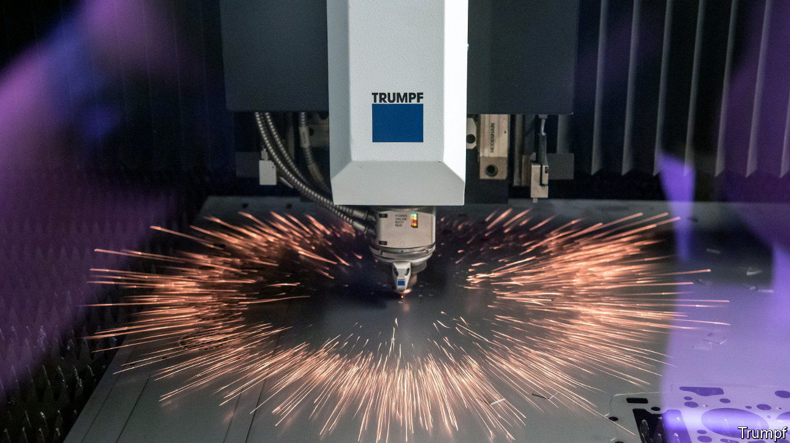

###### The costs of transparency

# German companies fret about a new supply-chain law 

##### Monitoring human-rights and environmental standards across their suppliers could have perverse consequences 

 

> Jan 12th 2023 

Peter Bokelmann has had a busy few months. The chief counsel at Trumpf, a maker of machine tools, oversees the firm’s efforts to comply with the new law on the due diligence of supply chains that came into force on January 1st. Mr Bokelmann has been at it since the law was passed in mid-2021. “The enormous effort needed is underestimated,” he sighs. 

No kidding. Many German businesses are only waking up to the new rules, which require those with more than 3,000 employees in Germany to monitor whether their suppliers around the world meet human-rights and environmental standards. From 2024 the law will extend to firms with 1,000 German workers. Misbehaviour by suppliers could lead to fines of up to €8m ($8.6m) or 2% of the German firms’ global sales, whichever is higher. Bosses warn this puts their firms at a disadvantage, creates more red tape in a country that already has tangles of it, and could harm not help workers in emerging markets. The law is “well meant, lousily done”, sums up the vDMA, the mechanical-engineering industry’s main lobby group.

Germany is not the first member of the EU to enact such a law. But the German statute is more stringent and applies to more companies than, for example, its French or Dutch equivalents. The government’s own estimates of the law’s direct cost to the country’s firms in time and toil—€110m this year and €43.5m a year thereafter—are unrealistically low, businesses say. 

In Trumpf’s case, of its 15,000 suppliers, 5,000 are deemed by the firm to be low-risk. Of the remaining 7,000, Trumpf has so far evaluated 800; assessing the rest will be a multi-year effort, says Mr Bokelmann. And that may not be the end of it. In October the Federal Office for Economic Affairs and Export Control, which is in charge of supervising implementation, sent out a 35-page questionnaire to businesses with 437 data fields, including for details not specified in the law. Moreover, civil-society activists want the German government to push for even stricter EU-wide legislation. 

Tougher EU rules are already in the works. They would require firms with 500 employees or more and annual sales of €150m to monitor environmental and labour standards across their supply chains, and to ensure their business is compatible with the decarbonisation path envisaged by the Paris agreement on climate change. In industries such as farming or textiles, where mistreatment of workers is more common, the EU law would apply to companies with just 250 employees and sales of €40m. It is likely to go before the European Parliament and the European Council this year. German firms would then need to comply with both domestic and EU rules, adding a layer of cost and complexity.

A company such as Trumpf, which has over 16,000 employees worldwide and €4.2bn in annual sales, just about has the resources to deal with the attendant headaches. For Germany’s smaller pocket multinationals, the easiest way to comply is by leaving developing countries with a poor record on human rights and environmental standards, reckons the Kiel Institute for the World Economy. The German-African Business Association opposes the law for that reason. ■


