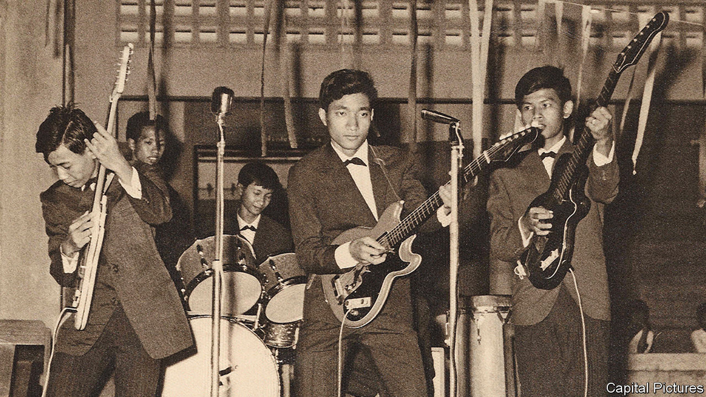

###### Going underground

# How Cambodian music survived the horrors of the Khmers Rouges 

##### Many of the country’s musicians did not, as Dee Peyok recounts in her new book 

 

> Jan 12th 2023 

By Dee Peyok. 

In 1974, in a town in central Cambodia, Keo Sinan hid his collection of records. Wrapping them in plastic bags, the musician stashed them in an outhouse. Through the years of war, famine and genocide, he checked on them once a week. The 45s were a fragile link to his previous life. But as the Khmers Rouges took over the country, they were a fatal liability. 

Mr Keo Sinan’s story features in “Away From Beloved Lover”, Dee Peyok’s unusual book. An oral history of Cambodian music, as told by those who survived the Khmer Rouge regime—90% of musicians may have perished—it is also an affecting memoir and travelogue. In 2014 Ms Peyok, a session musician besotted with Cambodia’s unique take on rock’n’roll, moved from London to Phnom Penh, determined to unearth the country’s musical inheritance. Her book is a portrait of a place trying to move on from —and of a young woman finding her feet. 

In Ms Peyok’s telling, Cambodian music had two golden eras. The first was at the height of the Khmer empire in the 16th century. The second came after independence from France in 1953, when Cambodian musicians spliced Western jazz, blues and rock’n’roll with traditional Khmer sounds. The arts, Ms Peyok writes, were “the perfect vessel” to modernise Cambodia. She evokes the hustle of Phnom Penh in the 1960s, a  and spies danced in broiling nightclubs, to a beat that became the metronome of a generation across South-East Asia. 

All that ended when the Khmers Rouges seized power.  and his followers sought to impose a radical vision of agrarian communism. The regime declared it to be “Year Zero” and decapitated Cambodian society; those members of the intellectual and artistic elite who were not killed were sent to work on the land. All music, except party propaganda, was banned. Between April 1975 and 1979, when it was overthrown by the Vietnamese, the regime slaughtered around 1.7m Cambodians, about a quarter of the population. 

The blame for the Khmers Rouges’ takeover lies partly with America, Ms Peyok argues. In a bid to break the Ho Chi Minh trail, a north Vietnamese supply line, the American air force dropped over 2m tons of explosives—more than the Allies used in Europe and the Pacific during the second world war—on supposedly neutral Cambodia.  was a powerful recruiting tool for the anti-imperialist Khmers Rouges. They drove the governing class from Phnom Penh on the lie that the Americans were about to bomb the city. 

In the most moving parts of Ms Peyok’s book, readers hear the musicians’ stories in their own words. “I have hidden this inside for a long time,” one of her interviewees says. When the author strays from their accounts, the focus blurs. Ms Peyok is an entertaining raconteur, detailing misadventures with creepy-crawlies in fetid guesthouses and a run-in with the modern-day Khmers Rouges. Yet her poetic prose slides occasionally into misty-eyed obscurity. The memories she has gathered needed no embellishment. 

Still, her conviction that music can help Cambodia reckon with its past is compelling. Despite the country’s woefully lax copyright laws, home-grown outfits are garnering international support to protect and celebrate its lost sounds. The book closes with a photograph of a soldier in flight. In one hand, he holds an assault rifle. In the other is an electric guitar. ■


