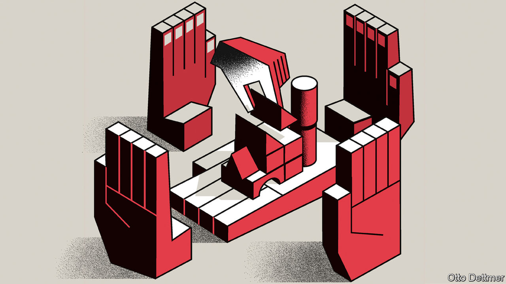

###### Free exchange

# Warnings from history for a new era of industrial policy 

##### The danger is not that America’s reshoring push fails—but that it succeeds 

 

> Jan 11th 2023 

“Free trade is almost dead,” declared Morris Chang, the founder of tsmc, dampening the mood at an event in December to celebrate a milestone in the building of the Taiwanese chipmaker’s new fab in Arizona. The remark was not out of character. In July he called America’s effort to bring chipmaking  an “exercise in futility”. Until recently, rich-world governments mostly shared his judgment. But worries about supply-chain security in a fraught world are prompting experimentation. History provides some reasons for optimism—as well as many for concern. 

Industrial policy is just about as old as industry itself. Scarcely had Britain’s Industrial Revolution got going when Alexander Hamilton, America’s first Treasury secretary, argued for protection of his country’s industry, declaring that Adam Smith’s arguments in favour of free trade “though ‘geometrically true’ are ‘practically false’”. America, France and Germany industrialised behind tariff barriers. After the second world war scores of governments tried to help industrialisation along, with seeming success in places like Japan and South Korea, and rather different results elsewhere. Policy today is of a different sort: pursued by countries already at the technological frontier, in a world of complex global supply chains. Yet past research still holds valuable lessons.

Recent interventions are mostly based on “infant-industry” arguments. The idea is that, if the state corrects a market failure, a particular industry might thrive on its own in an economy where it is nascent or absent. Local firms might need investment in know-how or equipment to be competitive, which imperfect capital markets cannot finance. Alternatively, production might require a network of suppliers and manufacturers, but firms struggle to co-ordinate. Or there may be information problems. An economy might have undiscovered potential, but an entrepreneur who seeks it out risks revealing it to competitors, which costs him the opportunity to profit from his discovery. In each case, government support or a brief spell of protection from foreign competition (or both) might create the space the industry needs to mature. 

Working out if these theories are practically or merely geometrically true is no simple task. Industrial policy is never conducted in isolation, meaning it is often challenging to isolate its effects. Still, careful work suggests that infant-industry policy can work in the real world. In the 1970s, for instance, America was the dominant exporter of computer chips. The Japanese government invested heavily in semiconductor research, and may have helped chip-consuming Japanese firms co-ordinate to obtain most of their supply from fledgling Japanese producers (in effect shutting American firms out of the market). Work by Richard Baldwin of the Graduate Institute in Geneva and Paul Krugman of the City University of New York concluded that these policies supported the accumulation of expertise, without which Japanese firms could never have succeeded in export markets. 

More recent work by Myrto Kalouptsidi of Harvard University revealed that Chinese shipyard subsidies between 2006 and 2012 reduced costs by as much as 20%. These subsidies, she reckons, helped account for a major reallocation of shipbuilding, with Japan the big loser. Other research turns up more cases when interventions have helped industries secure a market foothold, and meaningfully influenced the global distribution of production. At least sometimes, comparative advantage can be engineered.

Yet an abundance of caution is in order. Interventions often raise costs and thus hurt consumers. Messrs Baldwin and Krugman judged the Japanese were made worse off, on net, by the effort to build a chip-exporting industry. Because the output of one industry is often the input for another, help for upstream producers can inflict pain further along the supply chain. Reviewing efforts to boost steel industries across 21 countries, Bruce Blonigen of the University of Oregon found such interventions sharply cut the export competitiveness of downstream industries.

Governments, for their part, must be willing to cut off help, so that winners eventually swim while losers sink. Otherwise zombie firms will tie up capital and labour, and drag down growth. Local conditions matter. A study of eu investment funds provided to poorer regions, by Sascha Becker of the University of Warwick and Peter Egger and Maximilian von Ehrlich of eth Zurich, found that the cash translated into faster growth in investment and income—but only in places with strong institutions and educated workers. 

And as the world is , careless policy can provoke retaliation, leaving everyone worse off. This may prove to be a particular problem at a time when sophisticated goods are produced along cross-border supply chains. If friendly countries fail to co-ordinate, they may end up funding duplicative plants, which cannot all be economical, or orphan industries without access to the foreign components they need to compete.

Hard problems

Policies which fill institutional gaps are safer. Douglas Irwin of Dartmouth College notes that America’s tariffs in the 19th century do not seem to have been decisive in promoting its rise to industrial dominance. Banking laws that facilitated saving and investment were more important. In their survey, Ann Harrison and Andrés Rodríguez-Clare of the University of California, Berkeley, doubt that “hard” interventions which distort market prices are of use, but find an important role for “soft” collaborations between firms and the state, to solve co-ordination failures. 

This does not mean that the “harder” parts of America’s policy mix will doom its reshoring enterprise. Mr Chang, for his part, insisted in December that he gave his remarks “in the full expectation that we are going to have success”. Indeed, the most pressing concern may be less that America’s gambit will fail, than that it will succeed in boosting domestic industry—and leave a fractured world worse off for it. ■


