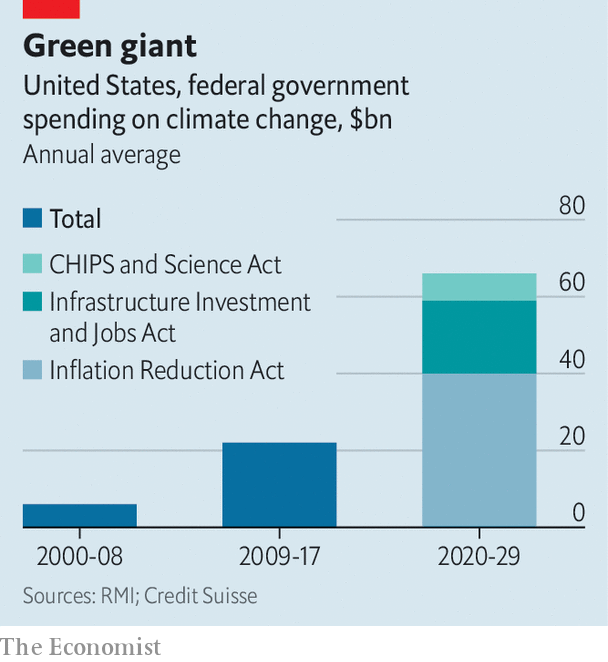

###### The wrong competition

# What America’s protectionist turn means for the world 

##### Officials from Berlin to Tokyo are planning their response 

 

> Jan 9th 2023 

Step for a moment into the ancient past. The year is 2016. Michael Froman, the United States Trade Representative, is making a stirring call to arms. American workers and businesses are competing against firms that get subsidies and other favours from their governments. “The question”, he says, “is what do we do about it? Do we accept this status quo, or do we actively work to change it?” Mr Froman’s choice, in line with decades of his country’s trade policies, is the latter: try to tear down the subsidies hurting American exporters and gumming up global trade.

Now, return to the present—with a thud. America’s answer to Mr Froman’s question has been flipped. Rather than trying to get other countries to cut subsidies, the Biden administration’s unabashed focus is on building a subsidy architecture of its own, complete with the kinds of local-content rules that American officials once railed against. Thanks to landmark legislation on semiconductors and greenery passed last year, the government is poised to shower $465bn on chips and climate technology. Officials have started getting into the nitty-gritty of how to distribute the money; some of the new rules went into effect on January 1st. 

For many in Washington—both Democrats and Republicans—this new approach is common sense. It is, they believe, the only way that America can protect its industrial base, fend off the challenge from a rising China and reorient the economy towards greener growth. But for America’s allies, from Europe to Asia, it is a startling shift. A country that they had counted on as the stalwart of an open-trading world is instead taking a big step towards protectionism. They, in turn, must decide whether to fight money with money, boosting their subsidies to counter America’s. If the result is a global subsidy race, the downsides could include a fractured international trading system, higher costs for consumers, more hurdles to innovation and new threats to political co-operation.

The first big crack in America’s commitment to free trade came when Donald Trump levied tariffs on products from around the world. In some ways, though, it is this second crack—the present ratcheting up of subsidies—that hurts more. “Free trade is dead” is the blunt assessment of a senior Asian diplomat in Washington. “It’s basic game theory. When one side breaks the rules, others soon break the rules, too. If you stand still, you will lose the most.”

Although subsidies have long been part of America’s economic landscape, the new plans are notable for both their scale and their America-first emphasis. Putting an exact price tag on them is impossible because most of the subsidies will come in the form of tax credits, the total size of which will depend on how much companies produce. Yet the cumulative impact will be enormous. If calculations include infrastructure spending, the federal government’s investment spree may reach $100bn a year over the next decade—roughly twice as much as total subsidies in the pre-pandemic decade. Credit Suisse, a bank, thinks that American solar panels could wind up the cheapest in the world by the late 2020s.

To advocates of free trade, subsidies are bad in their own right: they make goods produced by one country artificially cheaper, reducing economic efficiency. America’s new subsidies are that much more objectionable because in many cases they require recipients to meet local-content thresholds. To obtain a $7,500 credit towards their purchase of an electric vehicle, consumers need to buy a car assembled in North America. At least half of the battery components in eligible cars must also be made in North America. Wind, solar and geothermal projects will all receive heftier subsidies if they use American steel and iron. Roughly half of their manufactured components must also be made in America. And so the list goes on.

Killing me lavishly

America’s protectionist turn has numerous motivations. China’s ascendancy is the starting point. American leaders once believed they could get China to rein in the worst of its industrial policies. These hopes were dashed, giving way to the view that America needs its own industrial policies to avoid becoming reliant on a rival in the technologies of tomorrow. Politicians’ concerns about disruption to supply chains early in the covid-19 pandemic strengthened this view, as did a desire to boost middle-class jobs. Climate change is another reason: spending on renewable energy is expected to lead to a sharp reduction in America’s carbon emissions. 

 


The economic thinking that underpins much of this logic is dubious. Yet its political momentum is, for the time being, inexorable. That gives rise to two critical questions for countries around the world. How big an economic threat are the American subsidies? And how should they respond?

As the main target of America’s measures, the answers for China are straightforward. Coupled with export controls and sanctions, America’s subsidies are designed to draw business from China. This reinforces the Chinese government’s commitment to greater self-reliance, including through its own vast industrial subsidies. 

For America’s friends, though, the answers are more complicated. When Joe Biden signed America’s green-tech subsidies into law in August (via the Inflation Reduction Act, or ira), he was met with praise in Europe. At last America was on board in the fight against climate change. And since everything from cars to supermarkets is bigger in America, Mr Biden going big financially was just seen as the American way of doing things. Not any more. Trade experts in Europe raised the alarm that America’s subsidies spell trouble for the continent’s green-tech ambitions. Soon enough these concerns percolated up. In December Emmanuel Macron, the French president, called the ira a “killer for our industry”. Criticism from America’s allies in Asia has been more muted, but policymakers there are also frustrated by the turn to nationality-based subsidies.

The angrier reaction in Europe is partly because of its weak position. The energy crisis provoked by Russia’s war on Ukraine has hit European firms hard. The continent has scrambled to replace cheap piped gas with expensive liquefied gas. With its abundant natural resources, America has an existing advantage in lower energy prices. The new subsidies may give it cheaper renewable power, too. There is anecdotal evidence that Europe is already losing investment. Northvolt, a Swedish manufacturer, is reviewing its plan for a factory in Germany in favour of its existing American operations. Others will follow. 

This readjustment is a source of angst, even for some firms. Morris Chang, founder of tsmc, a Taiwanese chipmaker, estimates that manufacturing costs in America are 55% higher than in Taiwan. Work will be duplicated rather than merely distributed differently. The chipmaking giants fret about breaking up networks of expertise in their most advanced manufacturing centres, and surrendering the technological leads that sustain their existence. Research by Boston Consulting Group suggests investment of between $900bn and $1.2trn would be required to create multiple self-sufficient semiconductor supply chains around the world, with annual operational costs rising by between $45bn and $125bn.

At least America’s semiconductor subsidies do not have the same local-content rules as its green-tech subsidies. America’s allies are now trying to persuade it to soften the latter. President Biden suggests America “never intended to exclude folks who were co-operating with us”. Practically, though, it is not easy to recraft the rules. Legislation was written precisely, specifying amounts, timelines and conditions. Congress would need to pass formal amendments—a tall order at the best of times and inconceivable when the House of Representatives is dysfunctional. Any adjustments are thus likely to be minor. 

Telling tales

Governments could in theory take America to the World Trade Organisation (wto). The wto’s prohibition against subsidies involving local-content requirements is clear. Yet so far there is little appetite for such a challenge. If America were to lose, it could appeal against the ruling, which would in effect bring the case to an end since the wto no longer has a viable appellate body (thanks to America’s decision to block appointments). Another recourse would be to slap tariffs on American exports benefiting from unfair subsidies. That could get very messy. Everything from cars to solar panels and hydrogen to semiconductors would be in play.

Instead, governments elsewhere face an invidious choice about whether or not to join the subsidy race. There is an economic rationale for staying on the sidelines. When America pays for technologies at great cost to its taxpayers, these technologies should, in time, become cheaper for everyone. However much America throws at its companies, it cannot have a comparative advantage in all products. Some officials in Asia cling to the hope that their governments and those in Europe will exercise restraint. “That way all non-Americans could have a level playing field with each other,” says a Japanese official.

But the voices calling for more subsidies seem to be prevailing. The South Korean environment ministry has reportedly informed carmakers that domestic subsidies for electric vehicles could be limited to firms which run their own service centres in the country, excluding most foreign companies. Japan is making its own efforts to revive the manufacturing of advanced semiconductors. Eight domestic firms, including Toyota, a carmaker, and Sony, an electronics firm, recently announced the formation of a new chipmaking firm, Rapidus. Then the Japanese government promised ¥70bn ($500m) in funding for the firm’s semiconductor research. 

In Europe politicians and businesses want strict state-aid rules to be adjusted, so that governments can support industry more lavishly. These rules are one of the European single market’s big success stories, helping to ensure competition. Politicians including Bruno Le Maire and Robert Habeck, the economic ministers of France and Germany, and Ursula von der Leyen, president of the European Commission, have argued that changes are needed to let more aid flow to strategic sectors, more quickly. Olaf Scholz, the German chancellor, is reportedly going to join them.

Americans who helped craft the country’s old trade strategy worry its new approach will backfire. Susan Schwab, trade representative from 2006 to 2009, argues that many in Europe and Asia will be only too glad to see the doors opened wide to industrial subsidies. “We’re never going to subsidise as much or raise as many barriers as our trade partners,” she says. “So it’s in our interest that there be a rules-based system and that the rules be enforced.”

It is an opinion scarcely heard in Washington these days. Katherine Tai, the current trade representative, is a staunch believer in subsidies. She has called for America and its allies to co-ordinate their investments, in order to maximise their clout. Theoretically, this is a sound idea. America wants allies in Asia and Europe to join its harder line on China; its allies, meanwhile, want to continue under America’s security umbrella and would like support in confronting climate change.

Yet even with the utmost sincerity, co-ordination is bound to be fiendishly hard. Just as America wants to be at the cutting edge of semiconductor production, so do governments in Asia and Europe. All have national champions, and scores of startups vying for a slice of the action. As America and its allies offer more aid, these firms will lap it up. In the process, there will be a duplication of efforts across borders, a waste of public funds and recrimination between countries meant to be co-operating. It may take hundreds of billions of dollars to relearn why America was once an opponent, not an advocate, of subsidies. ■


