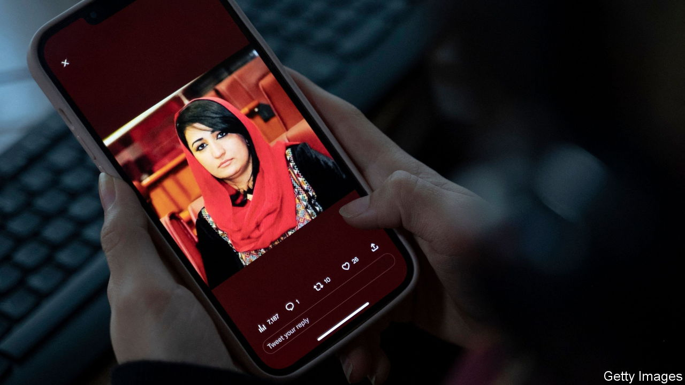

###### Killing women

# A murder in Afghanistan highlights the misery of women 

##### Stopping women from working at NGOs will cost lives 

 

> Jan 19th 2023 

WHEN THE Taliban took power in Afghanistan in August 2021, thousands of Afghans who had been associated with the American-backed government fled. Mursal Nabizada, an activist and former parliamentarian, chose to stay. Afghanistan, as she put it, was not like a restaurant you can leave if you do not like the service. It was her home.

In mid-January Ms Nabizada was shot dead in Kabul, the capital. It is not yet clear who killed her. But her murder provides another appalling glimpse of how life in Afghanistan is deteriorating—for women and girls in particular. Under the Taliban, people who mistreat or attack women have much less reason to fear punishment. “The gloves have come off,” reckons Ashley Jackson of the Centre on Armed Groups, an NGO based in Geneva. “Anyone can do anything to a woman.”

At the Taliban’s first press conference after seizing power a spokesman announced that women would be “very active” in Afghan society. There was some hope that “Taliban 2.0” would set itself apart from the brutish regime that ran the country from 1996 to 2001. But moderate voices are being drowned out by diehard mullahs in Kandahar, the group’s southern stronghold. Steve Brooking, a former special adviser to the UN in Afghanistan, says it is “the ideologues, rather than the pragmatists, who are in charge”.

In March last year girls were told they could start returning to secondary schools, but were then sent back home as soon as they turned up. Bosses in Kandahar apparently ordered that reversal at the last minute. Since then, new rules have forced women to cover their faces in public, sought to ban them from going out without a male escort, and barred them from parks and gyms (how strictly these rules are enforced varies around the country). In the past month alone, the Taliban has ruled that women may not attend university and may not work for NGOs. 

These edicts are impoverishing the country. The UN thinks the share of households for whom humanitarian assistance is the main source of income has increased six-fold since 2021. Across the country some 20m people are at risk of severe hunger. An unusually cold winter has worsened the situation. 

Afghanistan received more than $3bn in humanitarian aid last year, delivered mainly by the UN and NGOs. But confusion over whether and how women are permitted to work for such organisations is stopping assistance getting to people who need it. Female aid workers are indispensable in places where women are loth to let unknown men into their homes, or to discuss topics such as their health. On January 16th Amina Mohammed, the UN’s deputy secretary-general, arrived in Afghanistan to discuss this crisis, and all the others.

Last year only 12% of Afghan women told Gallup, a pollster, that females are treated “with respect and dignity”, down from 26% in 2021. Marzia Babakarkhail, a former judge in the country’s Supreme Court, says the Taliban’s rules are pushing millions into poverty and are greatly harming mental health. “They are killing women in a thousand different ways.” ■

