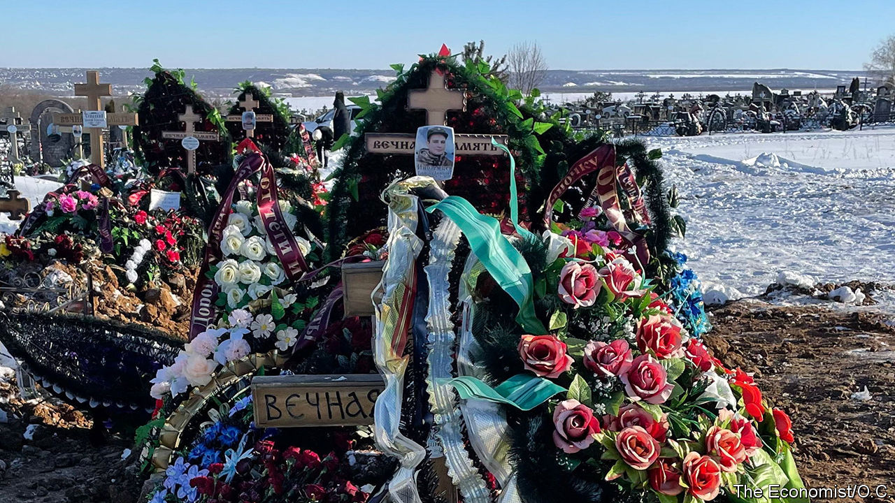

###### Invisible dead

# A Russian town counts the cost of Vladimir Putin’s war 

##### A new wave of mobilisation may be on the way 

 

> Jan 16th 2023 


FIVE FRESH graves break through the tranquil snow covering Novokuybyshevsk’s municipal graveyard. “Denis, my son!” a woman wails. Not long ago, 27-year-old Denis was a young dad and an engineer at the local oil refinery. In September he was drafted by the Russian army. By December he was in Ukraine. His military career lasted all of six days: he was stationed at the now infamous  when a salvo of HIMARS missiles struck it on New Year’s Eve. His mother feels fortunate to have received his body whole. Other families’ sons could be identified only by DNA. “I told him don’t go, don’t go. But he was insistent. He said he couldn’t run away.” 

Two weeks on, the true death toll at Makiivka remains secret. Families are burying their sons in unadvertised funerals in towns across south-western Russia’s Samara region, which was home to most of the soldiers in the barracks. Local authorities claim implausibly that just 89 men died, but they refuse to publish full lists of the dead. Ukraine says at least 400 perished. Denis’s parents, who say the explosion was boosted by lorries full of munitions parked alongside the barracks, agree that the numbers were probably in the hundreds.

In today’s Russia words are expensive. Family members are reluctant to speak for fear of losing financial compensation, or worse. But “Anna”, the sister of one of the injured, who agreed to talk on condition of anonymity, confirmed that many relatives are angry at what they see as a cover-up. “The commanders blamed soldiers for giving away positions by mobile-phone use,” she said. “In fact, it’s a story of their criminal negligence.” Anna’s brother escaped with a minor shoulder injury after being blown clear by the blast. The soldier in the bed next to him died immediately. Anna does not understand what Russia is fighting for. Many other relatives feel the same, she says. 

An open letter from the families, published on a regional website on January 10th but since deleted, called on President Vladimir Putin to scale back the use of conscripts in his “special military operation”. It is unlikely to have any effect. There are indications that a renewed wave of conscription is being planned. Ruslan Leviev, an open-source investigator, says in recent days Kremlin officials have stopped ruling out the possibility. Several figures connected to the “special operation” are openly calling for more mobilisation. One independent journalist reports that military authorities in Yekaterinburg, Russia’s fourth-biggest city, have set up green tents in anticipation of the renewed conscription drive. 

Russia has yet to deploy all of the 300,000 or so soldiers it mobilised in the first wave. Those who have arrived have succeeded in stabilising the front, says Mr Leviev. But it is hard to see how Russia could stage any sustained  without a new call-up. A source in Ukrainian military intelligence insists that even a new wave of conscripts would have little impact: Russia’s problem, he says, is with mid-level command, and cannot be solved by increasing the headcount. But the source nonetheless expects Russia to try to mobilise half a million more men ahead of a fresh offensive in the spring: “They need to cover hundreds of thousands of losses in killed and wounded, in addition to the new troops they need for an offensive.”

The recent appointment of Valery Gerasimov, Russia’s hitherto sidelined chief of the general staff, to head the operation in Ukraine may suggest a big offensive in the making. It could also be an attempt to reassert the usual military chain of command over  and his Wagner Group of fighters. Many in Moscow are troubled by the newfound influence of Mr Prigozhin’s sadistic shadow army, which has been leading the fight in Bakhmut and Soledar, the bloodiest section of the front lines.

If conscription resumes, thousands more Russian men will try to leave the country. After the  announcement on September 21st an estimated 700,000-800,000 men fled in one month. Others hid within the country, some in radical ways. Since September Adam Kalinin, an IT specialist, has been living in a forest somewhere in southern Russia. Speaking via an encrypted messaging app, Mr Kalinin said he was content with his new life and has everything he needs: a tent, a sleeping bag and a workspace for his computer, which he runs on solar power. He recommended it for other draft-dodgers who are unable to get out of the country (and who have some camping experience). 

The slaughter in Makiivka has made many ordinary Russians reconsider the cost of fighting in Ukraine. Hence Russian authorities are tightly controlling what is made public. ’s correspondent was filmed and harassed by a “blogger”, apparently sent by local security services, in the departure lounge of Samara’s local airport. Anna, the injured soldier’s sister, predicts that any attempt to recruit more men from the region would meet strong resistance from their family members. But she said it was too much to expect a public protest. People are too atomised, too frightened. “You need strong collective spirit for protest, and we have a bit of a problem with that,” she said. ■

