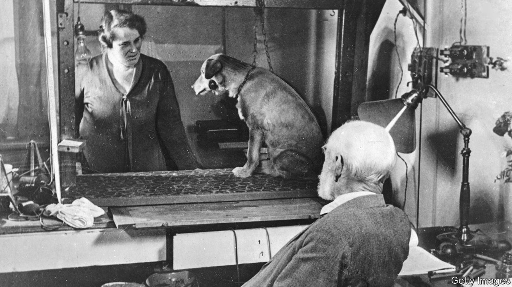

###### Dopamine. Dogma. Doubt

# A decades-old model of animal (and human) learning is under fire 

##### The result might be better AI 

 

> Jan 18th 2023 

The buzz of a notification or the ding of an email might inspire excitement—or dread. In a famous experiment, Ivan Pavlov (pictured) showed that dogs can be taught to salivate at the tick of a metronome or the sound of a harmonium. This connection of cause to effect—known as associative, or reinforcement learning—is central to how most animals deal with the world.

Since the early 1970s the dominant theory of what is going on has been that animals learn by trial and error. Associating a cue (a metronome) with a reward (food) happens as follows. When a cue comes, the animal predicts when the reward will occur. Then, it waits to see what arrives. After that, it computes the difference between prediction and result—the error. Finally, it uses that error estimate to update things to make better predictions in future.

Belief in this approach was itself reinforced in the late 20th century by two things. One of these was the discovery that it is also good at solving engineering problems related to artificial intelligence (AI). Deep neural networks learn by minimising the error in their predictions. 

The other reinforcing observation was a paper published in  in 1997. It noted that fluctuations in levels in the brain of dopamine, a chemical which carries signals between some nerve cells and was known to be associated with the experience of reward, looked like prediction-error signals. Dopamine-generating cells are more active when the reward comes sooner than expected or is not expected at all, and are inhibited when the reward comes later or not at all—precisely what would happen if they were indeed such signals. 

A nice story, then, of how science works. But if a new paper, also published in , turns out to be correct, it is wrong.

Researchers have known for a while that some aspects of dopamine activity are inconsistent with the prediction-error model. But, in part because it works so well for training artificial agents, these problems have been swept under the carpet. Until now. The new study, by Huijeong Jeong and Vijay Namboodiri of the University of California, San Francisco, and a team of collaborators, has turned the world of neuroscience on its head. It proposes a model of associative learning which suggests that researchers have got things backwards. Their suggestion, moreover, is supported by an array of experiments.

The old model looks forward, associating cause with effect. The new one does the opposite. It associates effect with cause. They think that when an animal receives a reward (or punishment), it looks back through its memory to work out what might have prompted this event. Dopamine’s role in the model is to flag events meaningful enough to act as causes for possible future rewards or punishments. 

Looking at things this way deals with two things that have always bugged the old model. One is sensitivity to timescale. The other is computational tractability. 

The timescale problem is that cause and effect may be separated by milliseconds (switching on a light bulb and experiencing illumination), minutes (having a drink and feeling tipsy) or even hours (eating something bad and getting food poisoning). Looking backward, Dr Namboodiri explains, permits investigation of an arbitrarily long list of possible causes. Looking forward, without always knowing in advance how far to look, is much trickier. 

This leads to the second problem. Sensory experience is rich, and everything therein could potentially predict an outcome. Making predictions based on every single possible cue would be somewhere between difficult and impossible. It is far simpler, when a meaningful event happens, to look backwards through other potentially meaningful events for a cause.

In practice, however, it is hard to distinguish experimentally between the two models. And that is especially true if you do not even bother to look—which, until now, people have not. Dr Jeong and Dr Namboodiri have done so. They devised and conducted 11 experiments involving mice, buzzers and drops of sugar solution that were designed specifically for the purpose. During these they measured, in real time, the amount of dopamine being released by the nucleus accumbens, a region of the brain in which dopamine is implicated in learning and addiction. All of the experiments came down in favour of the new model.

The 180° turnabout in thinking—from prospective to retrospective—that is implied by these experiments is causing quite a stir in the world of neuroscience. It is “thought-provoking and represents a stimulating new direction,” says Ilana Witten, a neuroscientist at Princeton University uninvolved with the paper. 

More experiments will be needed to confirm the new findings. But if confirmation comes, it will have ramifications beyond neuroscience. It will suggest that the way AI works does not, as currently argued, have even a tenuous link with how brains operate, but was actually a lucky guess.

But it might also suggest better ways of doing AI. Dr Namboodiri thinks so, and is exploring the possibilities. Evolution has had hundreds of millions of years to optimise the process of learning. So learning from nature is rarely a bad idea. ■


