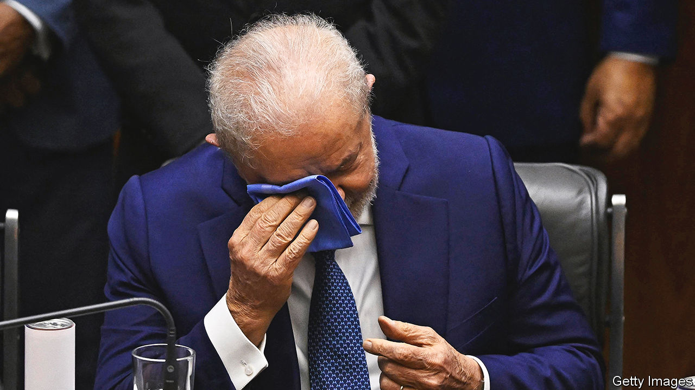

###### Fewer bellies full

# Brazil’s new president wants to reduce the number of hungry people 

##### That will be more difficult than the last time he was in charge 

 

> Jan 19th 2023 

Days after winning Brazil’s presidential election in October last year, Luiz Inácio Lula da Silva stood on a stage with tears streaming down his face. Lula, as he is known, sobbed as he talked about the large and growing number of Brazilians struggling with hunger. “If at the end of my term in 2026, every Brazilian is having breakfast, lunch and dinner once again,” he said, “I will have fulfilled my life’s mission.” At his inauguration in January, he broke down once again and reiterated that his government’s “first action” will be to rescue millions from malnutrition.

As Marcelo Neri, an economist, puts it, if China is the world’s factory, Brazil is the world’s farm. The country is the world’s largest exporter of beef and the second-largest exporter of grain. Yet despite the bounty, millions of Brazilians are not getting enough to eat. Partly because of the war in Ukraine, food prices have increased so quickly recently that families who considered themselves solidly middle-class a few years ago are now struggling to put food on the table.

The share of the population that is hungry has jumped from 9%, or about 19m people, at the end of 2020 to over 15%, or 33m people, in 2022, according to the Brazilian Research Network on Food and Nutrition Sovereignty and Security (PENSSAN), a non-profit organisation. The number that face some form of food insecurity—for example, skipping meals or opting for lower-quality food—is around 125m. 

The last time Lula was president, from 2003 to 2010, he got some way towards his goal. One campaign, “Zero Hunger”, which was launched in his first 30 days in office, became a model for other developing countries. Bolsa Família, the world’s biggest conditional cash-transfer scheme, ensured families did not starve. By 2010 47m students got healthy free school meals. 

The effects were obvious almost immediately. The share of the population that was undernourished fell by half, from around 8% in 2003 to just 4% in 2010, according to the World Bank. A generation grew up with better prospects as fewer children were distracted by rumbling stomachs at school. In 2014 Brazil dropped off the UN Hunger Map, which includes countries where at least 5% of the population face serious food insecurity. But those gains were short-lived. A commodities boom, which boosted growth and funded Lula’s social programmes, came to a crashing halt in 2015. Economic mismanagement by his handpicked successor, Dilma Rousseff, did not help. GDP per person fell by 8% from 2014 to 2016, leaving millions jobless and unable to feed their families. 

The governments that followed oversaw a “radical dismantling” of Brazil’s pro-poor policies, says Renato Maluf of PENSSAN, who also advised Lula’s campaign. Under Jair Bolsonaro, a right-wing populist who was elected in 2018, the hungry were initially a low priority. In 2011 Mr Bolsonaro, then a congressman, called Bolsa Família’s beneficiaries “ignorant wretches”. During covid-19, however, he launched a cash-transfer programme that helped many. But these handouts were not enough to stave off hunger for the poorest. Inflation is easing but the prices of food and non-alcoholic drinks were up by more than 11% year-on-year in December.

People from the  of Rio de Janeiro are turning up at state hospitals with minor ailments, hoping to be checked in just so they get a hot meal, says Rodrigo Afonso of Ação da Cidadania, a charity. Rural households are doing little better. 

For many of the poorest in Brazil, Lula’s victory comes as a relief. So far, it looks like the new president and his Workers’ Party will manage to keep their promise to bring hunger down. In December a Supreme Court ruling that raises government-spending limits helped save Lula’s plans to continue Bolsa Família. 

More on the menu

But Lula may have a harder time pushing through other pro-poor policies. He won the presidential vote with the narrowest margin—1.9 percentage points—since Brazil’s return to democracy in the 1980s. He faces a Congress dominated by conservatives. And the government is desperately short of funds. Among G20 countries Brazil had one of the most generous fiscal responses to the pandemic. Congress declared a “state of calamity” to bypass a constitutional ceiling on spending, allowing gross public debt to climb to a peak of 88% of GDP in late 2020.

Hunger is not the only thing Lula has to worry about. The country has a productivity problem, too. Even in the commodities boom output per worker grew on average at just 1% each year, according to Capital Economics, a consultancy. Analysts expect that output will expand by less than 1% in 2023. Since the election, the government’s borrowing costs have ticked up as lenders worry about soaring spending on social protection. The president faces a tricky balancing act. ■

