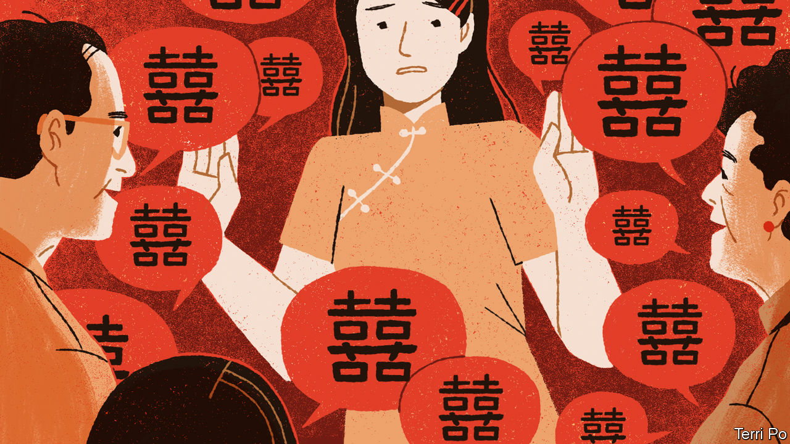

###### Itching to hitch ’em

# Chinese singles face the heat over the holiday 

##### It’s not just parents who want them to get married 

 

> Jan 26th 2023 

In the weeks leading up to the lunar new year on January 22nd, millions of people in China travelled back to their home towns to celebrate . Some have not been home for two years, thanks to pandemic travel curbs. There have been joyful reunions, fireworks and banquets. But, for single people of a certain age, there have also been awkward questions. 

The holiday is a chance for parents, aunts, uncles—even distant cousins—to press their young relatives to get married. Such nagging occurs in most countries. In conservative , though, the pressure is intense. 

Online searches for  (urging someone to wed) peak every year at this time, according to data from Baidu, a search engine. Beleaguered 20- and 30-somethings are flooding social media with complaints. “I used to like the atmosphere at new year, but now I hate it more and more,” said one person on Weibo, a Twitter-like platform. “If you are not married, you’re urged to get married. If you are married, you’re urged to have children.”

Nowadays the pressure comes from the state, too. China’s young people have been marrying later—or not at all. The average age of a first-time newly-wed was 28.7 in 2020, about four years higher than it was a decade ago. China registered 7.6m marriages in 2021, the lowest number on record. 

Fewer marriages have meant fewer births. According to the National Bureau of Statistics, China had 1.412bn people at the end of last year, down by 850,000 on the year before. It is the first time the population has declined since 1962, after millions died in a famine brought on by Mao Zedong’s “Great Leap Forward”. A shrinking, ageing population is bad for economic growth and will create a huge burden of care. But incentives for couples to have children, such as cash handouts and tax cuts, have had little effect.

There are several reasons behind this demographic crunch. Young people are better educated than previous generations and more likely to spend their 20s pursuing careers. This is especially true of women. Owning a car and a house is seen by many as a basic requirement for settling down—and many young people have neither. In cities, a gruelling work culture leaves little time for marriage and kids. In rural areas, a hefty bride price can get in the way of a match.

Parents don’t care for such excuses. Some singles have come home to find that a string of blind dates has been set up for them. Others provide  countermeasures. One netizen suggested telling parents that it is tough to find a partner worthy of them. An article published two years ago in , a local newspaper, advised feigning deafness or going on the attack by interrogating aunts and uncles about their own children’s marital status. 

Another solution is to rent a boyfriend or girlfriend for new year. Some actors provide such a service. But the ruse was easier to pull off when the holiday was celebrated over video.


