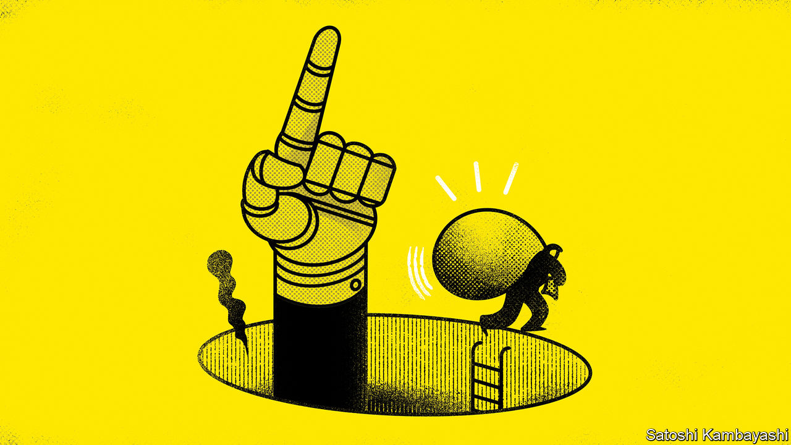

###### Buttonwood

# When professional stockpickers beat the algorithms 

##### Just occasionally, their fees are worth it 

 

> Jan 26th 2023 

Last year’s plunging markets left few investors smiling. Stocks and bonds fell in tandem; haven assets failed to offer safe harbour. Doing well meant making single-figure percentage losses rather than double. It might, therefore, seem an odd time for fund managers to be walking with a spring in their step. 

But on January 23rd it emerged that Citadel, a secretive investment firm based in Miami, had generated $16bn in net profits for its clients in 2022, breaking the record for the largest annual gain in dollar terms. Its main hedge fund posted a 38% return—while msci’s broadest index of global stocks declined by 18%. Champagne corks were popping elsewhere, too. Strategas Securities, a brokerage and research firm, reckons that 62% of active fund managers investing in large American firms beat the s&amp;p 500 index of such shares in 2022, the highest percentage since 2005. 

Last year therefore snapped a miserable losing streak for stockpickers. Every year from 2010 to 2021, more than half of active managers who benchmarked their performance against the s&amp;p 500 failed to beat it. In other words, the average fund manager was outclassed by a simple algorithm blindly buying every stock in the index. Such algorithms—known as “passive” or “index” funds—are taking over. By 2021 they held 43% of the assets managed by American investment companies, and owned a greater share of the country’s stockmarket than their actively managed counterparts.

The logic that drives passive funds is inescapable. By definition, the performance of an index is the average of those who own the underlying stocks. Beating an index is a zero-sum game. If one investor does, another must lose out. Active managers may spot a superstar stock that ends up leaving the rest in the dust. But it will also be in the index, so passive investors will buy it too. Meanwhile, active managers tend to charge fees that are orders of magnitude higher than passive ones: often 1-2% a year, and more for whizzy hedge funds, compared with as little as 0.03% for their algorithmic peers. This drag on performance makes it all but inevitable that index funds will outpace human money managers in the long run.

So how did fund managers outperform in 2022? One possibility is sheer luck. Pick a group of stocks from an index at random, subtract a percentage point or two from their returns for fees, and occasionally you will have chosen shares that do well enough to beat the average.

A variation on this allows for some skill on the stockpicker’s part. At the start of 2022, Alphabet, Amazon, Apple, Microsoft and Tesla accounted for nearly a quarter of the total market capitalisation of the s&amp;p 500. Their collective value dropped by 38% over the year; that of the rest of the index dropped by just 15%. So concentrated was the index that a single good judgment—thinking the shares of America’s tech giants were frothy and to be avoided—would have left a stockpicker with a decent chance of beating the market.

Broadening out this tech queasiness to a more general worry about stock valuations would have given stockpickers a second chance to outperform. Quibbling about such things went out of fashion during the years of cheap money that followed the global financial crisis of 2007-09 and then covid-19. Share prices soared to eye-watering multiples of the underlying companies’ earnings or assets, then kept climbing. Those who took that as a signal to shun them, in anticipation of a correction, lost out. Passive funds that indiscriminately bought everything, including stocks which seemed overpriced, prospered. But in 2022 rising interest rates brought the trend to an abrupt halt. Investors who had hunted for stocks that were cheap relative to their fundamentals were at last rewarded.

For firms like Citadel, a final chance to prove their worth came from plummeting share and bond prices. Market crashes and an uncertain economic backdrop are the raison d’être for hedge funds with a mandate to invest in any asset class they wish. Stockmarket indices that are falling by double digits are a lot easier to beat if you aren’t obliged to buy stocks, as are the funds which track the market. And for the most nimble managers, last year’s crises looked like opportunities. As a convulsing sovereign-debt market forced British pension funds into fire-sales in September, Apollo, a private-investment firm, started snapping up assets to book a quick profit. Index funds are not going away, and nor should they. But just occasionally, active managers are worth their fees.


