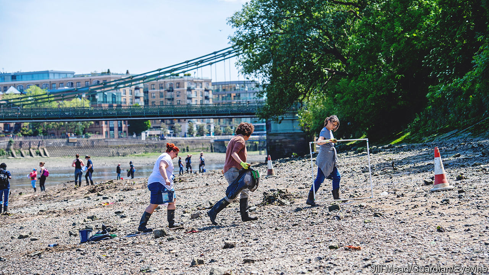

###### Wipe out

# Britain’s newest islets are made of wet wipes 

##### They clog sewers, leach microplastics and change the course of rivers 

 

> Jan 30th 2023 

The British Isles is acquiring some new additions. These nascent islets are not made of granite or limestone, but of agglomerations of wet wipes and mud. The largest is a metre deep, spans the width of two tennis courts and sits at a bend in the Thames by Hammersmith Bridge in London. It was measured last summer by volunteers from Thames21, a charity, which has been tracing the formation of such monstrosities for seven years. It reckons that there are at least nine wet-wipe islets in the Thames, and that smaller ones may be forming in the bends of other rivers. 

Britons dispose of 11bn wet wipes a year. They clean the nation’s babies and homes, but they also block sewers when they are flushed: a report in 2017 by Water UK, an industry body, found that wipes made up 93% of the material obstructing sewers. Even those claiming to be “biodegradable” may not decompose fast enough to avoid clogging waterways. Some 90% of them contain microplastics, which leach into water and digestive systems (Britons ingest enough plastic each week to make a credit card, reckons the World Wildlife Fund, a charity). 

A few retailers, such as Tesco and Boots, have put a stop to the sale of all wipes that contain plastic. Alternatives are emerging. Wype, a natural gel that is applied to toilet paper, is the invention of Giorgia Granata, an Italian expat mourning Britain’s lack of bidets. FlushAway is a dissolvable wipe.

But wet wipes are hard to get rid of. They are not included in the government’s list of single-use plastics that are due to be banned from October. Although wipes are plastered with words like “flushable” and “biodegradable”, the use of these terms is largely unregulated. The study by Water UK found that “flushable” wipes were still 88 times more likely than toilet paper to block sewers. The technical standard “fine to flush”, which was introduced by Water UK in 2019, tests wipes under lab conditions that do not reflect the state of Britain’s sewers. 

According to the Water Industry Act of 1991, it is illegal to flush anything that is “likely to injure the sewer or drain” or “interfere with the free flow of its contents”. But Britons don’t seem able to stop. In a survey carried out in 2022 by Thames Water, a utility, just over one in five people admitted to flushing the things away. The emergence of wet-wipe archipelagoes suggests that others may have been economical with the truth. ■


