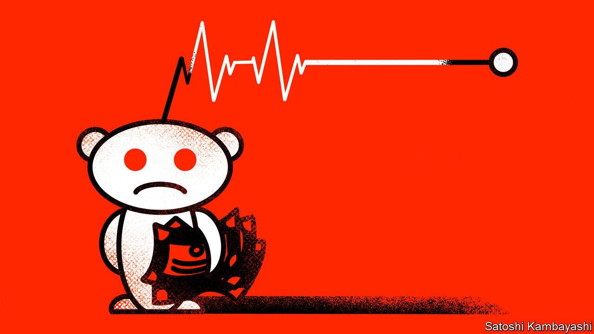

###### Buttonwood

# The last gasp of the meme-stock era 

##### So long and thanks for all the fun 

 

> Feb 2nd 2023 

Two years ago the stockmarket was in the grip of speculative mania. Shares in GameStop, a struggling video-game retailer, hit an all-time intraday high of $483 on January 28th 2021, up from around $5 at the beginning of the month. Retail traders co-ordinated in a Reddit forum and snapped up shares using brokerage apps like Robinhood. Empowered by technology, newcomers piled into GameStop, ostensibly because the beleaguered chain was one Wall Street had heavily sold short (ie, bet that the firm’s shares would fall in price). Short-sellers were the villains. When GameStop spiked they lost their shirts. What could be better?

The question at the time was how much of this would endure. Manias are as old as the hills, but this one seemed different: it was enabled by new technology that wasn’t going anywhere. For a time, the GameStop crew were unstoppable. They pumped up prices for companies that had attracted interest from short-sellers, such as amc, a cinema chain, and Bed, Bath &amp; Beyond, a home-goods retailer. Battle-hardened short-sellers, including Andrew Left of Citron, a research firm, threw in the towel. Melvin Capital, a firm that had shorted GameStop, which the Reddit hordes made the cartoon villain of the saga, decided to close its doors in May 2022.

When interest rates are zero the price of a dream can be infinite. Higher rates change the dynamic. Last year was therefore rough on the meme-portfolio, but its fans are nothing if not resilient, even when making losses. Matthias Hanauer of Robeco, an asset manager, tracks the most heavily shorted stocks in the msci Developed Index, a benchmark of global shares. Since December 31st 2020, a month before GameStop shares peaked, they have underperformed the market by around 15 percentage points. 

If 2022 was a reckoning with professional investors, then 2023 will be a reckoning with reality. A slowing economy is going to break many of the companies meme-stockers profess to adore. Monetary tightening slows the economy with a lag. As conditions worsen, struggling retailers, such as Bed, Bath and Beyond, are floundering. On January 26th the shower-curtain purveyor was served a slew of default notices by its bankers. Reuters, a newswire, has reported it may soon file for bankruptcy. 

The end of more than a decade of rock-bottom interest rates is also beginning to reveal corporate misdeeds and sometimes outright fraud. “Capital was free for 12 years,” says a former Wall Street tycoon. “We have no idea about all the places capital went that it should not have gone.” Some initial pockets of misallocation have become apparent. The pricking of the bubble in cryptocurrency markets has exposed businesses including Celsius and ftx, the founders of which have been charged with defrauding their investors. 

The stage is therefore set for the triumph of those the meme-stock lot profess to hate most of all: short-sellers, who try to sniff out this sort of stuff. Nathan Anderson, founder of Hindenburg Research and a famed short-seller, has already made quite a splash with an investigation into what he alleges is widespread fraud and market manipulation at the , an enormous Indian conglomerate, which strongly denies the claims. 

What, then, is left of the retail era? Individual traders are more important than they used to be, even if they are far from the peak of their powers. In 2019 the retail share of stock-trading volumes hovered at around 15%. Then, in the first quarter of 2021, it peaked at 24%. This figure understated the true power of retail investors. Exclude marketmakers, who stand in the middle of most trades, and retail traders made up about half of volumes, with institutional investors accounting for the rest. Although retail traders’ share fell to an average of 18% in 2022, or around one-third excluding marketmakers, this is still above where things started. When the stockmarket rallies, it is faddish favourites, like GameStop and Tesla, leading the charge. 

Perhaps what will endure longest, though, is the levity. Investing is normally a serious business. But even as the hold-on-for-dear-life gang let go of their treasures and rethink their old grudges, their influence is still felt. There are already plenty of Hindenburg versus Adani memes on r/WallStreetBets, the Reddit forum where it all began. These echo the ones made about Melvin versus GameStop two years ago, with a small difference. This time Mr Anderson, the short-seller, is the hero.■


