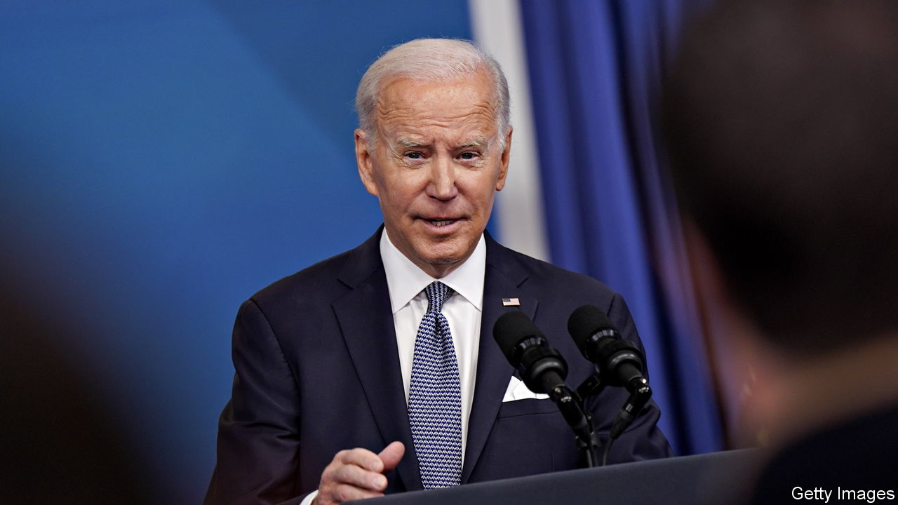

###### On the North Sea, police reform, economics research, doctors, America’s civil war, classified documents

# Letters to the editor 

##### A selection of correspondence 

 

> Feb 2nd 2023 


The energy of the sea

I read your article on the possibilities for green energy from the North Sea with great interest (“”, January 7th). Clearly there are opportunities for industries to start up or relocate to the North Sea. The region boasts a skilled workforce, stable institutions and an industrial culture. But the biggest additional asset is the potential for cheap and plentiful energy, mostly from wind power. Few other places in the world can match this.

All this wind energy is obviously renewable and can replace the existing use of fossil fuels. However, your article is unrealistically optimistic in this regard. At present, the six main countries that border the North Sea have a combined annual energy output of around 830 gigawatts. This includes renewable energy output of about 90GW. In order to achieve the goal of 80% of energy output coming from non-fossil sources by 2050, this 90GW must be increased to 670GW. This would require 240 nuclear-power stations of the size of Hinkley C, or 300 wind farms on the scale of the nearly completed Dogger Bank. Despite the skilled workforce and the plentiful winds, I very much doubt that this can be achieved within the next 28 years.

S.R. Garrard

Chartered engineer


The full potential of the North Sea will only be realised by accompanying wind with offshore grids, carbon capture and storage and associated hydrogen production. Britain has the potential to meet all of Europe’s needs. As renewable projects ramp up oil and gas will still be needed to effect a just transition and enhance security of supply. 

To make the North Sea a true powerhouse, we need a properly integrated basin. We should be maximising the existing infrastructure, skills base and supply chain to accelerate the energy transition. Much of the existing pipeline infrastructure and expertise from Britain’s oil and gas industry can be repurposed for this aim, but unlocking this prize will require sustained strategic thinking, cross-government co-ordination, and a shared vision. 

Tim Eggar

Chair

North Sea Transition Authority


 


Reforming the police

The cover strap to your January 21st issue describing London’s police as “rotten” was unfair to the absolutely overwhelming majority of the 34,000-strong force who are not criminal, corrupt, misogynist or racist (“, January 21st). They do an extraordinary job protecting us every single day. That said, there clearly are areas where poor leadership and an ingrained toxic culture have so comprehensively taken hold that only radical surgery to cut them out will do.

As a comparison, a culture of bullying had taken hold in the British army in the 1980s at training establishments for recruits and for newly trained soldiers. These were termed “initiation rites”. This was eradicated through severe and uncompromising disciplinary action which, in the case of one unit, involved the sacking of the commanding officer, regimental sergeant major and a whole swathe of the unit’s hierarchy, not because they had participated in the abuse but because they had not prevented it. 

In another instance, an entire company of soldiers was dismissed because they would not co-operate with service police investigating a serious assault on a senior officer. In the early 1990s the Canadians went one stage further and disbanded an entire regiment when it was found to be irredeemably infiltrated by neo-Nazi groups. Sometimes only the boldest action, including cutting off the rotten head, will suffice.

In all those instances, the essential values and value of the organisation were actually reinforced. 

Simon Diggins

Colonel (retired)


Declining research quality

One reason why economics may be running out of big new ideas is that funding evaluation cycles are too short for the pursuit of path-breaking research (“”, January 14th). A study that I led analysed more than 3m research papers in Britain over two decades. British researchers are subject to regular government evaluations, and the data suggest these assessments drive academics to prioritise quantity over quality. 

There is a significant rise in the number of papers published just before a government deadline, but also a drop in quality: lower-impact journals, fewer citations, more retractions. This trend reverses abruptly after each evaluation cycle, indicating that freedom from these deadlines allows for more novel and longer-term research.

Governments and funding institutions around the world place similar evaluation demands on researchers. All this close monitoring may indeed foster responsible spending, but evidence suggests it comes at a fundamental cost to research itself. Those who design research assessments should consider varying cycle lengths across different fields, enabling researchers to pursue riskier, but therefore more innovative projects.

Dr Moqi Groen-Xu

Senior lecturer in economics and finance

Queen Mary University of London

 


GPs under pressure

Strained primary-care systems are at the heart of health-care problems around the world (“”, January 21st). Family doctors in Britain see over a year’s worth of accident and emergency patients in a month. When our systems aren’t adequately resourced desperate patients bypass us and go directly to hospitals, which aren’t set up to manage bad backs and sinusitis. We handle 90% of all interactions in the National Health Service for less than 10% of the budget, receiving £13 ($16) a patient per month (less than my pet’s health insurance). 

We are seeing 15% more patients than in 2019 with less money and fewer doctors. After the pandemic, patients are coming to us with more advanced illness, and our ageing population requires ever more care and attention. With fewer resources to meet rising demand and complexity, preventive consultations tend to get squeezed out, storing up problems for the future. 

You are not the only ones to overlook these structural issues. Political solutions invariably focus downstream, on hospital-centric manifestations of problems that are fundamentally to do with primary care. Health systems won’t get back on their feet until our battered and burnt-out workforce is resuscitated. 

Dr Luke Allen

WHO health-systems consultant


 


Still reliving the war

The American South has clearly not recovered from losing the civil war (, January 14th). In 1963 I went to school less than 100 miles from Stone Mountain, a Confederate monument. In history lessons two chapters on “The War between the States” included an illustration of slaves weeping after being told by their kindly master that he hated to force them to leave his plantation, but the North decreed that they must. Our elderly instructor refused to teach those chapters, because the emotional scars of the war were still too fresh for her. 

Vamik Volkan, a psychoanalyst nominated for the Nobel peace prize, devoted much of his career to studying the group psychology of chronic ethnic conflict. He concluded that it persists partly because groups retain their cohesiveness thanks to an unconscious refusal to mourn and move on from past collective traumas. 

Richard Waugaman

, 

One of the three men depicted on Stone Mountain, General Robert E. Lee, made his feelings about such memorials clear after the civil war. He swore allegiance to the Union and opposed the creation of monuments to Confederate leaders (including himself) on the ground that they would “keep open the sores of war.” He was certainly right about that.

Marshall Carter-Tripp


 


Long overdue

Joe Biden’s mishandling of classified documents raises a big question (“”, January 21st). Does the federal government not have a system to manage classified materials? If Blockbuster, a bankrupt video-rental firm, was able to track my overdue copy of “Caddyshack”, then surely those in Washington can devise a similar scheme.

Dan Pesek


