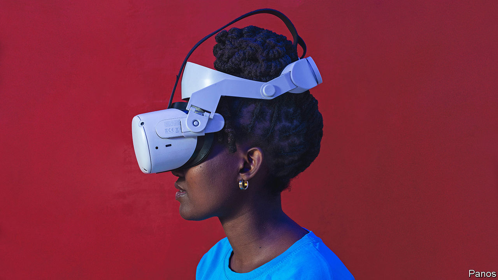

###### Pixels in the eye

# Researchers find a way to make VR headsets more realistic 

##### Micro LEDS produce sharper digital displays 

 

> Feb 1st 2023 

To enter a virtual environment, users must don a set of VR goggles (see picture). Typically, these contain a pair of stereoscopic lenses and a light-emitting diode (LED) display screen. The lenses distort the image on the screen so that it appears to be in three dimensions. And various sensors in the goggles track the position of the user’s head, to co-ordinate that with what is being viewed. 

A group of researchers based at the Massachusetts Institute of Technology (MIT), along with colleagues at universities in France, South Korea and other parts of America, have come up with a way of arranging LED pixels to produce screens with a much higher resolution than is currently possible. As they report this week in , their technique could be used to make VR images that appear far more lifelike than today’s. “You could have a completely immersive experience and wouldn’t be able to distinguish virtual from reality,” claims Jiho Shin, one of the team’s members.

To generate displays with higher and higher resolution, LED pixels have been getting smaller and smaller. But this makes them ever harder to manufacture reliably. Some in the industry think a practical limit will soon be reached. Yet smaller pixels are especially valuable for improving screens that are viewed up close, as with a VR headset. Insufficient pixel density can result in unwanted optical illusions, such as perceived stripes in the image. 

At present, LEDs are made like silicon chips. The red, green and blue versions required for a full range of colours are grown on different wafers, then cut out and placed side by side, with microscopic precision, to form pixels. Misalignment leads to rejection. And the smaller the LED, the greater the chance of misalignment. Today’s LEDs can be pretty small (less than 100 microns across). But gogglemakers would prefer something far tinier than that.

Dr Shin and his colleagues think they can turn out such minuscule LEDs by going about things differently. They grow their diodes directly on reusable wafers of silicon and other materials to produce a single-crystalline membrane. These membranes can then be peeled away, stacked one on top of another like layers of a cake, and cut into patterns of tiny vertical pixels, each as little as four microns across. 

As with conventional side-by-side LEDs, the team’s vertical ones yield a full spectrum. The result should be perfect for VR goggles. And screens for goggles could just be the start. Now that televisions come in curved and foldable forms, they, too, might be used to surround a viewer in a virtual environment. One day, perhaps, stacked micro LEDs might even take the immersive experience to the silver screen of cinema itself.■


