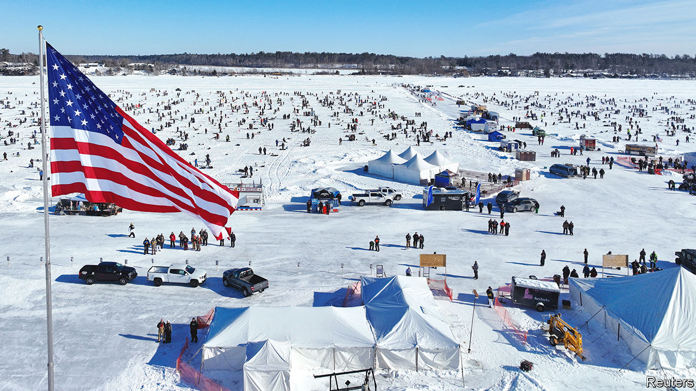

###### Ice, ice, maybe

# The sport of ice fishing is being transformed by technology 

##### But global warming threatens its future 

 

> Feb 2nd 2023 

In ancient Israel, somebody walking across a body of water constituted a miracle. In Minnesota, it just means that it is ice fishing season. On a late January afternoon at a bend in the St Croix river, which divides the state from Wisconsin, half a dozen tents are visible, spread evenly across the ice. Inside each one sits one or two people, fishing rods (and perhaps a beer) in hand. Every now and then somebody new arrives, pulls a sled across from the car park, and starts drilling, briefly disturbing the quiet with the sound of an electric motor. All across the surface of the river, the ice is pockmarked with holes about six inches wide. Overhead, a bald eagle circles, perhaps wondering what on earth these people are doing.

When bars, restaurants and other indoor activities closed in 2020 as the coronavirus raged, outdoor activities boomed. Skiing, golf, hiking, tennis, cycling: all attracted new adherents. Yet ice fishing has grown particularly fast. Even before the pandemic, the sport was defying a decline in fishing in general. In 2020, the Minnesota department of natural resources sold just over 1.2m fishing licences, or roughly one for every five residents of the state, the highest number in at least two decades. Though those licences cover summer fishing too, many adherents say that the winter season is now actually more important. The reason why is that it has become a lot easier, thanks to new technology. It is oddly revealing of what Americans want when they venture into the great outdoors: isolation, peace and quiet, but with a good degree of comfort and the chance to buy a lot of expensive paraphernalia.

Standing outside his tent on the ice, with his dog, Justin Fodor, a heating and air conditioning technician who lives in St Paul, explains that he started ice fishing a few years ago, at first with little more than his summer rods and lines. “I came out just with a drill, a table and a chair, I didn’t even have a hut,” he says. But as time has passed, he has bought plenty of gear, and in turn, goes out more to use it, enjoying the chance to bond with his friends. As well as a neat folding tent-hut and a sled, Mr Fodor now has a sonar, with which to spot fish underwater, a battery powered “auger”, or ice drill, and a portable heater. With the sonar, “it’s more like a video game now”, says Mr Fodor, admiringly. Even if you catch nothing, you can still see the fish you almost caught.

According to Tad Johnson, who runs the Brainerd Jaycees Ice Fishing Extravaganza, an annual tournament which draws thousands of people to fish on one lake in central Minnesota, all of this gear has helped lure newcomers in. It “has evolved so much that really anyone can go out and ice fish in relative comfort”, he says. The sonar is not even the most dramatic development. In recent years, the most enthusiastic ice fishermen have invested in “wheelhouses”—essentially caravans that can be pulled out onto the ice by a truck or a snowmobile and fixed in place with a crank. The fanciest houses feature generators, satellite televisions, hot stoves, beds and even showers, meaning that fishermen can stay on lakes for days at a time. Ice Castle Fish Houses, the biggest manufacturer, advertises the chance to buy somewhere to escape your mother-in-law.

How long can this boom last? One risk is that climate change is eating away at the season, and no amount of equipment can guarantee a frozen lake. Fishermen in more southern parts of the Midwest have had no ice at all so far this year. In Maine in late December the authorities warned fishermen to check the ice, as much of it was too thin to venture onto. Two men drowned in the state in early January. Even in the Gopher State, which is so bitterly cold that most lakes are still frozen reasonably solid, it rained earlier this year. Mr Johnson says next year they are moving the date of the ice-fishing extravaganza from late-January to February, to guarantee safer ice. The scale of the problem is not yet clear, but your correspondent, whose own fishing was not particularly successful, explored every angle. ■


