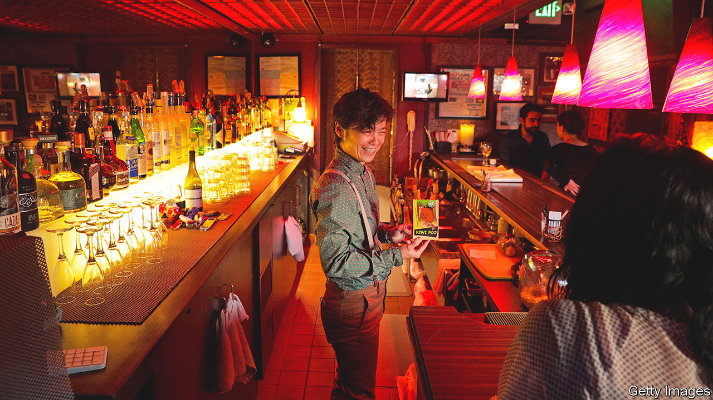

###### Arubaito abroad

# Japanese workers are seeking higher wages overseas 

##### Economic migration 

 

> Feb 9th 2023 

ASHIHARA MARINA, a 25-year-old from Kanagawa, near Tokyo, wanted to see the world. Last April she seized the opportunity to migrate to Australia through its government’s “working holiday” programme, which affords one-year visas to under-31-year-olds. She spent four months working on a farm in eastern Australia and now works as a barista in Sydney. What started as an adventure has found an economic logic. The minimum wage Ms Ashihara earns is, at A$21.38 ($14.9) an hour, twice as high as Japan’s. Even working part-time, she makes more than she did toiling as a lowly office lady in Tokyo.

Ms Ashihara is one of growing number of Japanese drawn to work abroad. Japanese applicants for Australia’s working holiday visa more than doubled in 2022. A recruitment platform called Indeed reports seeing record numbers of searches for overseas jobs. Study abroad agents have started advertising the term(“earning money while studying overseas”). “You could be doing the exact same job as in Japan and earn twice as much in another country,” says Hirawatari Junichi, a career consultant. “More and more young people have become interested in earning money in a stronger currency”. 

The historically weak yen is probably fuelling the trend. So, more troublingly, is the longer-term problem of Japanese wages, which have hardly increased in three decades. The average annual wage in Japan is $39,700, well below the oecd average of $51,600. In Japan’s seniority-based employment system, recent university graduates can expect to earn around ¥220,000 ($1,670) a month.

Young Japanese are understandably pessimistic about their prospects. In addition to low salaries, many are growing increasingly dissatisfied with Japan’s rigid, time-serving corporate culture. A survey by the Nippon Foundation, a non-profit, showed that only 14% of young Japanese believe that their country’s future will “get better”. “Many are struggling because wages are so low,” says Furusawa Yuta, 21, who recently moved to Canada to work and save money. When Tsuyuki Sho, 29, who works in it, noticed how much higher wages were in his industry in other rich countries, he felt a “sense of crisis”. He moved to America to work in 2019.

Japan’s declining population and acute labour shortage mean it can ill afford any loss of talent. And a bigger exodus could be looming, as the growing frustrations of young Japanese get the better of the poor foreign-language skills and risk aversion that are common to many. Some experts fear Japan could at the same time start losing out to neighbouring countries such as South Korea and Taiwan in the contest to attract the migrant South-East Asian workers that all need. “Japan is losing its attractiveness as a place to work,” frets Noguchi Yukio, professor emeritus at Hitotsubashi University in Tokyo. 

Life in Japan is still in many ways attractive. Its recent inflation has been much more moderate than elsewhere in the rich world and its housing is more affordable. “I came to America hoping to save lots of dollars, but at one point I was spending all my income”, recalls Mr Tsuyuki. He reckons there is no country “that could beat Japan in terms of liveability,” including safety and cleanliness. He also misses his excursions to Japanese fast-food chains, which serve tasty meals at pocket-change prices.

Yet affordability is a flipside of the country’s economic stagnation. Since the burst of the country’s bubble economy in the 1990s, Japan had been stuck in a “deflationary mindset”, where firms hesitate to pass on high prices to consumers. Thanks to the falling yen and mild inflation triggered by higher import costs, public frustration with the resultant stagnant wages is at last becoming evident. 

Ochiai Yuri, 24, who moved to Australia a year ago, also enthuses about the pleasantness of some things back home: “Everything in Japan is orderly and well-maintained. The trains always come on time and the customer service is great.” But she no longer considers returning to her old job in Tokyo—waiting tables on a miserable income—a serious option. ■

