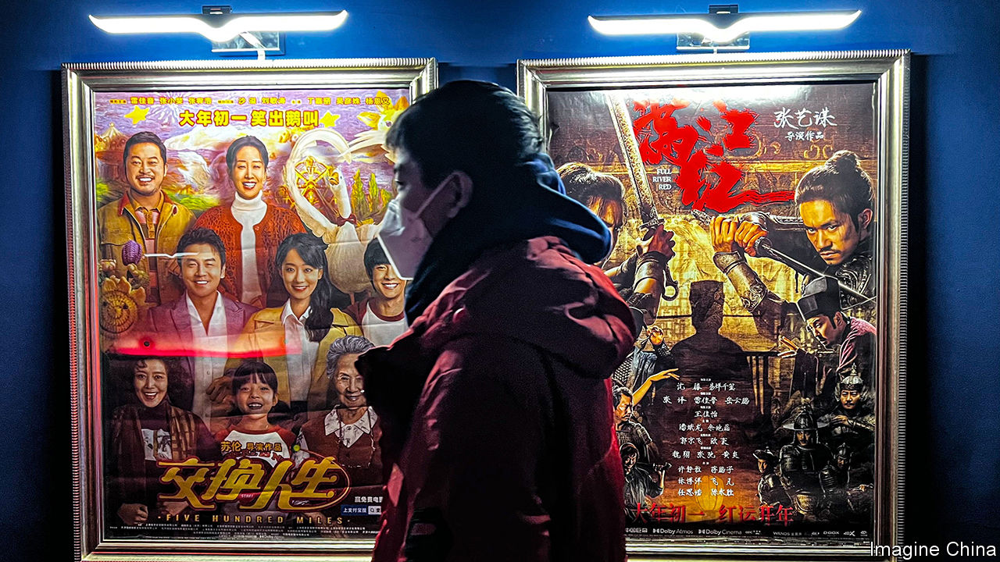

###### Seeing red on the silver screen

# A hit film recalling an ancient poem fuels Chinese nationalist fervour 

##### “Full River Red” draws on history, but its modern meaning is clear 

 

> Feb 9th 2023 

“My hair bristles with anger,” young men cry as they leave their red-cushioned cinema seats. “We will feast on the barbarians’ flesh...we will drink their blood.” They are reciting lines from “Full River Red”, a poem believed to be written by Yue Fei, a 12th-century general of the Song dynasty. It is also the title of China’s top-selling film over the recent Lunar New Year holiday. The movie has grossed more than 4bn yuan ($590m) since its release on January 22nd.

The film is set four years after the death of Yue, who famously led the Song kingdom’s battles against invading Jurchens, whose descendants became known as Manchus. Legend says he was killed in 1142 by Qin Hui, a corrupt Song chancellor who pushed the emperor to negotiate and stop fighting the Jurchens. In Chinese lore Qin is recalled as a , or traitor to one’s Han ethnicity, and Yue as the opposite.

In recent years, the Communist Party has drawn on Yue’s story to promote patriotism. State media even say that Xi Jinping, China’s leader, was raised on tales of Yue’s exploits. The movie, by one of China’s most famous directors, Zhang Yimou, has aroused vitriolic fervour. Not only have cinema-goers delivered spontaneous recitations of the chilling poem at film screenings. The movie has also prompted an increase in attacks on statues of Qin at tourist sites—a practice that has a long tradition.

The film is about the assassination of a Jurchen envoy in Qin’s court. There are twists and turns as characters reveal their hidden loyalties, whether to foreigners or to the Song dynasty. Qin and his lackeys are portrayed as conniving officials who lie, cheat, and kill for power—and betray the ethnic-Han people. The film’s heroes are undercover vigilantes who resent Qin’s behaviour and infiltrate his court to avenge Yue.

They try to recruit a young commander in Qin’s army, Sun Jun, who is torn between obedience to his traitorous superiors and loyalty to his people. In one scene, Sun cuts a tattoo that says “Serve the nation with utmost loyalty” off his vigilante uncle’s back as his uncle shouts that Sun is a flunkey and a “running dog” of foreigners (an oft-used insult among Chinese nationalists today). By the end, Sun turns against Qin. He leads the Han soldiers in a recitation of Yue’s poem and expression of their fervent desire to recover lost land. That scene made some viewers cry, according to reviews on Douban, a film website.

“Full River Red” draws on ancient history, but its modern meaning is clear. The poem is a lament that national shame has not been avenged: it talks of retaking lost “mountains and rivers”. In case that is not explicit enough, one Chinese family made a video of themselves reciting the poem after watching the film, but replaced its words with modern terms. Let us “feast on American imperialists’ flesh” and “drink Han traitors’ blood,” they chant—and “unify all of China in coming years”. 


