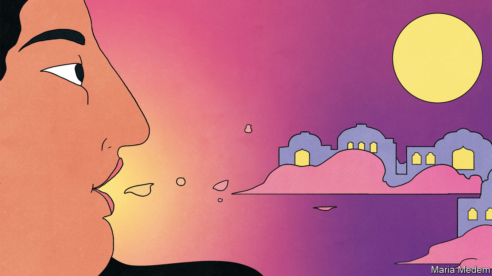

###### Historical fantasy fiction

# Salman Rushdie’s new novel is an ode to storytelling and freedom 

##### “Victory City” tells the story of an Indian princess-poet with magical powers 

 

> Feb 8th 2023 

 By Salman Rushdie. 

In Salman Rushdie’s , a magical storyteller survives a sadistic assault. In its aftermath she reflects that, although “terrible things happened”, nonetheless “life on earth was still bountiful, still plenteous, still good.” 

Sir Salman had completed “Victory City” before he was stabbed by a jihadist on a stage in New York, losing an eye and full use of a hand. His book’s joy in fictions that “could be as powerful as histories” testifies to a lifetime of free-spirited invention. But its defiance and exuberance is poignant now that the author of “Midnight’s Children” and “The Satanic Verses” has narrowly avoided the fate decreed for him by an Iranian . 

In Sir Salman’s stories, unfettered creativity rewrites the destinies laid down by dogma and law. “Victory City” is a fable about the power of narrative art, hitched to a historical chronicle. Pampa Kampana, the Indian storyteller-queen at its heart, believes that “the miraculous and the everyday are two halves of a single whole.” Over four decades, that kinship has given Sir Salman .

Pampa has been given a “cursed gift of longevity” and it grants her 247 years of life. She has other powers, too, and conjures the city and empire of Bisnaga into being by words alone. She directs its course over two centuries as queen consort, regent, minister and sorceress. In her realm of wonders, fairy-tale devices often drive the action, such as spells that turn humans into birds or talking forest animals.

Yet Sir Salman makes Bisnaga “a place with a history”, not just “the invention of a witch”. Its ascent, prosperity and decline track the real-world progress of the pluralistic Hindu empire of Vijayanagar (indeed Vijayanagar means “victory city”). That kingdom flourished from the 1330s until Islamic invaders left it ruined after the Battle of Talikota in 1565. 

Pampa steers history, then records it in an epic poem. There was a princess-poet, Gangadevi, in the 14th century; some of Sir Salman’s characters, such as Krishnadevaraya, a capricious king, bear the names of actual rulers. The green-eyed, red-haired Portuguese adventurers with whom Pampa has affairs, and who carry news of the empire overseas, have real counterparts. 

With its female progenitrix, Bisnaga becomes at its zenith a sort of feminist utopia. Its women are “neither veiled nor hidden” but honoured as warriors, “lawyers, traders, architects, poets, gurus, everything”. Pampa and her more enlightened allies also battle sectarians and fundamentalists, welcoming “unbelievers and other-believers” to share their “reign of love”. This may seem like wish-fulfilment, but Vijayanagar was noted for its tolerance and its influential women.

With history on one flank and fantasy on the other, Sir Salman gallops down the generations. Scenes of intrigue, exile, love and murder propel fast-flowing, wittily written chapters. Pampa learns, as writers must, that “once you had created your characters, you had to be bound by their choices.” Those choices are often unwise. “Golden ages never last long”: religious bigotry, palace plots and envious neighbours hasten Bisnaga’s downfall into “rubble, blood and ash”. 

In the closing verses Pampa declares: “Words are the only victors.” Sir Salman may distrust all evangelists, but in this novel he shows his faith in the  of art. ■


