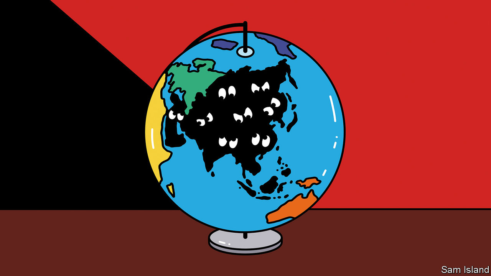
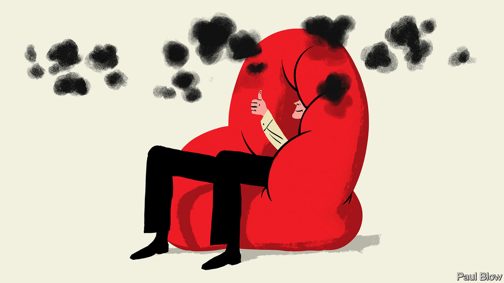
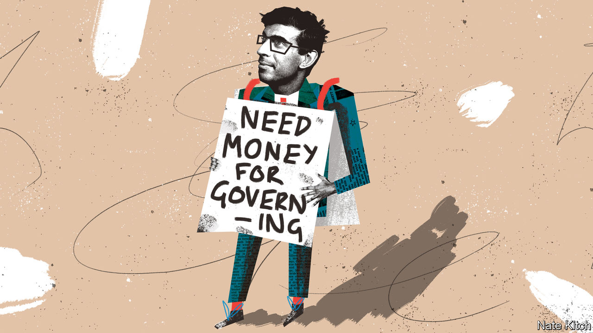

###### On Ukraine and Russia, Britain’s canals, protectionism, Gina Lollobrigida, Esperanto, cannabis, Mickey Mouse, paying MPs

# Letters to the editor 

##### A selection of correspondence 

 

> Feb 9th 2023 


Only the strong can intervene

Jeffrey Sachs argues that neutral countries should mediate between Russia and Ukraine (, January 21st). After his disastrous prescriptions for economic “shock therapy” in eastern Europe 30 years ago one would think he might want to sit this one out. His new idea is that countries such as Brazil and South Africa should be guarantors of a peace agreement, just as rich countries were supposed to guarantee the consequences from shock therapy. They didn’t then and neutral countries won’t now.

Mr Sachs does not say how his idea could be implemented. By imposing penalties at the UN Security Council, where America, Russia and others have a veto? By military force? It is difficult to imagine the Brazilian navy wanting to marshal blockades in the Black Sea, or the South African air force securing Crimean air space. As a result the efficacy of his argument is, once again, untestable.

Most of us will be hard pressed to think of any conflict which was resolved by the assumption that a club of decent kids can somehow intermediate in a schoolyard brawl between big tough ones. The naivety of the suggestion recalls a joke about a stranded economist trying to get off a desert island: just assume a life raft.

Tim Gollin


The great canal journey

Researchers investigating the industrialisation of Britain often overlook the canal system (, January 21st). In the 1740s Britain’s roadways were mostly muddy paths. Enterprising manufacturers, looking to transport raw materials into their factories and distribute the finished goods, formed joint-stock companies to dig canals linking navigable rivers throughout the countryside. It was a great success, and may possibly explain the first bump in your chart describing GDP per person. By the middle of the 1800s Manchester, Liverpool, Birmingham, Leeds, Sheffield, London and other cities were connected by a rapid, smooth transport system. The canals were overtaken by the railways after 1850, a possible explanation for the second bump in GDP.

CHRISTINE HOWZE


Digital protectionism

“” (January 14th) highlighted America’s startling shift towards protectionism, notably through subsidies. Protectionism is not limited to the United States. Even in the digital economy, data from the Global Trade Alert show that barriers to trade have been sharply on the rise, in particular through localisation requirements. The European Union and G20 have initiated over 1,700 legal acts since 2020 alone. 

Some view this as a response to American protectionism. For instance, America’s Commerce Department complained about a draft European scheme to classify cyber-security in the cloud (the EU cloud-services certification) because it allows only “EU headquartered firms” to gain the highest level of classification. American firms could therefore be excluded from that lucrative EU market. The scheme might also be in breach of the trade and co-operation agreement between Britain and the EU, and the EU’s commitments in the WTO’s general agreements on trade and government procurement. 

Consumers and businesses on both sides of the Atlantic should worry about the higher prices and less choice that all this brings. To rectify this we need a renewed consensus on non-discrimination and national treatment among trading partners, to save the international rules-based system that America once supported. 

Pascal Kerneis

Managing director

European Services Forum


 


An Italian star of screen

Thank you for the obituary of Gina Lollobrigida, a phenomenon in film (). You could have added that her fame had an impact far beyond the cinema. There is for instance the Gina gasket, a breakthrough for assembling tunnels underwater from great hollow sections of pre-cast concrete. The Dutch inventor of the thick rubber seal named it after Gina to honour certain “curvy similarities”.

And in an upsurge of civil war in Lebanon from 1982-84, Italian troops in a multinational force mostly escaped the bloody fates of the American and French contingents. It was widely supposed that the Italians’ empathetic Mediterranean outreach had simply won the hearts of their Shia Muslim neighbours in Beirut’s southern suburbs.

Or perhaps not. Over a decade later, the Syrian minister of defence revealed to , a newspaper in Dubai, that it was he who had ordered the Lebanese resistance to spare the Italians. Why? Because of his love since his youth for Gina Lollobrigida, whom he wished to spare a “single tear” of distress.

Hugh Pope


 


Lingvo vere tutmonda

Banyan found it comical that Baha’i missionaries to Japan used Esperanto to translate their creed (). Using Esperanto in Asia is no more comical than using English. China has published more than a hundred books in Esperanto and has regular radio broadcasts in the language. Esperanto can be learned in about quarter of the time needed to learn English. English conveys mainly the culture of its native speakers. By contrast Esperanto literature is written by native speakers of dozens of languages. The language is spreading ever wider around the world. 

Louis v. Wunsch-Rolshoven

German Esperanto Association


 


Worker toker

I partially disagree with the dry conclusion drawn by Bartleby about the relationship between cannabis use and creativity in the workplace (). Confidence in one’s creative ideas is not always a given. The adage “write drunk, edit sober” may not guarantee a bestseller, but it can sometimes help fill a page, or a letter to , which would have remained blank otherwise. 

Jean-Maxime Riviere


 


No Mickey Mouse operation

Mickey Mouse’s hand always has only three fingers, as depicted in the illustration for your briefing (“”, January 21st). Soon after creating Mickey in the late 1920s Walt Disney realised that if his mouse became popular it would be drawn millions of times. Thousands of illustrations are needed for a cartoon lasting just a few minutes. By omitting one finger Disney produced significant savings in ink and labour. And because it also enabled easier and more flowing movements it has been copied by almost all cartoon artists since.

Keith Carlson


 


Will do the job for nothing

I read Bagehot’s plea for British politicians to be more adequately funded (). It brought to mind a quip from long ago by the late John Arlott on the “Any Questions” radio programme: “So many people want to be MPs that the law of supply and demand suggests they need not be paid anything at all.” The audience applauded loud and long.

J. Fyles


