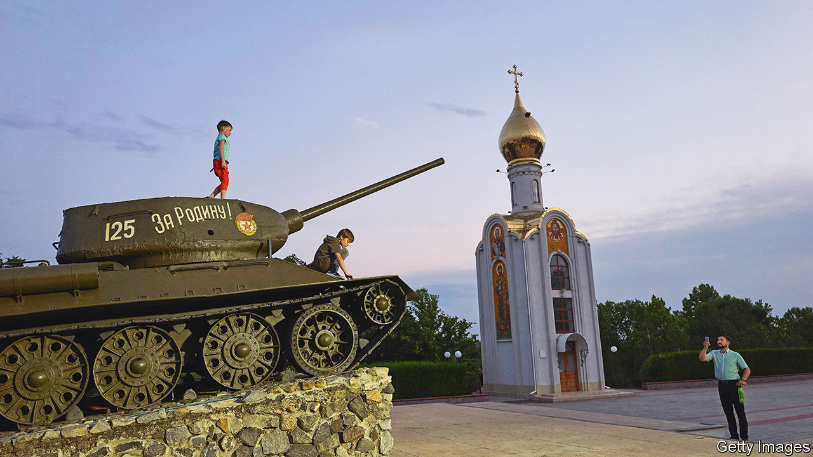

###### On the edge

# Moldova fears it may fall victim to a Russian coup plot 

##### But the West is rallying round the tiny former Soviet republic 

 

> Feb 13th 2023 


ON FEBRUARY 9TH Volodymyr Zelensky, Ukraine’s president, said he had informed his Moldovan counterpart of a Russian plot to destroy her pro-Western government. One day later a Russian missile streaked across Moldovan airspace on its way to a target in Ukraine. That same day Natalia Gavrilita, Moldova’s prime minister, resigned. Yet the cause of her fall was not the threat from Russia but rather soaring inflation, which has left huge numbers of Moldovans struggling to pay their bills. 

Dorin Recean, Ms Gavrilita’s replacement (pending parliamentary confirmation) says raising wages is a priority. But he stresses that beefing up Moldova’s defences is another. In the past few weeks Moldovan officials have appealed to the West for help in securing the country’s virtually undefended skies. But devoting resources to rebuilding Moldova’s puny defence capabilities is controversial when the cost of living is the main concern of most people. 

This year Moldova’s defence budget will leap by 68% compared with 2022. The sum is still tiny; approximately €75m ($80m), or 0.55% of GDP, according to Anatolie Nosatii, the defence minister. He jokes that he cannot even afford to change the Soviet-era map of Europe that dominates his office. The country’s only tanks are museum pieces, and barely half of its 6,500 soldiers are professionals. Should war break out, the police plus border guards plus reserves could boost the number of men under arms to 45,000, but they would be poorly equipped and enjoy no air support. For its part, besides the hundreds of thousands in Ukraine, Russia has 1,500 troops (most of them local recruits) stationed in Transnistria, a breakaway region in the east of Moldova that the Kremlin sponsors. 

On February 2nd Sergei Lavrov, the Russian foreign minister, said that the West wanted Moldova “to play the role of the next Ukraine”. Similar previous threats have prompted Moldova’s friends to come to its aid. Last June the country became an  of the European Union, and the EU has now promised €40m in non-lethal military aid for such things as drones and cyber-defence; Germany is supplying 19 armoured personnel-carriers. On February 14th-15th a meeting of NATO defence ministers approved another plan to help Moldova rejuvenate its defences. 

Internally things may be changing, too. Although bigwigs in Transnistria prospered under Russia’s umbrella, Alexandru Flenchea, the outgoing prime minister’s adviser on the breakaway region, says the war has changed everything. Moldovan officials are in intense, if discreet, contact with Transnistria’s leaders; Mr Flenchea spies an opening for a potential settlement of the conflict. Most of Transnistria’s leaders are more interested in money than in Russia, he reckons, however hostile their rhetoric. In the past a lucrative chunk of that has come from smuggling goods in and out of Ukraine, but the war has now closed that border. 

One of Mr Nosatii’s constraints in seeking aid from abroad is that Moldova’s constitution commits it to neutrality. Last month , the president, said, “there is a serious discussion…about our capacity to defend ourselves, whether we can do it ourselves, or whether we should be part of a larger alliance.” But Moldovans would almost certainly reject NATO membership if a referendum were held today. One official says that the country’s leaders see it as their mission to start shifting public opinion, but that it is hard. 

When Russian forces pushed into southern Ukraine a year ago several Moldovan officials expected their tanks to  within days. That fear has receded. But, says Mr Nosatii, the security issue is not simply about replacing Moldova’s antiquated military hardware. “It is more about the hybrid war that Russia is using against Moldova,” he says. That includes “disinformation, false news, cyber-attacks and everything that will discredit the government and create the conditions to change our leading party to a more pro-Russian one”. On February 13th Ms Sandu said that Russia was plotting to sponsor violent protests with a view to overthrowing the government. She said her prosecutors and spooks needed more powers to combat the threat from the Kremlin. ■

