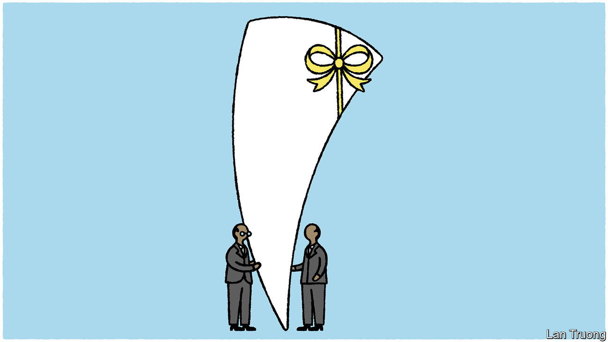

###### Banyan

# New Zealand is right to atone for its colonial crimes in the Pacific 

##### Its sensible diplomacy offers lessons for other countries 

 

> Mar 2nd 2023 

In LONDON RECENTLY, Penny Wong, Australia’s foreign minister, called on Britain to face up, in the Indo-Pacific, to the uncomfortable realities of its colonial past. Ms Wong’s forebears were from ethnic-Chinese communities that laboured in British Borneo’s perilous mines. Colonial stories, she said, “can sometimes feel uncomfortable—for those whose stories they are, and for those who hear them.”

Some in Britain’s ruling Conservative Party objected furiously to Ms Wong lecturing Britain on how to grapple with its past. Yet she raised an issue that will not go away. Britain has declared its intention to seek much deeper trade and security ties in the Indo-Pacific region. It is unlikely to succeed, Ms Wong intimated, in what she called “the most consequential region of our time”, unless Britain faces up to how an often-abusive history colours its relations there. Understanding the past, she said, “enables us to better share the present and the future. It gives us the opportunity to find more common ground.”

Patricia O’Brien, a historian of colonialism at the Australian National University, emphasises the point in an excellent piece in the , a foreign-affairs magazine: “Reckoning with colonial pasts, in current times, makes for good diplomacy.” Britain and other former colonisers might consider this especially worthwhile if they wish to criticise the region’s new imperial power, China, on firm moral ground. 

Britain, alas, is a past master at . Among numerous illustrations, it has serially bungled its approach to atoning for its imperial slavery in the Caribbean, where its king remains the head of state of eight countries. Yet Britain is by no means the only power in the Indo-Pacific with a sordid past. During the Pacific war of 1937-45, imperial Japan massacred civilians, forced Chinese and Koreans into slave labour and conscripted tens of thousands of Korean and other “comfort women” into military brothels. Japan’s relations with its neighbours are still bedevilled by that history.

In the South Pacific, where white-British colonies, including Australia, became colonisers themselves, colonial wrongs remain a political minefield. But recent experiences there show how it is possible for countries to pick a way through it. New Zealand, in particular, is an exemplary apologiser.

An apology from a state is quite different from one offered by an individual. Meaningful political apologies are extended by the many to the individual—to victims of slavery, for instance, or to their descendants. There is, notes Hiro Saito of Singapore Management University, a performative dimension to the act. But the performance counts for nothing if the actors are not sincere.

Few could fault New Zealand for apologetic sincerity. In 2002 Helen Clark, then the prime minister, issued a moving apology for her country’s past mistreatment of Samoa. It included banishing its leaders and causing the death of over a fifth of the population, after New Zealand allowed a ship carrying Spanish flu to dock at the island-territory. Her apology was met with Samoan rituals of forgiveness. “Unfinished business”, as Ms Clark called it, can only be settled with the victims’ agreement. 

Last August another New Zealand prime minister, Jacinda Ardern, volunteered an , a public display of humiliation and apology, for her country’s racist “dawn raids” in search of Pacific Islanders who had overstayed their work visas in the 1970s. Chris Finlayson, a former New Zealand attorney-general who negotiated dozens of apologies and financial settlements with , Maori tribes, says: “If the Crown simply breezes in and says we’re sorry, they don’t accept it.” Apologies have to be specific and attuned to the victim’s sensitivities. “It is acknowledgment that certain things happened in history…and a promise that there will be a different way [in future].”

It helps perhaps that modern diplomatic apologies chime with a South Pacific tradition of atonement, of which , polished sperm whales’ teeth used as gifts, are emblematic. Only in January the new prime minister of Fiji offered one to Kiribati. Yet even when such props are unavailable, doing the right thing is surely advisable. Not least because when states say sorry they are thinking more about opening up the future than closing down the past. At a time of bleak geopolitical contestation, there is a virtuous logic to that which even hard-headed strategists should keep in mind.■


