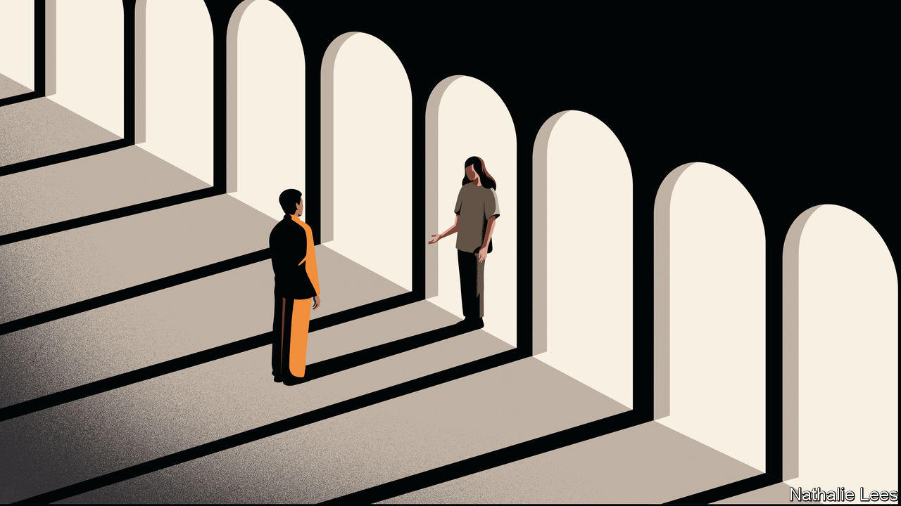

###### Campus fiction

# “I Have Some Questions for You” raises lots of them 

##### Rebecca Makkai’s new novel is a crime story about sex, race and the abuse of power 

 

> Mar 2nd 2023 

 By Rebecca Makkai. 

In the bleak midwinter of 2018, Bodie Kane, a 40-year-old film professor and podcaster, returns to the Granby School, her alma mater in New Hampshire, to teach for a fortnight. On the first day of her podcasting course, she asks her students to work on a project related to the past or present of Granby. One of them, Britt, chooses the killing in 1995 of Thalia Keith, a pretty, rich, popular white pupil—and Bodie’s former room-mate. 

Omar Evans, the boarding school’s black athletics coach, was convicted of the murder. Britt thinks he is innocent and has been  for nearly 23 years. Bodie, also sceptical of the verdict, is glad a fresh pair of eyes is looking at the case: “I wanted second sight. I wanted the ability to remember things I was never there for.”

As a campus novel and murder mystery set in New England, Rebecca Makkai’s latest book, “I Have Some Questions for You”, has echoes of “The Secret History”. Unlike Donna Tartt’s blockbuster, the story is a whodunnit not a whydunnit, the intrigue and drama crescendoing as Bodie becomes increasingly obsessive about the crime. She makes inquiries of her own into Thalia’s death by tracing last movements, evaluating suspects and sifting alibis. 

Other, equally involving plots unfold. As Bodie tries to right a wrongful conviction, she wrestles with demons of her own, from losing both her father and brother in childhood to her unhappy years at Granby. When her husband Jerome, an artist, is accused of predatory behaviour, she comes to his defence and finds herself embroiled in scandal. 

Ms Makkai makes clear how her protagonist’s life has been shaped by men’s nasty behaviour. Bodie reveals how, at school, she was the victim of a prolonged campaign of sexual harassment. She discusses a podcast she made on  and “the ways the industry chewed them up and spat them out”. She offers potted summaries of cases in which women suffered at the hands of men: “It was the one where the woman who stabbed her rapist with scissors was the one who ended up in jail. It was the one where the star had a secret button to lock the doors.” 

The book is particularly compelling when Bodie interrupts her narrative at routine intervals to address the “you” of the novel’s title. “You, a big part of what went wrong” is Denny Bloch, who was once her favourite teacher. One of Bodie’s friends considered him a “creeper”. As the evidence mounts up, Bodie wonders whether he might be “a more violent kind of monster”.

This novel lacks the emotional punch of Ms Makkai’s previous book, “The Great Believers” (published in 2018), which charted the history of the  of the 1980s. Instead, it is at once a propulsive crime story and a thought-provoking meditation on sex, race and the abuse of power. ■


