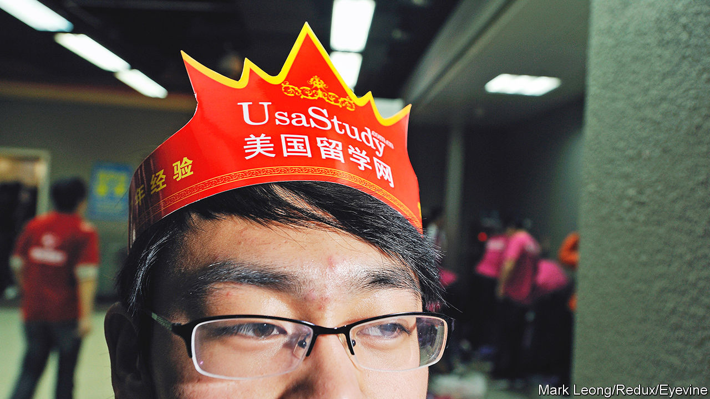

###### Learning skills, not values

# Many of China’s top politicians were educated in the West 

##### It did not endear them to it 

 

> Mar 9th 2023 

In the early 20th century thousands of Chinese Communist Party members went to Russia to learn how to stage a revolution and build a socialist state. The Russians, in turn, hoped the study programmes would give them lasting influence over their Chinese comrades, many of whom would rise to positions of great power. But within a decade of becoming communist, China began squabbling with the Soviet Union. In 1961 leaders in Beijing denounced Soviet communism as the work of “revisionist traitors”.

The episode holds sobering lessons for Western countries, which have hosted millions of Chinese students over the past four decades—many of whom have risen to positions of great power. While universities raked in cash, Western leaders hoped the experience would endear future Chinese leaders to liberal values. But, as with the Russians, they have been disappointed. Today the party is more anti-Western than it has been in decades, a mood reflected in the words of President Xi Jinping and Qin Gang, the foreign minister, at a meeting of the National People’s Congress this month.

Foreign-educated students who return to China are known as  (sea turtles), a homophone for “returning home from abroad”. For a long time those who entered China’s bureaucracy found themselves swimming upstream. While their technical knowledge was valued, the party feared that they might have divided loyalties. But as the number of  swelled, the distrust faded.

Today over 20% of Central Committee members—the 370 most powerful party officials in China—have had some foreign education, mostly at Western universities. That is up from 6% two decades ago, according to Cheng Li of the Brookings Institution, a think-tank in Washington. Eight of the 24 members of the Politburo have studied in Western countries, the most ever by far.

Like many overseas Chinese students today, the leaders often focused on STEM subjects (science, technology, engineering and mathematics). A Politburo member called Chen Jining, who is the party boss of Shanghai, spent a decade in Britain studying engineering. Another member, Yuan Jiajun, studied at Germany’s centre for aerospace research. He later ran the rocket programme that sent the first Chinese man into space. 

But there was demand for other subjects, too. In 2002 Harvard University’s Kennedy School of Government, working with Chinese institutions, set up a three-month programme to teach mid-ranking Chinese officials about administration. Similar short-term programmes sprang up at universities elsewhere in America and the West. (Some, such as Harvard’s, were later shut down.) 

Despite all this, an anti-Western spirit permeates the leadership. State directives rage against “erroneous” Western ideas, such as having an independent judiciary. Students in China’s schools are warned not to be misled by foreign concepts. In February a teacher in Anhui province was denounced by a student for “worshipping the West and pandering to foreign powers” after he encouraged students to study abroad. Never mind that China’s education minister, Huai Jinpeng, was a visiting scholar at America’s Columbia University in the 1990s.

President Xi Jinping studied only in China. But his ideological tsar, Wang Huning, was a visiting scholar in America in 1988. He wrote a book about his experience which revealed admiration for some aspects of the country, such as the way presidents reliably leave office when their term ends (Mr Xi will soon be confirmed for a norm-busting third term). But, Mr Wang wrote, there were “undercurrents of crisis” caused by racial tensions, disintegrating families and poor education. For him, America mostly offered a lesson in what to avoid.


