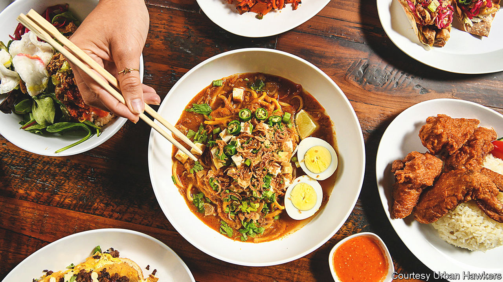

###### World in a dish

# Singapore’s unique dining style comes to Manhattan 

##### Cooking dishes from another culture is straightforward. Transplanting a mood is another matter 

 

> Mar 9th 2023 

COOKING A DISH from one culture while living in another is simply a matter of ingredients and technique. Translating an entire dining style is harder. No matter how tasty the , how artfully nicotine-stained the walls and how much Édith Piaf warbles from the speakers, eating at a bistro in Phoenix will always be different from eating at one in Lyon. The trick, as a new Singapore-style hawker centre in midtown Manhattan shows, is knowing which parts of the experience can be transplanted successfully, and which should be left at home.

In Singapore,  are large, semi-outdoor spaces (they have roofs but no walls). Food stalls line the perimeter while customers stake out seats at tables in the middle. Ubiquitous and cheap, they are  in Singapore, where your columnist once lived. They let groups of friends with different tastes and dietary requirements eat together. They are unpretentious and fun: vendors banter and flirt with their customers and the open setting encourages relaxed conversation.

Urban Hawker in Manhattan hews to the same basic design principles, with vendors along the walls and communal tables in the centre. The hawkers sell similar foods to their Singaporean counterparts, including creditable  (a folded fried bread of South Indian origin, served with  that was sweeter and less spicy than it should have been), greasy and delicious  (fried flat noodles), and properly chewy if slightly ungenerous  with  (grilled skewered meat with rice cubes). A sublime chicken rice could hold its own with any stall in Singapore, the poached chicken soothingly soft and springy, every grain of rice distinct yet slicked with rich chicken flavour, the sauces—thick soy, fiery chilli and ginger—complementary rather than overpowering.

But unlike Singapore’s hawker centres, Manhattan’s is indoors. It has a cocktail bar, whereas Singapore’s serve nothing stronger than Tiger, the local lager. And the prices are high: New Yorkers will evidently pay around $20 for a plate of chicken rice that would cost a few Singaporean dollars (a couple of American ones). 

In Singapore, everyone eats at hawker centres because they are everywhere and serve familiar food cheaply. In New York that role mainly falls to  and fast-food chains. Urban Hawker’s target clientele is posher: the sort of people who know what hawker centres are despite living halfway around the world. Dining there is an event rather than a habit. In other words, it sells cachet as well as food, like the many French bistros outside France that serve at prices many actual grandmothers cannot afford. 

Compare the New World Mall’s food court (in effect, an indoor hawker centre), a 40-minute subway ride away in Queens. It is at least as delicious and a lot cheaper. But it is authentically Asian-American and aimed at locals in New York’s biggest Chinatown; other visitors need to do some translation work. Urban Hawker gives diners a helping hand—and reaches into their wallets with the other one. ■


