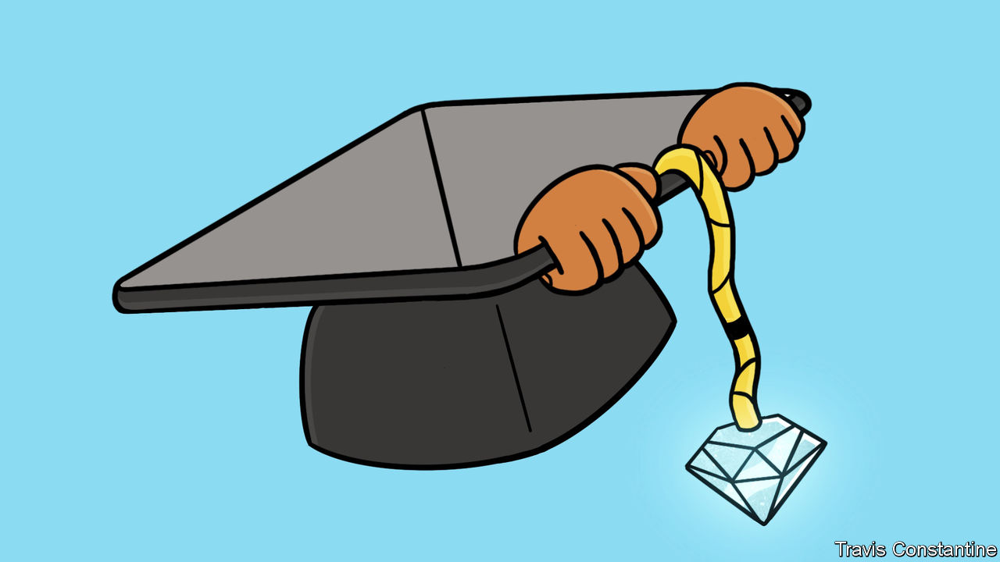

###### Testing fail

# American universities are pursuing fairness the wrong way 

##### Drop legacy admissions—not standardised exams 

 

> Mar 9th 2023 

THE BEST American universities wish to be ruthlessly discriminating on academic merit—and beacons for diversity on everything else. Trying to accomplish both at once can prompt mistakes. Lately Columbia University, an Ivy League member in New York, has been making a lot of them. Last year it admitted to submitting incorrect data to a college-rankings outfit in a bid to seem more exclusive than it really is. And on March 1st, in a bid to seem more inclusive than it is, Columbia said it would drop the requirement for applicants to submit standardised exam scores.

Campaigners claim that exams favour the privileged. Evidence for this is thin. Maths problems involve neutral things like numbers and algebra; reading-comprehension tests are rarely about silverware or yachting. The bias, however, is said to be latent. Because scores are correlated with race and parental income, the exams must therefore be contaminated with . 

This confuses disparity with discrimination. Tests correctly measure educational inequality, which begins before kindergarten and grows as a result of bad policy. Just as smashing thermometers does not prevent climate change, so abandoning the measurement of educational inequality will not magic it away.

In fact, for meritocrats to abandon exams is self-defeating. Scores may be correlated with privilege, but they are probably the hardest part of an admissions application to warp with money. Children of the rich can get ample help in completing their coursework (which may receive inflated grades), hire professional writers to “edit” their essays and even spend lavishly on consultants who will help craft a delectable smorgasbord of extra-curricular activities. Yet research shows that intensive tutoring has a marginal effect on test scores. That is why, in the Varsity Blues scandal of 2019, very rich parents paid to have others sit their children’s exams. 

Worse, supposedly progressive universities like Columbia operate affirmative-action schemes for deep-pocketed dullards in the form of “legacy” admissions that shower advantages on the relatives of alumni. One study found that undergraduates at Columbia are more than 100 times more likely to belong to the top 0.1% of families by income than to the poorest 20%. The best way to promote fairness would be to eliminate such a regressive pathway to admission. 

In the 1920s Harvard moved to a “holistic” admissions system because its president thought it had too many Jewish students (who excelled on the standardised exam adopted in 1905). A century later, Harvard is being sued over a holistic admissions system that limits the number of Asian-American students, who also do well on tests. Based on that case, the Supreme Court is expected to rule that race-based affirmative action  A cynical observer might conclude that universities are jettisoning quantitative measures, the lawsuit’s key evidence, to make discrimination harder to detect.

Fixing educational inequality requires more data, not less. Susan Dynarski, an economist at Harvard, makes the case that free, universal testing helps unearth promising young talent from rough backgrounds. Timely reminders about financial aid also help. For decades, elite universities have sought skin-deep diversity to paper over abysmal socioeconomic diversity, a failing that is exacerbated by legacy admissions. If the Supreme Court rules that stratagem out, universities should not devote their energies to maintaining an undesirable status quo, but to crafting something better: a true meritocracy shorn of an unjustifiable, hereditary mediocracy. ■

