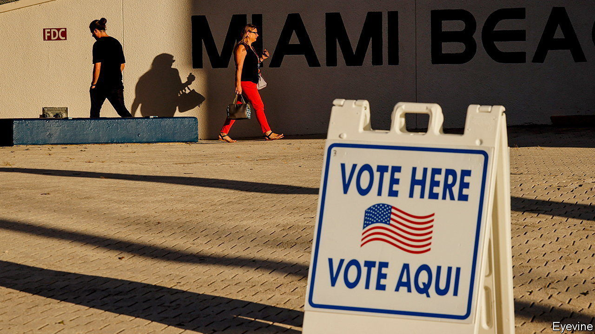

###### Republicans and voter fraud

# Three Republican states pull out of voter-fraud prevention scheme 

##### That will only make future elections more disorderly 

 

> Mar 9th 2023 

If Republicans have made  a core issue, this week marked something of a U-turn for the party’s state officials. On March 6th Florida, Missouri and West Virginia—all Republican states, where the party controls the offices of governor, secretary of state and attorney-general—withdrew from a multi-state data partnership intended to prevent voter fraud. The trio of election officials cited concerns over data security and a partisan adviser in their exit letters. 

The Electronic Registration Information Centre (ERIC), with which they cut ties, is a coalition that helps election officials sustain accurate voter rolls and identify fraud. It does so by comparing voter data across member states to a “death master file” from the Social Security Administration and driver-licence records. Since its inception in 2012, ERIC has spotted 1m duplicate voters and taken over 570,000 dead people off the rolls. By January 2022, 33 states along with Washington, DC, had joined the effort. 

For a decade ERIC was celebrated as a rare bipartisan triumph. States like Connecticut and Oregon joined forces with Utah and Texas. That started to change in early 2022 when Gateway Pundit, a conspiratorial blog, made the outfit its target. Known for spewing hoaxes about vaccines and elections—in 2021 Google banned the site from running ads due to misinformation—the blogger claimed that ERIC was manipulated by left-wingers and bankrolled by George Soros, a progressive philanthropist. Neither was true.

One week later, over concerns of “questionable funding sources” and “possible partisan actors”, Louisiana became the first to pull out of ERIC. In January, Alabama’s newly-elected secretary of state also cut ties. A February board meeting, during which member states refused to adopt proposed bylaw amendments, was the catalyst for three more states to defect this week. 

The leavers object to the involvement of the only non-voting board member, David Becker, a former Department of Justice official who founded ERIC. But claims of his liberal bias fall flat: his most notable case was against Georgia Democrats for gerrymandering and his non-profit, which gave $65m to states for non-partisan election education, is run by experts from both parties. (Both Florida and Missouri received grants.) The data-security concerns they raised were not serious enough to persuade the majority of member states to vote for change. 

“This is all an effort to create more chaos, to weaken the guardrails of democracy and allow for losing candidates to spread more lies,” says Mr Becker. States that defect hurt themselves most. Unorderly voter rolls make for delays. Come 2024, voters in these states will face lengthy lines at polls and more trouble with mail-in ballots. Confusion and longer waits for results will only incite more mistrust. 

More states could yet pull out of ERIC. Alabama and Missouri plan to craft new systems to clean voter rolls. But replicating it in the short-term is infeasible—it took ERIC three years to get its data-sharing apparatus up-and-running. John Ashcroft, Missouri’s secretary of state who led the withdrawal, is not sure how his voters feel about it. That does not matter. “True leaders do what needs to be done without taking a poll,” he says.■


