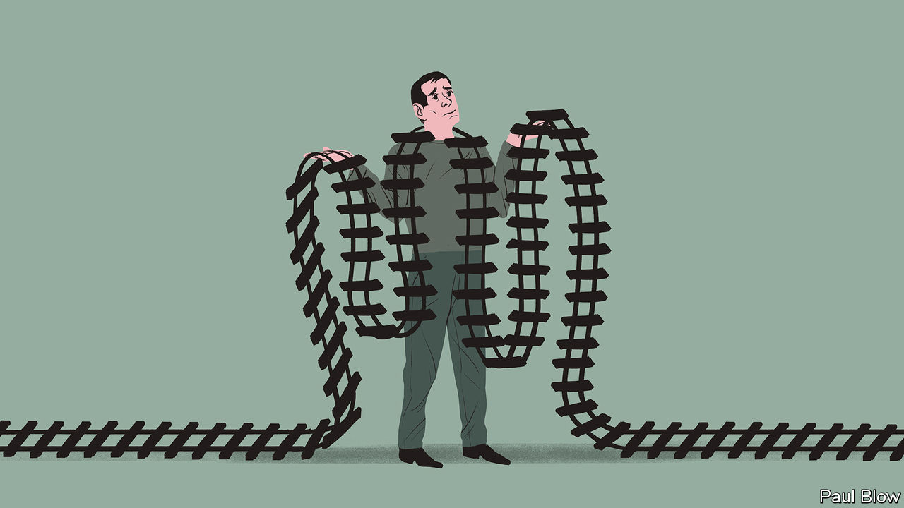

###### Bartleby

# From high-speed rail to the Olympics, why do big projects go wrong? 

##### An entertaining new book spots the common threads between mega-snafus 

 

> Mar 16th 2023 

Lots of countries have big construction projects that become a byword for ineptitude. In America the “Big Dig”, a highway project that snarled up the centre of Boston for years, came in five times over its initial budget. The stadium built for the Montreal Olympics in 1976 was unaffectionately known as the “Big Owe” after costs overran massively; the debts from the games were paid off only 30 years later. Even the Germans get megaprojects wrong. Ground was broken at Brandenburg Airport in Berlin in 2006, and the first flights took off in 2020, ten years later than scheduled. 

The embarrassment caused by Britain’s biggest construction project is set to last for many years yet. A plan to build a high-speed railway, called HS2, down the spine of England was approved by the government in 2012. This month came confirmation of another in a long series of delays. Now the first passengers will only get on board some time in the 2030s, if they are lucky. Costs have doubled from their initial estimate; bits of the route have been lopped off; and the trains will not zip along as quickly as originally planned. 

Megaprojects like HS2 are the subject of an entertaining new book called “How Big Things Get Done” by Bent Flyvbjerg, an academic at Oxford University who specialises in such things, and Dan Gardner, a journalist. Mr Flyvbjerg is the compiler of a database of over 16,000 projects, which tells a grimly consistent tale of missed deadlines and shattered budgets. By his reckoning, only 8.5% of projects meet their initial estimates on cost and time, and a piddling 0.5% achieve what they set out to do on cost, time and benefits. 

Mr Flyvbjerg’s advice is not a guarantee of success: his team was involved in assessing the risks associated with HS2. But the picture that he and Mr Gardner draw of why projects, large and small, tend to go wrong is compelling. 

Over-optimistic time and cost estimates stem from both psychological and political biases: a reliance on intuition rather than data, and a problem that Mr Flyvbjerg and Mr Gardner call “strategic misrepresentation”. This is when budgets are deliberately lowballed in order to get things going, on the premise that nothing would ever get built if politicians went around being accurate. The sunk-cost fallacy, whereby people hesitate to halt projects because money spent will seem to have been wasted, means that the plug is seldom pulled once work is under way. 

Planning is too often done in haste. The authors laud Pixar’s methodical approach to developing and testing films in great detail before they go into production. They also tell the story of how Frank Gehry’s meticulous architectural models helped ensure the success of the Guggenheim Museum in Bilbao. By keeping to a minimum the window when the project is actually being implemented, thorough planning reduces the probability of unexpected events derailing things. The people running HS2 seem to disagree. In theory the most recent delays enable the British government to spend less money each year; in practice they just increase the risk of yet more things going wrong.

Big bespoke projects are particularly likely to run into trouble. The more that a project can be disaggregated into replicable processes, the better its prospects. Mr Flyvbjerg’s database shows that solar-power and windpower installations stand the best chance of not going wrong, in part because standard components can be snapped together into arrays and turbines. At the other end of the risk scale lie gigantic one-off efforts like nuclear-power stations and the Olympic games. 

Mitigating the dangers inherent in big bespoke projects is possible. Some think the future of nuclear energy lies in modular reactors. Paris, the city hosting next year’s summer Olympics, is using existing facilities for most of the sporting venues. Standardised designs and manufacturing processes for everything from train tracks to viaducts helped China build the world’s largest high-speed rail network in less than a decade at the start of this century. 

Projects run into problems for specific reasons as well as general ones: Britain’s quagmire of planning rules is not something that China had to worry about, for instance. And the timescales, the scrutiny and the objectives of big public-infrastructure projects differ from those of corporate initiatives. But there are lessons here for managers of all stripes. If you plan rigorously and standardise where possible, you are less likely to dig yourself into a hole. ■


