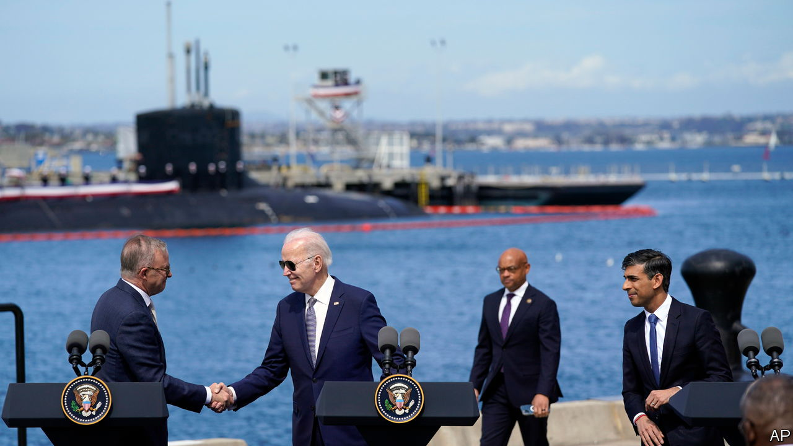

###### Nuclear submarines

# The AUKUS pact is a model for Western allies 

##### Pooling talent and resources is the only way to match China’s heft 

 

> Mar 16th 2023 

Australian and British sailors have been visiting American submarines for decades. It would be hard to imagine closer allies than their three countries. But as those sailors approached the engine room they would come to a watertight door that even they could not pass. For beyond it lay one of America’s most sacrosanct technologies, shared only with Britain in 1958: nuclear propulsion. The  throws that door open, pointing the way to a new phase in the West’s competition with China.

Under the plans announced on March 13th by Anthony Albanese, Joe Biden and Rishi Sunak, the leaders of Australia, America and Britain, Britain will co-design and build a  with Australia. To bridge the gap until the first boat arrives in the 2040s, America and Britain will rotate subs through Perth in the 2020s and America will sell up to five Virginia-class nuclear submarines to Australia in the 2030s. Each of these steps is unprecedented.

The scheme is fraught with risks. The cost to Australia is eye-watering. America is struggling to produce enough subs for its own navy. The project will have to survive the vicissitudes of politics and budgets in all three countries for at least two decades. But that is partly the point. Like-minded leaders have bound themselves and their successors into a long-term commitment not to watch passively as China starts to dominate Asia.

Worries over nuclear proliferation are overblown. The submarines will be nuclear-powered, but not nuclear-armed. Their reactors will contain highly enriched uranium, but it will be supplied to Australia in units that are welded shut. The boats will not need refuelling during their time in service. Even when they are decommissioned, the fuel cannot be used for weapons without processing in facilities that Australia does not have.

The deal has also raised concerns over regional stability. Why, critics ask, is a mid-sized power in the southern Pacific acquiring weapons that can strike thousands of kilometres away near China’s coastline? China is not the only country to have raised such objections. On March 14th Malaysia released a statement urging countries to refrain “from any provocation that could potentially trigger an arms race”. But the truth is that the arms race started long ago and China has sped ahead.

China’s defence budget has been growing at spectacular rates. It now exceeds those of Australia, India and Japan combined. Between 2014 and 2018 alone, China’s navy—now the largest in the world—launched warships with a greater total tonnage than the navies of France, Germany or India. It has built 12 nuclear submarines in the past 15 years, and has just announced that it will raise defence spending by around 7% this year. Australia is not the only regional power to be bothered by these trends. Japan, too, has accelerated its re-armament.

Mr Biden should be commended for taking bold steps to shore up Asian alliances at the same time as he provides extraordinary support—$77bn of military and financial aid so far—for Ukraine’s war effort. It shows that America need not abandon Europe to deter China as some, like Ron DeSantis, the Republican governor of Florida and a likely candidate for the presidency, seem to think. It is vital that Congress smooths the way for technology-sharing with Australia and Britain, not just for submarines but also for the second “pillar” of aukus, which covers emerging technologies like artificial intelligence, quantum navigation and hypersonic missiles.

In a review of  published on March 13th, Britain described China as an “epoch-defining challenge” that would touch on every region and issue. One recent study of high-impact research papers found that China is the leading country in 37 of 44 key civilian and military technologies, often producing more than five times as much influential research as its closest competitor. 

Allies can match that effort only by acting together. aukus is therefore a model. It involves a trade-off between sovereignty and capability. America must share its most hallowed secrets, but gains Australian investment in its struggling shipyards, access to more Pacific ports and, ultimately, greater allied firepower in Asia. Australia gets world-class naval technology in exchange for tighter integration with American war plans. All three countries enjoy economies of scale. Their pooling of talent and resources is the way forward. ■

