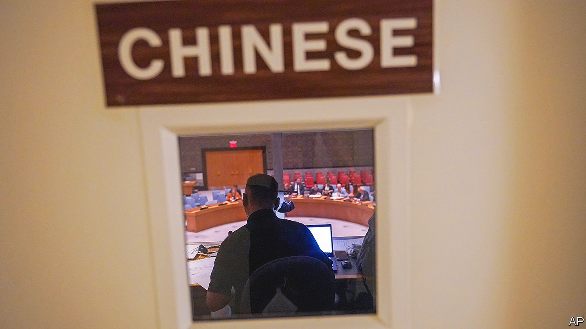

###### Freedoms and failures

# China may face more embarrassment over its human-rights record 

##### More countries appear willing to call out its treatment of the Uyghurs 

 

> Mar 23rd 2023 

ON PAPER, CHINESE diplomacy was victorious. Last October the UN’s Human Rights Council (HRC) voted by 19 to 17 against holding a debate on a long-delayed report which concluded that China may have committed “crimes against humanity” by mistreating Uyghurs in Xinjiang. The Chinese delegation expended extraordinary energy in seeking to persuade HRC members to vote against the resolution, which would merely have triggered a discussion in the council lasting a few hours.

China was determined to avoid what, in its eyes, would have been a humiliation. President Xi Jinping himself was said to have telephoned several of his counterparts to ensure that their representatives in Geneva voted the Chinese way. His chief delegate in the city “literally camped at the gates” of the residence of the wavering Mexican ambassador in order to badger him on the day of the vote, says a Western diplomat. Sure enough, Mexico limply abstained, along with Brazil and India. 

But that is not the end of the matter. Western diplomats and human-rights campaigners argue (optimistically) that failures by China to get its way in other international forums presage an erosion of its influence in the human-rights arena. The closeness of the HRC vote was “a massive step forward”, says a seasoned rights monitor. “It was the first time China had ever been directly tackled in the HRC.” 

Human Rights Watch, a monitor, has tracked a gradual increase in the number of countries willing to name China in the HRC and other forums, where “country-specific” criticism has habitually been frowned upon, especially by the many countries who fear their own records may be put in the spotlight if naming and shaming becomes the norm. In 2016 only a dozen countries signed a letter written by the American ambassador to the HRC’s president, complaining about China’s human-rights abuses. In 2020 a similar German-led statement in the UN General Assembly launched with 39 signatories; one last year got 50. Not a huge tally, but a clear trend.

The HRC is an odd body. Nobody pretends that its 47 members, which include Cuba, Eritrea, Pakistan and Uzbekistan, as well as China, are chosen for their spotless records. Members are elected for three years in five regional groups on pre-cooked lists (ie, if there are five vacancies there will be only five candidates). A few years ago Somalia got more votes than Denmark. 

Even in this questionable company China has been losing ground. When it was elected in 2016, it won the most votes in its group. In 2020, when it was re-elected, it won the least. Once back on the council, it fought hard to ensure that its preferred candidate became president. But it failed to prevent a Fijian, who genuinely believed in promoting human rights, from being elected instead.

China is finding it harder to win leadership posts across the UN’s many agencies. A recent report by the Lowy Institute, a think-tank in Australia, says that China’s efforts “whether in terms of funding, staffing, voting alignment or drafting of UN language, often yield mixed results.” A Singaporean easily defeated a Chinese candidate to head the World Intellectual Property Organisation in 2020. A few months ago an American woman thrashed a Chinese-backed Russian to become head of the International Telecommunications Union. 

China and Russia both aim to redefine the terms of human rights, tilting them away from individual freedoms towards an emphasis on social and economic progress. In the run-up to the 75th anniversary in December of the universal declaration of human rights, they have encouraged talk of junking the Western-led liberal consensus that has prevailed, more or less, since the end of the second world war. 

They were both keen to prevent a much-discussed UN convention on crimes against humanity, which would technically be binding. But at the end of last year a medley of countries led by Bangladesh, the Gambia and Mexico infuriated China and Russia by paving the way towards one in a committee of the UN—and gathering an unstoppable wave of support in the General Assembly. A recent article in  magazine sums it up, bleakly from China’s point of view: “Moscow and Beijing got outfoxed. And they knew it.” ■


