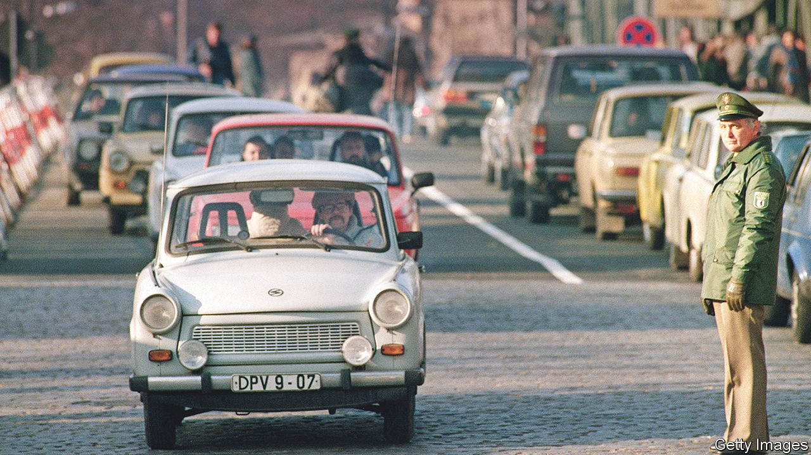

###### Inside the GDR

# “Beyond the Wall” adds depth to caricatures of East Germany 

##### “There was oppression and brutality,” Katja Hoyer writes, but also “opportunity and belonging” 

 

> Mar 23rd 2023 

 By Katja Hoyer. 

In the eyes of its critics, the communist-run part of Germany was never a proper country. The Kremlin-backed puppet state belied its moniker, being neither German, nor Democratic, nor a Republic. To the day of  into West Germany in 1990, it was at most the “GDR”, written with inverted commas, or more contemptuously, the Zone—recalling its original status as the Soviet-occupied bit of defeated Nazi Germany. 

From this dismissive premise, cliché sprouts easily. The “East Germans” were caricatured as clueless and robotic, ill-dressed and housed in dimly lit concrete hutches. They were thought to drive ridiculous little Trabant cars, with plastic bodywork and powered by lawnmower engines. The food was notoriously awful too. The few Westerners who experienced the GDR did so when driving across it to the fleshpots of West Berlin, or when they caught a budget flight to a far-flung destination (Cuba was a favourite) at the dismal Schonefeld airport. 

In “Beyond the Wall”, Katja Hoyer adds depth, texture and colour to this simplistic picture. Her book’s backbone is a vivid political history of the communist German state. The people who founded it were relics, survivors of the Stalinist purges that wiped out three-quarters of the exiled communists who had fled to the Soviet Union in the 1930s. Her sharply drawn pen-portraits bring to life Walter Ulbricht, the ghastly party overlord, and his cronies. Only their “abdication of morality”, she writes, enabled them to escape the purges. 

This “ideological sediment” of diehard loyalists determinedly recreated the Soviet system they revered. They faced a population traumatised by defeat (and the accompanying mass rapes by Soviet soldiers), along with an economy crippled by their occupiers’ relentless demands for reparations. Harsh economic conditions prompted the workers’ uprising of 1953. It was bloodily crushed by the Soviets, dispelling any pretence that the place was run on behalf of the toiling masses.

Relations with the Kremlin were perennially mistrustful. The Soviet leadership would have readily sacrificed its comrades in Berlin if that meant securing a neutral, demilitarised Germany. Moscow also disliked warming ties between the two Germanys, though by the end West German bail-outs were keeping the easterners’ economy afloat. 

Amid the great-power machinations, East Germans were real people, not cartoon characters from a cold-war comic book. They lived as best they could inside a political and economic system that mostly functioned badly and harshly. Their achievements—, sporting and industrial—stoked genuine pride. Previously the author of an acclaimed history of the German empire, Ms Hoyer is now a British academic but was born in the GDR. “There was oppression and brutality,” she writes, but also “opportunity and belonging”.

Her book is packed with vignettes and anecdotes that bring this half-forgotten side of German history to life. Your reviewer was a foreign correspondent covering the GDR in the late 1980s and married an East German. These stories ring true. 

The book challenges Western smugness. Social mobility was far more common in East Germany than West Germany, Ms Hoyer relates. Working-class people went to university in much greater numbers. Child-care provision was superior. Unlike the situation in West Germany at the time,  could be army officers in the GDR. When their country was abolished, they were promptly sacked. 

These are all fair points. West Germany itself was stiflingly conformist. Not only that, it was infested with Nazis in its early decades, plagued by political corruption and subject to hidden American tutelage. It came close to adopting police-state tactics against terrorism in the 1970s. 

For all that, West Germany defies comparison to the brutal sham in the east. Cheap Soviet energy mitigated the gdr’s economic failures. Snooping and bullying by the secret policemen of the  cowed its people. So did the presence of some 350,000 Soviet troops. For most of its existence it murdered people caught escaping. 

These features of life in the GDR were fundamental not incidental, whether in its heyday decade after the mid-1960s or its moribund decay in the 1980s. Ms Hoyer rightly highlights the gaps in modern Germany’s understanding of the four decades of oppression in its eastern regions and the resentments that bequeathed. But sentimentality and relativism distort her evaluation of a loathsome dictatorship. ■


