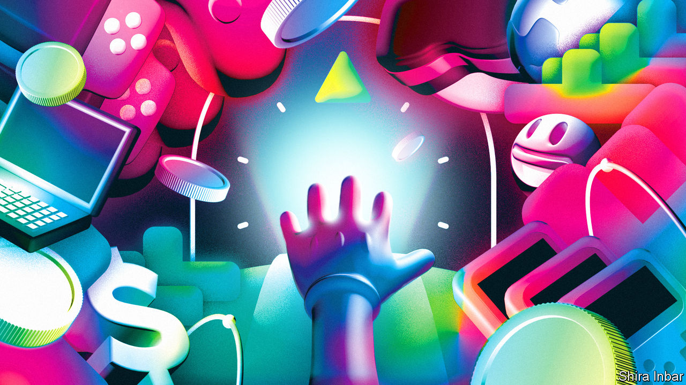

###### The future

# How digital gaming spreads far and wide 

##### Video games are becoming platforms for more than play 

 

> Mar 20th 2023 

After arriving by parachute, the spectators rushed to a concert in a park. Next they went to a grimy city, where they escaped a snarling, fiery monster. Then they flew to a stadium to see a show, during which they floated around the arena.

A game? A gig? A social event? The makers of this live production, staged on January 27th by The Kid Laroi, an Australian rapper, opted for “immersive sonic experience”. It took place in “Fortnite”, an online multiplayer game that is often a venue for mass virtual gatherings. It was the latest case of games being the platform of choice for digital activities that go beyond conventional play.

There was a burst of excitement about such experiences in 2021, when they were dubbed part of the “metaverse”, a term coined in “Snow Crash”, a 1992 novel by Neal Stephenson. This virtual space would form “a new economy that is larger than our current economy”, promised Jensen Huang, chief executive of Nvidia, a chipmaker. Mark Zuckerberg changed Facebook’s name to Meta and called it a “metaverse company”. The buzzword featured over 500 times on company earning calls in the final quarter of 2021, says a tally by GlobalData, a research firm. But the metaverse has fallen out of fashion. It became linked to the boosterism for cryptocurrencies and non-fungible tokens before their crash in 2022. Investors’ excitement turned to impatience, not least at Meta, whose share price plunged by 65% last year. Last month Mr Zuckerberg announced cuts and a “year of efficiency”.

One reason for disillusionment with these virtual worlds is the slow pace of improvement of virtual and augmented reality (VR and AR), technologies that bring such environments to life. About a quarter of American adults under 40 own a VR headset, largely thanks to Meta, which sold truckloads of its Quest 2 goggles to a bored, locked-down audience. But headsets are more of a novelty than the ubiquitous platform Mr Zuckerberg predicted. Apple’s first headset, due later this year, may cost several thousand dollars. “There’s a very high entry-barrier for users, particularly in emerging countries,” says Kim Chang-han, chief executive of Krafton, whose free games are played mostly on mobile phones.

The delayed arrival of good, cheap VR and AR technology means most immersive online experiences are still on ordinary screens, where games are the leaders. “I didn’t see video games coming when I wrote ‘Snow Crash’. I thought that the killer app for computer graphics would be something more akin to TV,” Mr Stephenson wrote. “Thanks to games, billions of people are now comfortable navigating 3D environments on flat 2D screens.”

Games like “Fortnite” have created the cheapest and most realistic 3D environments. This became clear in the pandemic, when real-world gatherings hastily went online. After South by Southwest, a festival in Austin, Texas, was cancelled in 2020, revellers decamped to “Minecraft” for a virtual festival called Block by Blockwest. Bored by Zoom, some people staged work meetings in games. “Red Dead Redemption 2”, a cowboy adventure, facilitated cosy team chats around the campfire (as well as shoot-outs).

Lockdowns may have lifted, but the use of gaming environments for other purposes has continued. Roblox has staged concerts and fashion shows, as well as educational events for organisations like the Museum of Science in Boston, which organised a virtual mission to Mars. FIRST, an educational outfit which organises robot-building contests for children, runs them on Roblox too. Epic Games, which makes “Fortnite”, is working with the lego Group to build what it calls a metaverse for children.

As games evolve, they swallow up experiences that once belonged to other media. Last year “The Walking Dead”, a long-running TV drama, staged an interactive experience on Facebook Gaming. Users participated in daily activities to determine how the story would unfold. GenVid Technologies, which created the hybrid game-cum-show, will launch a similar experience based on “Silent Hill”, a long-running video game. Netflix has used streaming to create interactive TV shows where viewers can choose how the plot develops. And where once people watched fitness videos, increasingly they play fitness games. In February, after a battle with regulators, Meta acquired Within, which makes VR workout experiences. In the same month Tencent invested in Quell, a British maker of fitness games.

Many believe that AR, which maps video graphics onto the user’s vision of the real world, will be the next big tech platform. Tim Cook, Apple’s boss, has called it “profound”. Yet today the most successful AR app is “Pokémon GO”, a monster-hunting game in which players use mobile phones to track down animated creatures. Technology honed in “Pokémon GO” has allowed Niantic, its American developer, to devise a system for mapping the world in AR, something that will have widespread uses if AR glasses become mainstream.


Gaming’s lead in these new platforms is down to technology overlaps. But another explanation is behavioural. “Games, even before video games, were a way for people to meet one another and spend time together socially,” says John Hanke, Niantic’s chief executive. “So when you talk about getting people together through some electronic mediation, games are already a natural fit.” As interactions are more electronically mediated, gaming touches all corners of life. “Perhaps one day, we won’t even have the term ‘gamer’,” says Jim Ryan, chief executive of Sony’s gaming division, “because everyone will play in some form or other.”■

