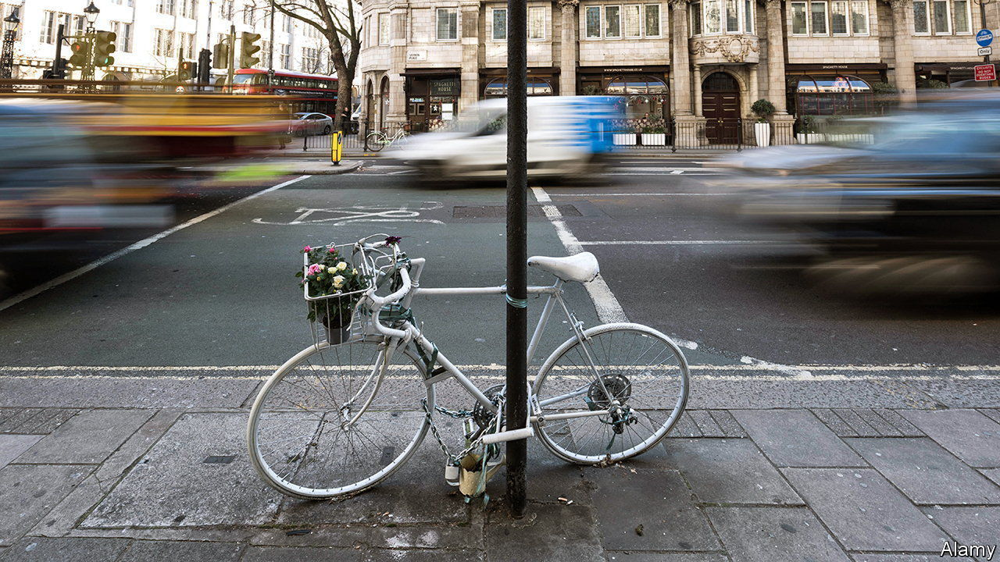

###### Accident zone

# Can London stop deaths and serious accidents on its roads? 

##### The city’s “Vision Zero” programme identifies its most dangerous junction 

 

> Mar 30th 2023 

Official figures show that 101 people were killed in road accidents on the streets of London last year. The mayor, Sadiq Khan, wants to reduce the number of deaths and serious injuries on the capital’s roads to zero by the curiously specific date of 2041. He is a believer in “”, an initiative to eliminate road deaths that started in Sweden. 

Nought is an implausible target. But it focuses minds on an extremely important question: what reduces collisions in a big city? Transport for London (TfL), the capital’s road and rail authority, puts its answers into five categories so broad they verge on the insipid: safe speeds, safe vehicles, and so on. But there is real value in the detail. A safety standard for Heavy Goods Vehicles (HGVs), which harnesses blind-spot cameras and close-proximity sensors, is pioneering. The European Commission has followed it. 

TfL has also helpfully identified London’s most lethal places. Half of Britain’s most dangerous roads run through the capital. Research in 2021 found that the A1010, which stretches from Tottenham to Waltham Cross in the north of the city, sees the most accidents per vehicle-miles driven of any in the country. Around three-quarters of collisions that cause death or serious injury happen at junctions; the Holborn gyratory, near the British Museum, has been the site of the most deaths since 2012. Westminster is the most dangerous borough for pedestrians and cyclists: it introduced 20mph speed limits on all its roads in 2021. 

“Vision Zero” was launched in 2018. Deaths and serious injuries on London’s roads have fallen—by 53% and 40% respectively in 2022 compared with a 2005-09 baseline. But movement is not one-way. Fatalities were record-breakingly low in 2020 and 2021, when lockdowns kept people at home. But in 2022 the death toll rose again. “We are moving in the right direction”, says Will Norman, London’s walking and cycling commissioner, “but sometimes we are running to stand still.” 

Bureaucratic obstacles, and a funding crisis for TfL brought about by the pandemic, have impeded work to improve the riskiest spots. Only a few parts of the A1010 have bike lanes with barriers. TfL has improved 43 of London’s most dangerous junctions, but Camden council did not adopt a plan to change the Holborn gyratory until the end of 2022. 

Mr Khan’s embrace of “Vision Zero” is driven in part by another 2041 target—for 80% of journeys in the capital by then to be made by walking, cycling or taking public transport. Safety is the biggest barrier to people taking up cycling or letting their children walk or cycle. But greener vehicles may be unsafe themselves. , suggests Mr Norman, are the latest thing to flummox planners. “One of those doing 50mph down the A12 is not good for anybody.”■


