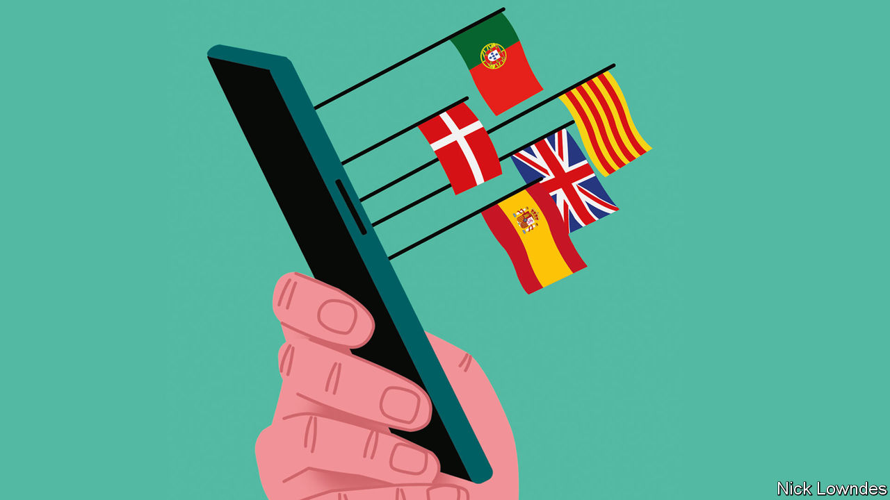

###### Johnson

# ChatGPT is a marvel of multilingualism 

##### It may make things up, but it does so fluently in more than 50 languages 

 

> Mar 29th 2023 

THE HYPE that followed ChatGPT’s  last year was, even by the standards of tech innovations, extreme. OpenAI’s natural-language system creates recipes, writes computer code and parodies literary styles. Its latest iteration can even describe photographs. It has been hailed as a technological breakthrough on a par with the printing press. But it has not taken long for huge flaws to emerge, too. It sometimes “hallucinates” non-facts that it pronounces with perfect confidence, insisting on those falsehoods when queried. It also fails basic logic tests.

In other words, ChatGPT is not a general , an independent thinking machine. It is, in the jargon, a large language model. That means it is very good at predicting what kinds of words tend to follow which others, after being trained on a huge body of text—its developer, OpenAI, does not say exactly from where—and spotting patterns.

Amid the hype, it is easy to forget a minor miracle. ChatGPT has aced a problem that long served as a far-off dream for engineers: generating . Unlike earlier versions of the system, it can go on doing so for paragraphs on end without descending into incoherence. And this achievement’s dimensions are even greater than they seem at first glance. ChatGPT is not only able to generate remarkably realistic English. It is also able to instantly blurt out text in more than 50 languages—the precise number is apparently unknown to the system itself.


Asked (in Spanish) how many languages it can speak, ChatGPT replies, vaguely, “more than 50”, explaining that its ability to produce text will depend on how much training data is available for any given language. Then, asked a question in an unannounced switch to Portuguese, it offers up a sketch of your columnist’s biography in that language. Most of it was correct, but it had him studying the wrong subject at the wrong university. The language itself was impeccable. 

Portuguese is one of the world’s biggest languages. Trying out a smaller language, your columnist probed ChatGPT in Danish, spoken by only about 5.5m people. Danes do much of their online writing in English, so the training data for Danish must be orders of magnitude scarcer than what is available for English, Spanish or Portuguese. ChatGPT’s answers were factually askew but expressed in almost perfect Danish. (A tiny gender-agreement error was the only mistake caught in any of the languages tested.)

Indeed, ChatGPT is too modest about its own abilities. On request, it furnishes a list of 51 languages it can work in, including Esperanto, Kannada and Zulu. It declines to say that it can “speak” these languages, but rather “generates text” in them. This is too humble an answer. Addressed in Catalan—a language not on the list—it replies in that language with a cheerful “Yes, I do speak Catalan—what can I help you with?” A few follow-up questions do not trip it up in the slightest, including a query about whether it is merely translating answers first generated in another language into Catalan. This, ChatGPT denies: “I don’t translate from any other language; I look in my database for the best words and phrases to answer your questions.” 

Who knows if this is true? ChatGPT not only makes things up, but incorrectly answers questions about the very conversation it is having. (It has no “memory”, but rather feeds the last few thousand words of each conversation back into itself as a new prompt. If you have been speaking English for a while it will “forget” that you asked a question in Danish earlier and say that the question was asked in English.) ChatGPT is untrustworthy not just about the world, but even about itself.

This should not overshadow the achievement of a model that can effortlessly mimic so many languages, including those with limited training data. Speakers of smaller languages have worried for years about language technologies passing them by. Their justifiable concern had two causes: the lesser incentive for companies to develop products in Icelandic or Maltese, and the relative lack of data to train them. 

Somehow the developers of ChatGPT seem to have overcome such problems. It is too early to say what good  will do, but this alone gives one reason to be optimistic. As machine-learning techniques improve, they may not require the vast resources, in programming time or data, traditionally thought necessary to make sure smaller languages are not overlooked online.■


