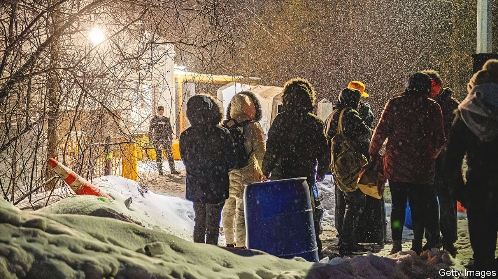

###### A stricter welcome

# Refugee-friendly Canada tightens its border with the United States 

##### Even so, the country is set to welcome more migrants through legal routes 

 

> Mar 30th 2023 

Wheeling two enormous suitcases and carrying a bulging shoulder bag, Isaïe Jean-Baptiste, his wife Stephanie and their two-year-old daughter Gloria stand on one side of a shallow ditch. On the other is a member of the Royal Canadian Mounted Police. “If you come any further you will be crossing into Canada and you will be arrested,” says the Mountie. “Understand?” Mr Jean-Baptiste, an agricultural engineer from Haiti, nods his head and steps forward to be arrested, processed and then admitted into Canada as a refugee. 

Mr Jean-Baptiste is one of many asylum-seekers who have crossed Roxham Road, an unofficial border point between Quebec and New York state, in the past year. On March 24th, however, Justin Trudeau, Canada’s prime minister, struck a deal with President Joe Biden to curb such crossings. The two leaders amended a “safe third country” agreement, which previously let Canada send back asylum-seekers to the United States only if they crossed at official border points. Now nearly all asylum-seekers crossing the 8,900km (5,525 mile) border can be sent back to the United States, unless they are an unaccompanied child or have relatives in Canada. 

Last year 40,000 migrants were caught crossing the border—the highest number since 2017, when illegal crossings started to be tracked. Despite the new agreement, Canada’s government remains keen on accepting migrants through legal routes. Mr Trudeau wants the country to welcome 500,000 new permanent residents each year by 2025. That is twice the number admitted on average between 2001 and 2014. It hints at the paradox of Canada: although it has strict immigration laws, it is far more generous than the United States.

It helps that few Canadians are opposed to migrants. Some 85% of those surveyed believe immigration is good for the economy and 69% support current or increased immigration levels. Fully 76% would like to see the country accept more refugees. By contrast, 30 years ago, when half as many immigrants came each year, 70% felt there was too much immigration.

Some of this generosity is pragmatic. Around 1m posts are unfilled across the country, about 6% of the total. With an ageing population, things are likely only to get worse. Fifty years ago there were seven workers for every pensioner; by 2035 the ratio is forecast to be 2:1. Already more than 40% of Canadians are 55 or older.

Pro-migration sentiment also stems from the fact that a quarter of Canadians today are themselves immigrants. Figures released on March 22nd by Statistics Canada show that the country’s population rose by more than 1m in 2022, or 2.7%, to 39.5m. That is the highest annual population growth rate in 60 years. Nearly all this increase was due to migration.

Partly because of the widespread support for migration, and the fact that several constituencies which determine general elections have large immigrant populations, few opposition politicians have spoken out against Mr Trudeau’s ambitious targets. Quebec is an exception. It is the only province to which the federal government has granted the right to determine how many migrants it admits each year. In 2018 the governing Coalition Avenir Québec, a conservative party, reduced the province’s immigrant intake from 50,000 to 40,000. Last year François Legault, its premier, equated increased immigration with “extremism and violence”. 

Mr Legault apologised and has subsequently toned down his language. This is probably because business owners are particularly concerned with the shortage of workers. Quebec’s population is older than elsewhere in the country, says Karl Blackburn, head of the Conseil du patronat, an employers’ group that is calling for higher immigration levels and wants to allow temporary foreign workers to become permanent residents. “These people aren’t stealing anyone’s job,” he says. “They are contributing to the growth of Quebec.” As with that province, so too with Canada.■

