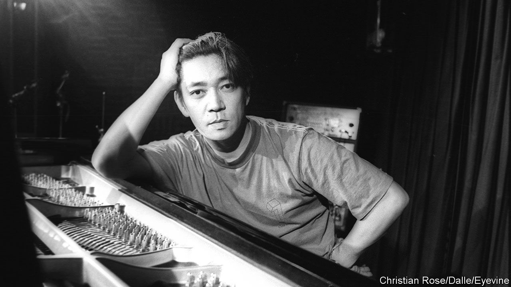

###### The sonic outernationalist

# Sakamoto Ryuichi heard how the world sounds—and changed it 

##### The legendary Japanese composer died on March 28th, aged 71 

 

> Apr 4th 2023 

SAKAMOTO RYUICHI, who died on March 28th after a long battle with cancer, once described his musical method thus: “I open my ears to the world.” But what Mr Sakamoto heard, few others could. As a member of the  band Yellow Magic Orchestra, he helped pioneer modern electronic music. As a composer of epic film scores he enlivened the work of directors such as Bernardo Bertolucci and Alejandro Iñárritu. In his later solo work, he  in haunting ambient soundscapes. His passing elicited tributes from musical luminaries around the world, testimony to the influence of his genre-spanning career. 

Mr Sakamoto was born in Tokyo in 1952 and took to music early. He graduated from one of Tokyo’s top conservatories, where he studied Western classical music, becoming especially enamoured with Claude Debussy. There, he also explored an interest in the traditional music of Japan’s Okinawa prefecture as well as in that of India and Africa. 

Early in his career, Mr Sakamoto trained his ears on the sound of technology. Yellow Magic Orchestra (YMO), a group he formed in 1978 alongside  and Takahashi Yukihiro, used synthesisers in instrumental songs intended for dancing—a novel combination at the time. “Errors or noises absorb me and I wonder if new cultural currents could emerge from this deficiency,” Mr Sakamoto said in “Tokyo Melody”, a 1984 documentary about his experiments. That was exactly what happened: Mr Sakamoto’s music helped inspire what would later become techno and hip-hop. His early work also presaged the bleeps and boops that became the soundscape of the modern digital world. (He would take a turn at composing some of those too, including ringtones for early Nokia mobile phones.)

YMO’s success made Mr Sakamoto a star in Japan, leading to a role opposite David Bowie in Oshima Nagisa’s 1983 film “Merry Christmas, Mr Lawrence”. Mr Sakamoto agreed to act in the movie on the condition that he could score it. His compositions, which blended melodic piano chords, sweeping synthesisers and Javanese gamelan, propelled him to global fame—and established his bona fides as an artist who could bridge east and west. 

“I want to break down the walls between genres, categories or cultures,” he said many years later. He described his philosophy as “outernationalism”. “Being outernational is like Moses in the desert. There’s no country.”

In the second half of his career he turned towards the sound of nature. “He listened to the wind blowing and the water falling, he listened to the rocks moving and to the leaves fluttering, and he introduced those sounds—consciously and subconsciously—into his music,” says Roger Pulvers, an author and film director. 

His sonic interests dovetailed with his politics. Unusually for a Japanese musician, Mr Sakamoto used his fame to speak out on social and political issues, including environmental preservation and the oppression of Okinawans. Nuclear power was a particular bugbear. “They know nuclear power is unnecessary and dangerous,” he railed in an interview in 2006, five years before an earthquake and tsunami rocked north-east Japan and triggered a nuclear meltdown in Fukushima. In the wake of the disaster, Mr Sakamoto travelled often to the region to support local residents. 

In 2014 a first cancer diagnosis shook Mr Sakamoto’s life. But even that could not mute his longing to hear more. The next year he composed the score for Mr Iñárritu’s “The Revenant”. Two years later he released “async”, an ambient album constructed around collages of poetry and music that was recorded partly on a water-damaged piano he found in a schoolhouse after the tsunami. In “Coda”, a documentary about Mr Sakamoto released the same year, he can be seen traversing the North Pole and dropping microphones underneath the ice. “I’m fishing the sound,” he says, grinning at the camera, before declaring his catch “the purest I’ve ever heard”.■

