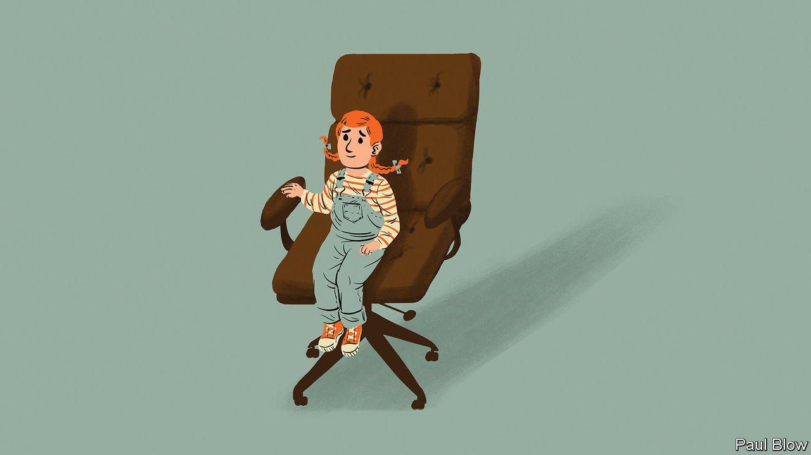

###### Bartleby

# The resistible lure of the family business 

##### The pros and cons of following in your parents’ footsteps 

 

> Apr 5th 2023 

Family business makes for compelling drama. Just ask anyone tuning in to the final season of “Succession”, which has recently begun airing on HBO. This Bartleby prefers “Buddenbrooks”, Thomas Mann’s chronicle of the decline and collapse of a German merchant family over the course of four generations. That novel, first published in 1901, drew heavily on the author’s personal experience. The dilemmas of working for an organisation which an immediate family member runs or in which they own the majority sound alarming enough in fiction, never mind real life. And nepotism can be plenty dramatic even without the plot twists. 

These days it is frowned upon—most publicly listed companies and professional firms ban it. Still, family businesses make up more than 90% of the world’s enterprises. Many of them, quite literally, are mom-and-pop shops. Some are large-ish businesses in smallish economies, like the one in Athens where this guest Bartleby, straight out of university, was put in charge of managing relations with institutional investors. A handful are giant global corporations: think of Rupert Murdoch’s media empire (which allegedly inspired “Succession”) or Bernard Arnault’s $460bn luxury conglomerate, LVMH (which, as it happens, has grown by acquiring other family firms, such as Bulgari and Fendi). 

Regardless of size, all family companies face common challenges. Filial loyalty and multi-generational thinking can morph into resistance to change, and if a firm has outside shareholders, clash with their interests. The process of generational transition can be particularly draining and frustrating to the staff members who are not family, raising uncomfortable questions about social mobility, or the lack thereof. 

For the corporate heir, meeting family expectations and continuing a legacy while achieving personal fulfilment can generate a mass of contradictions, as Mann splendidly illuminated. Even in companies that insist they are meritocratic, no amount of skill will convince all your colleagues that you have actually earned your job. Any pre-existing domestic frictions might make their way into the business. And vice versa: disagreements over the business can breed feuds, often between siblings. In India, the bitter dispute between Mukesh and Anil Ambani over their inherited empire, Reliance Industries, lasted for years after their father died without leaving a will. 

No wonder some heirs decide to hold on to their shareholdings, perhaps a board seat, but pursue a career elsewhere. Not all Waltons work for Walmart; it is hard to find Hoffmanns among executives at Roche, the Swiss drugmaking giant founded by their forebear in 1896. They thus avoided being accused of belonging to the “lucky sperm club”, as Warren Buffett calls those who might well possess the managerial skills to lead a large organisation but never had to jump through the same hoops as everyone else. Hilton and Marriott, two of the world’s biggest hotel chains, as well as Lego, a toymaking giant, are examples of companies which did not produce a strong successor and eventually ended up in the hands of professional managers.

For those who nevertheless decide to take an active role in the family business, it does not have to be a poison. Some of the logic that historically made family firms de rigueur continues to stand. For example, designated heirs—like Mr Arnault’s five children, all of whom now run parts of LVMH—are groomed early on, so by the time they are ready to take over they have already acquired some industry knowledge by osmosis. 

At the personal level, work is not solely about money but also about empowerment and prestige. Your name on the door may bestow a sense of purpose. Preserving the legacy of an empire can be rewarding, so long as the heir displays passion and persistence. They can probably forget being one of the gang when it comes to office gossip, but they can earn their colleagues’ and subordinates’ respect with modesty and hard work. The serious heir knows that showing up simply because it is easier than venturing out on their own doesn’t cut it.

Ultimately, being entrusted with a business by people who share your DNA is something you ought to earn, not expect. As the adage goes, “A family business is not a business you inherit from your parents, it is a business you borrow from your children.” Disregard for this nugget of wisdom is what makes “Succession” such riveting television—and Waystar Royco so dysfunctional.


 (Mar 30th)


