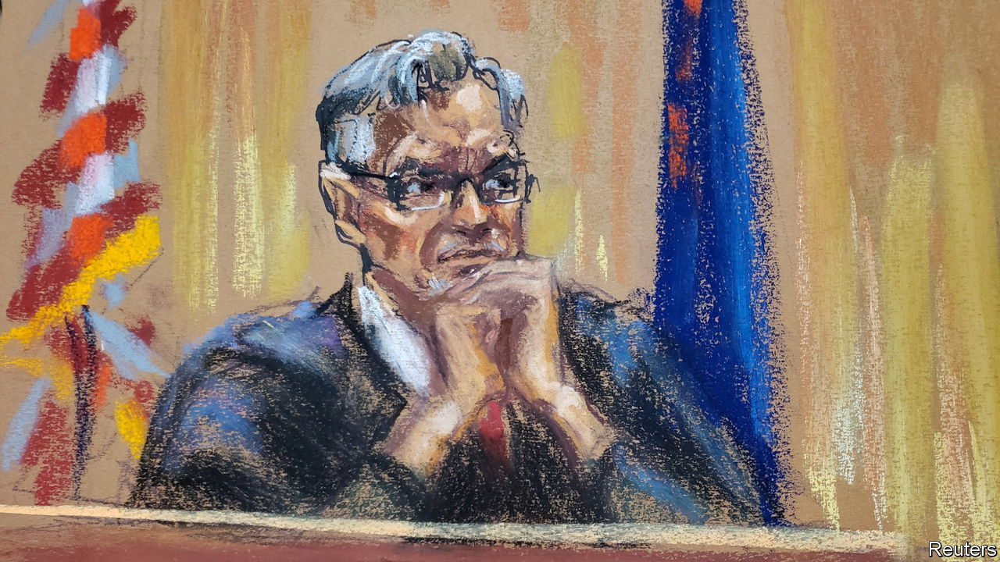

###### The Economist explains

# Who is Juan Merchan, the judge overseeing Donald Trump’s arraignment? 

##### This is not the first Trump-related case he has presided over 

 

> Apr 4th 2023 

“THE JUDGE ‘assigned’ to my Witch Hunt Case, a ‘Case’ that has NEVER BEEN CHARGED BEFORE, HATES ME.” When Donald Trump found out who would be presiding over his arraignment he took to Truth Social, the social-media platform he founded, to rant. On March 30th the former president was  in a probe relating to hush money paid to a porn star. He will surrender for booking and arraignment on April 4th. Mr Trump has reserved most of his anger for , who as Manhattan’s district attorney issued the indictment; he claims Mr Bragg is politically motivated. But the former president has also attacked Juan Merchan, the judge who was (randomly) assigned to his case. Who is Judge Merchan, and why is Mr Trump so worked up about him?

According to the Mr Merchan was born in Colombia and emigrated to the United States in the late 1960s as a six-year-old child. He grew up in the ethnically diverse neighbourhood of Jackson Heights in Queens, which is also Mr Trump’s home borough. Before entering law Mr Merchan worked as an auditor for a property firm, a dishwasher and a night manager at a hotel. His first judicial appointment came in 2006, when Michael Bloomberg, then mayor of New York City, made him a judge in the Bronx family court. Since 2009 he has served on New York’s state Supreme Court, presiding over criminal trials. 

This is not Mr Merchan’s first Trump-related case. He is overseeing a criminal case against Steve Bannon, a former Trump adviser, who has pleaded not guilty to charges of fraud and money-laundering related to fundraising for a wall along the border with Mexico. That case is expected to go on trial in November. In late 2022 Mr Merchan oversaw a trial in which a jury found Trump Corporation and Trump Payroll Corporation, entities of the former president’s property business, guilty of a host of crimes, including conspiracy, tax fraud and falsifying records. Mr Merchan fined the two companies $1.6m—the maximum allowed by law. Before the jury deliberated he reminded its members that they should set aside personal feelings: “Donald Trump and his family are not on trial here,” he said. 

Yet Mr Trump claims that Mr Merchan treated his companies “VICIOUSLY”. Indeed, the Brennan Centre for Justice, a think-tank, has found that Mr Trump has a pattern of attacking the authority of the judiciary, both on political matters and in connection with civil cases to which he is a party. But Mr Merchan is unlikely to take Mr Trump’s vitriol personally. Its main effect may not be welcomed by Mr Trump: a potential order to the former president not to post on social media anything relating to the hush-money case. 

On April 3rd Mr Merchan made his first ruling since the indictment—and he sided with Mr Trump’s legal team. Several media organisations had sought permission to broadcast the arraignment. But Mr Trump’s team said news cameras would create a “circus-like atmosphere” and be “inconsistent with President Trump’s presumption of innocence”. Mr Merchan concurred. A small number of journalists will be allowed in the courtroom, but will not be permitted to use laptops or mobile phones during the proceedings. 

“The way to approach a case like this is to be a kind of judge from central casting,” says Rebecca Roiphe, a professor at New York Law School and a former prosecutor. Defence lawyers tend to inject emotion to distract the jury, cast doubt on evidence and fluster witnesses. But “to project fairness”, says Ms Roiphe, Mr Merchan will be calm, measured and keep sentiment out of the proceedings as much as possible. 

Mr Trump’s team are particularly adept in the legal arts of emotional manipulation. But they seem to realise, even if their client does not, that impugning the judge’s integrity will not help their case. After Mr Trump attacked Mr Merchan on Truth Social, Joe Tacopina, one of the former president’s lawyers, pooh-poohed criticism of him. “Do I think the judge is biased? Of course not.” ■

