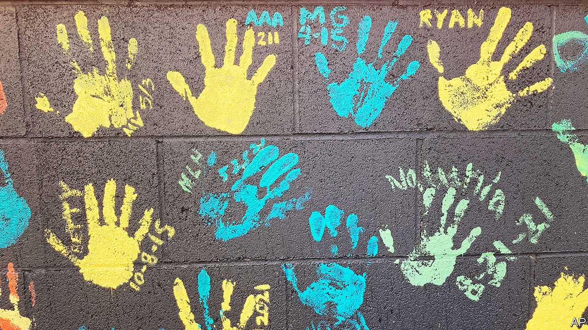

###### The Oregon experiment

# Oregon’s drug decriminalisation has had a troubled start 

##### The state was the first in America to try it—and its experience holds lessons for others 

 

> Apr 13th 2023 

“We’re known for microbreweries and marijuana—and now fentanyl and tent cities,” says Tony Vezina, who runs 4D Recovery, an addiction-recovery organisation in Oregon. Driving around Portland’s Old Town, he points out people smoking fentanyl from pieces of tinfoil. Things were different a dozen years ago, when he was addicted to drugs: then, “you couldn’t just be using out in the open.” 

There are now few, if any, repercussions for having some drugs in Oregon, after the state voted in 2020 to decriminalise the possession of small amounts of drugs. Now, instead of being arrested, if people are caught with substances including fentanyl, heroin, methamphetamine and LSD, they are issued with citations, similar to speeding tickets, and fined up to $100. That fine is waived if the offender calls a hotline and has a health assessment. 

The state has ranked among the highest in America for  and lowest for access to treatment. Using the criminal-justice system to treat addiction “was a miserable failure”, says Mike Schmidt. As the district attorney in Multnomah County, including Portland, he was in charge of prosecuting possession, but he campaigned for decriminalisation. 

Although no one was in prison solely for possession before decriminalisation, a criminal record could make it harder to get a job or a house. Black Oregonians were 2.5 times more likely to be convicted of a possession felony than whites. “People suffering from addiction need help, not criminal punishments,” the campaign for the ballot measure proclaimed. Oregonians agreed: 58% voted to decriminalise possession.


Since decriminalisation went into effect in February 2021, help seems hard to come by. It is difficult to know what impact the policy has had on drug use in Oregon in the two years since—especially as, in the country as a whole, use . But deaths from drugs rose sharply. The overdose death rate in Oregon almost doubled between 2019 and 2021, compared with a national rise of 50%. 

Trying to get people into treatment through citations does not work, says Keith Humphreys of Stanford University. Without meaningful pressure on drug addicts, he says, “there is no mechanism at all to get them to change their behaviour.” From the 4,000 citations issued in Oregon in the first two years of the policy, fewer than 200 people called the hotline and fewer than 40 were interested in treatment. It has cost taxpayers $7,000 per call. 

“For a lot of people, the criminal-justice system is their rock-bottom,” says Paige Clarkson, the district attorney in Oregon’s Marion County. Law enforcement had been a tool to push people into treatment, she argues, and decriminalisation “completely negated that tool”. Few jails offer high-quality treatment, but across the country, in 2019, 27% of Americans entering public addiction treatment were sent by the criminal-justice system. 

Portugal decriminalised possession of drugs for personal use in 2001, the first country to do so. There, drug-induced deaths have since fallen and street dealing is uncommon. But Portugal’s policy is different: offenders are taken to a police station and must go before a dissuasion panel at the Ministry of Health. Fully 80% of addicts then choose to start treatment. Repeat offenders face punishment, like being banned from bars, or community service, enforced by police. “The state still has a paternalistic approach,” says João Goulão, one of the architects of Portugal’s effort. 

Supporters of Oregon’s policy hope that peer mentors—former addicts—can encourage people to enter treatment voluntarily. They were allocated extra funding in the same ballot measure in 2020. But although possession was decriminalised three months after voting, it took another 20 months for the funding to roll out fully. “If I had to do it all over again, I think I would reverse the way that we’ve done it,” reflects Rob Nosse, a state representative.

Even with the extra funding now being spent, Oregon’s drug treatment remains woefully scarce. Addiction-support workers in Portland estimate that the wait for residential treatment can be up to three months. Recent state analysis found that it needed 60% more inpatient facilities. But the extra money will be going to other services, like the mentors, as well as  and supported housing.

Oregon is the only state to have attempted decriminalisation. But the bad results may not dissuade others from trying it. Bills to decriminalise possession have been introduced in nine states, including Massachusetts, New York and Washington. In Canada, British Columbia has unveiled its own decriminalisation pilot.

Boosters say decriminalisation has already brought benefits to Oregon, estimating that 7,000 fewer people have been arrested, and that the additional gains need time to become apparent. Oregon’s legislature is in session, but no major reforms are planned. “Give it a chance,” says Mr Nosse.

Yet some have already changed their minds. Mingus Mapps, a member of Portland’s city council, supported decriminalisation. Now he is more wary, particularly of those pushing patience. “You just have to look out on the sidewalks,” he says, “we really don’t have more time.” Mr Mapps regrets that Oregon dismantled a system to deal with addiction, albeit a flawed one, without planning what would replace it. ■


