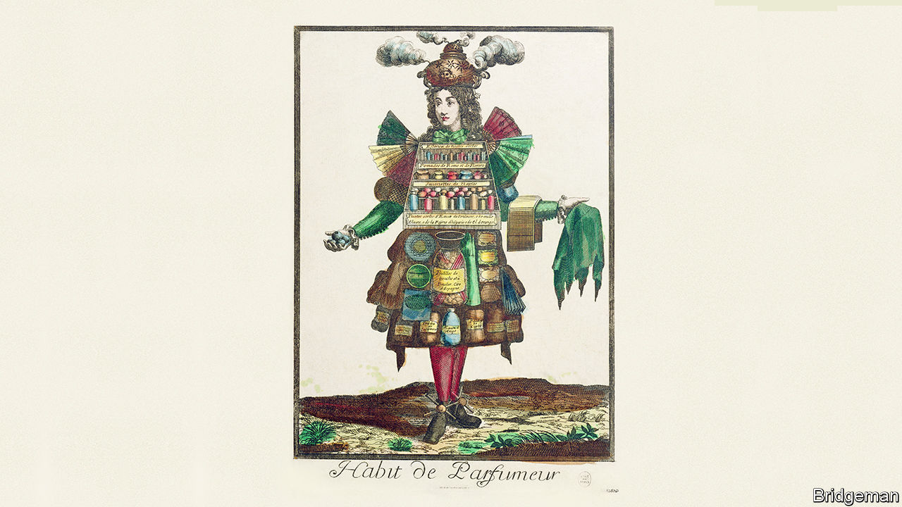

###### On the scent

# Two perfumers helped lay the foundations of organic chemistry 

##### “Elixir” is an account of scientific discovery as well as a cultural history of perfume 

 

> Apr 19th 2023 

By Theresa Levitt. 

By day, Édouard Laugier and Auguste Laurent worked in the back room of Laugier Père et Fils, a Parisian perfumery established by Laugier’s grandfather. Surrounded by boilers and flasks, they distilled the cinnamon, mint, orange peel and rose that were among the base materials for the  sold by the shop. After hours, the two men, who had met on the  in the early 1830s, and who shared a passion for chemistry, turned to an enigma that had baffled the brightest minds in Europe. 

What separated living from non-living matter? The pair’s work helped lay the foundations of organic chemistry—the study of molecules that contain carbon, the building block of living things. In “Elixir” Theresa Levitt, a professor of history at the University of Mississippi, situates the late-night quest of the two young chemists in its cultural and scientific context.

The author’s comprehensive account includes some enjoyable diversions into the soap shortage of 1793, the best time to pick jasmine for its extract (early morning) and the number of ingredients in Chartreuse liqueur (130). At times, her immense cast of characters threatens to subsume her two subjects as well as the reader. Fortunately, the book’s back matter includes a list of the .

Ms Levitt is especially good at evoking the all-consuming nature of scientific rivalry. In a display of duplicity and envy, a French pharmacist stole an English chemist’s formula for manufacturing nitrobenzene cheaply; the Frenchman raked in a fortune from the  he made from the aromatic compound. A German chemist dismissed a Dutch peer for having “no taste for accurate chemical research”. (The Dutchman later won the first Nobel prize for chemistry.) 

Meanwhile, Laurent suffered a vindictive rival, Jean-Baptiste Dumas, who belittled his work. Squash him like a bug, Dumas’s colleague advised: “Punch him in the stomach such that he doesn’t even think of getting up.” The morose Laurent was an outsider; the book describes at length how he was kicked around by Dumas and others. At one point he drew a sketch of himself jumping headfirst into the Seine. Still, he pressed on. 

The most beguiling passages in “Elixir” are those in which the author describes the significance of perfume in French history. In later life, Louis XIV, known as the “flowery one”, could only tolerate the scent of oranges from his own trees in Versailles. Marie Antoinette’s her flacon-filled travel case—was  to her snitching servants that she planned to flee Paris, leading to her capture. Napoleon Bonaparte, too, hated bad odours and kept a bottle of cologne beside him on the eve of every battle. Such was his fondness for nice smells that he supposedly got through 60 bottles a month. 

Laugier and Laurent, who would leave the perfume business, separate, and set up their own labs, benefited from a shift in scientific thought. The sorcery of alchemy and its belief in  (the vital force directing the growth of plants), the philosopher’s stone, and Aristotle’s four elements of earth, water, fire and air, was being supplanted by the work of an 18th-century scientist, Antoine Lavoisier. He banished the hocus pocus and brought precise language and an enlightened framework to the discipline of chemistry. 

A knob of gummy resinoid distilled by Laugier from a lump of bitter almond, and then crystallised by Laurent, pointed to the molecular structure of living matter. Organic chemistry, the discipline fathered in part by Laurent, sparked a second industrial revolution. Chemists would use synthetic compounds to create everything from dyes and drugs to plastics and perfumes. 

Even so, the perfumer’s flask did not quite yield the secret of life. Molecular structure does not explain how life originates. Louis Pasteur, one of Laurent’s and Laugier’s peers, had quietly concluded the mystery of life was not reducible to a chemical formula. The secret remains a secret still. ■


