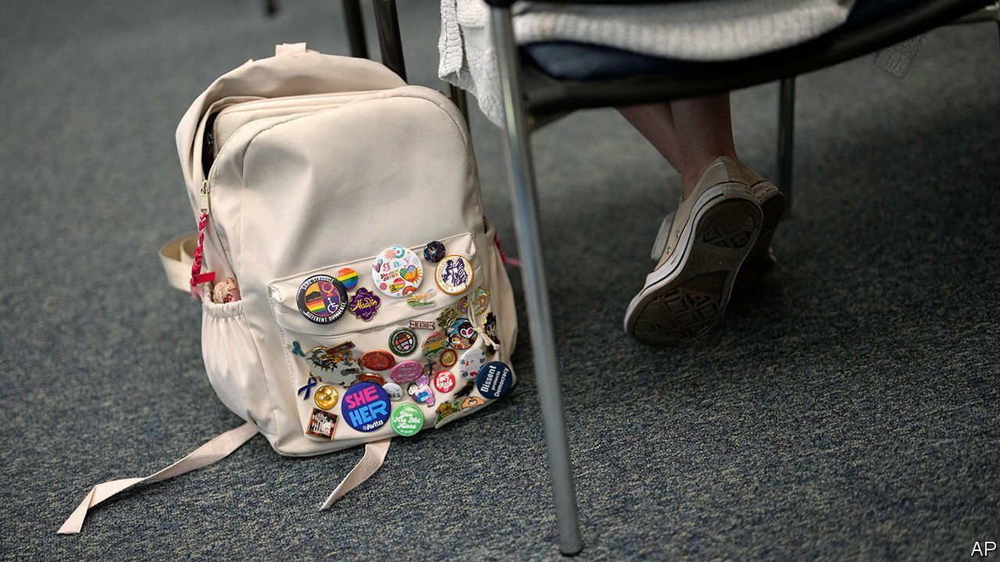

###### On the IMF, liberal-arts degrees, housing in London, woke history, politicians, the OECD

# Letters to the editor 

##### A selection of correspondence 

 

> Apr 27th 2023 


In defence of the IMF

You claimed that the IMF has become uncertain of its purpose, leaving the impression that  has, in this instance, lost perspective in favour of a more sensationalist viewpoint (“”, April 8th). First and foremost, those who would claim that the fund’s purpose is uncertain simply need to read Article One of its constitutional document. The purposes listed—beginning with promoting “international monetary co-operation”—without a doubt would find support and agreement among the institution’s 190 member countries. That the IMF’s specific operations in pursuit of its purposes have been evolving has been a constant since its inception. 

Nor is the fund enfeebled. Some 96 countries requested and have received IMF financing since the beginning of the pandemic. Outstanding loans or promises to lend total $300bn. Just since Russia’s invasion of Ukraine, the IMF has agreed in principle to requests from 37 countries for new financing totalling $128bn, most recently including $15.6bn for Ukraine, $3bn for Sri Lanka, and a $5bn precautionary credit line for Morocco.

Moreover, the issues on debt restructuring are notoriously complex and contentious. Success will require co-operation, not confrontation, and the only way a solution can emerge is through meaningful dialogue. To this end, the fund, in collaboration with the World Bank and the G20, has convened a Global Sovereign Debt Roundtable that brings creditors (including China) and borrowers together to seek consensus on standards and processes. 

You also dismissed efforts by the fund to take into account the economic influence of such issues as climate change as “side-gigs”, and decried the limited commitments to date from the new Resilience and Sustainability Trust that is intended to help the IMF’s poorest members confront these issues. However, this measured pace is by design, in order to pilot a new instrument and learn from experience. Is your counter- argument that the fund simply should ignore these factors, and leave them to others?

On the challenge posed by geopolitical tensions and fragmentation, you seemed to recommend that the fund should become a front-line warrior in a new cold war. This would be terribly wrong. It is precisely at a time of deep divisions that a multilateral convening place is needed badly. With its 190 member countries, the IMF serves that purpose. Its members today are asking more from the institution, not less.

John Lipsky

Senior fellow

Foreign Policy Institute

School of Advanced International Studies at Johns Hopkins University

 

 


Degrees of concern

I was astounded by the title and the text of “” (“April 8th), and by the graphs. Since many now believe that a degree is no longer worth the cost, the solution offered is to teach only subjects that have demonstrable earning value: computing and economics, “yes”, English, philosophy and arts “no”. Why not go further? Let’s drop any faculty members, libraries, museums and labs that can’t demonstrate their cash value, indeed why bother to have colleges and universities at all? 

It would be much simpler just to set up “Comp Sci U” or, more accurately, “Comp Sci Inc.” Of course, one might end up with a world where no one would want to read a news publication, or perhaps no one could even write for it, except ChatGPT.

Howard Gardner

Professor of cognition and education

Harvard Graduate School of Education


Although student-loan debt is indeed a problem in the United States, it is less so for students earning liberal-arts degrees. The highest proportion of student debt is incurred at for-profit colleges offering practical degrees. Moreover, a study from Georgetown University’s Centre for Education and the Workforce demonstrated that the average 40-year return on investment for students at liberal-arts colleges can reach $918,000, more than 25% above the median return of all colleges, including engineering and technical schools, which is $723,000. 

Humanities majors do tend to start at lower salaries than students specialising in scientific or technical fields. However, a study from the Brookings Institution noted wide variability in individual career paths of people with liberal-arts degrees, with some outstripping earnings of those from science or business fields. What you call degrees “of peripheral relevance” (“Higher expectations”, April 8th) in fact provide a broad foundation in critical thinking, research and communication skills that allow graduates to assume leadership roles in a wide variety of fields and to adapt during their careers.

Alison Byerly

President

Carleton College


 


Living in London

As a resident of London I am acutely aware of the problems of unaffordable housing and found your article about the pros and cons of high-rise buildings and high-density housing very interesting (“”, April 15th). However, there was no mention of schemes that provide low-rise, high-density housing. I live near the Whittington (Highgate Newtown) Estate, which was built in the 1970s to fulfil this concept and continues to be a popular place to live with a high density of apartments alongside safe, pedestrian communal spaces. There are several other similar estates from the same era in London, including the Brunswick Centre and the Alexandra Road estate. I suggest reading “The Golden Age of Camden Housing” by Fabian Watkinson, who lives on the Whittington Estate and welcomes visitors into his apartment on open house days. 

Elizabeth Goodburn


You mentioned Britons’ cultural dislike of flats as the biggest barrier to high-rise blocks. A bigger barrier than that is the lack of proper housing legislation and the continuous abuse of leaseholders and tenants by housing associations and landlords who own the grounds of these buildings. The concept of the lease itself is archaic and discourages many from making a flat their home. Why pay over the odds for a place that is never fully yours and for which you have very little voice over how it is run or maintained? 

Service charges are another sore point. The management of buildings is poorly regulated and lacks transparency. Charges are often arbitrary, inflated and misspent. The rest of the world runs on various forms of commonhold. Britain is still very much behind. 

Simona Pau


 


The antecedents of woke

You cited research suggesting that woke ideas began not in “the social science departments of American universities” but rather in countries like Australia, France and Sweden (“”, April 15th). However, Carlos Granés argues in his excellent “Delirio Americano: Una Historia Cultural y Política de América Latina”, published last year and not available in English, that the politics of grievance has been a distinctly Latin American phenomenon for more than 100 years. Mr Granés traces the roots of what he calls “the invention and instrumentalisation of the victim” to the Cuban war of independence from Spain and to the  movement that flourished after the Mexican revolution.

Grievance culture quickly spread throughout Latin America. It is the core of the Peronist political style that first came to power in the 1940s. It inspired the liberation theology of the 1960s and 1970s and dozens of guerrilla movements throughout the region. These “typically Latin American phenomena”, Mr Granés argues, “currently pervade the political and cultural practices of the entire Western world.”

Boris Spiwak


Robotic politicians

It is correct to say that when both chatbots and humans do not know what to say, they often fib (Daily chart, April 14th). This is particularly true of humans in one profession: politics. Indeed, if you apply the criteria to get the job done at a thousand times less cost and hundred times better quality you will find that politicians can be replaced by software. This will be an event to be welcomed and not feared.

Sanjoy Sanyal

Visiting fellow

Judge Business School

University of Cambridge

 


Club culture

OK, OK. We get it. You’re going to keep referring to the OECD as “a club of mostly rich countries”, or some derivative thereof (, April 8th; “”, April 15th). But maybe there is a solution. Has anyone considered asking the OECD if it might be willing to change its name to the CMRC?

Adam Wilson


