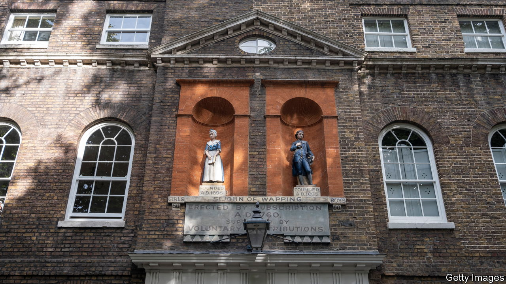

###### Science lessons

# Britain plans new guidance on sex and gender in schools 

##### That will bring education into line with changes in the National Health Service 

 

> May 4th 2023 

Teachers in state schools should not try to convert pupils to their religious or ideological beliefs. Relationships, sex and health education (rshe) should be “high quality” and “evidence-based”, delivered in a “non-judgmental, factual way”. So runs guidance issued by the Department of Education (DoE). 

Yet there are growing concerns that these standards have slipped when it comes to the way biological sex and gender identity are covered in the classroom. On March 30th Rishi Sunak, the prime minister, said he was “very concerned” by reports that some schools were allowing pupils to change their names and pronouns (a process known as “social transitioning”) without their parents’ knowledge. New guidelines on how schools should tackle such issues are expected imminently.

Mr Sunak’s comments followed the publication of a report by Policy Exchange, a think-tank, about “gender and safeguarding” in schools. Though the think-tank is centre-right, the report’s foreword was written by Rosie Duffield, a Labour MP. The report argues that gender ideology—which holds that gender identity is as important as biological sex—has become “embedded” in the school system. 

It has done so via the influence of transgender activist organisations, which have long provided lesson plans and resources to schools. Such material is often light on science (suggesting human beings can change sex and describing sex as being “assigned” rather than observed at birth) and heavy on gender stereotypes. Genderbread, a resource used by some schools, defines “man-ness” (“strong-willed, logical, athletic”) and “woman-ness” (“empathetic, sensitive, caring”) rather than “male” and “female”. This contradicts guidance from the DoE which says that schools should not “reinforce harmful stereotypes”.

More worryingly, Policy Exchange says all this has created a “safeguarding blind spot”. Of the 154 secondary schools who responded to its Freedom of Information requests, only 28% said they would inform a parent if a child expressed “gender distress” (a mental-health condition that can be alleviated with therapy). Some 28% did not have single-sex toilets. Policy Exchange points out that this could be illegal: schools are required to provide single-sex toilets for children aged over eight.

The government’s new guidance is expected to tell schools they must inform parents when pupils suffer gender distress, and must provide single-sex toilets and changing rooms. It is also likely to clarify that single-sex schools are not legally obliged to admit children of the opposite sex. In 2022 the Girls’ Day School Trust, a network of girls’ public schools, was criticised by some politicians and activists when it said it would admit pupils only on the basis of biological sex. Equality legislation allows it to do so. On rshe lessons, the government is likely to emphasise the immutability of biological sex. 

Some teachers worry that the new guidelines will inflame tensions on a sensitive topic and endanger some trans-identifying children. Mary Bousted, general secretary of the National Education Union, has said the government is hoping to distract from creaking public services.

Yet a more straightforwardly scientific approach to sex and gender would bring schools into line with changes in the National Health Service (NHS). In 2020 the NHS asked , a former head of the Royal College of Paediatrics, to review its child gender services. Her interim report sounded the alarm on the and led to the closure of what was then Britain’s only NHS youth gender clinic. Dr Cass also warned that “social transition” was not a “neutral act” but could affect “psychological functioning”.

Her review, which will publish its final report this year, was prompted by revelations that the number of children referred for medical gender services had risen sharply in recent years. A high proportion presented with traits of autism; children in care were also over–represented. Although many children discover the idea that they can change sex on the internet, schools should be relied on to provide the facts. ■


