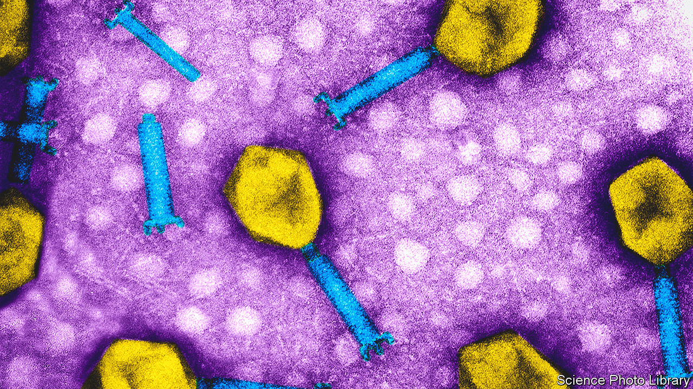

###### When viruses are good for you

# How to battle superbugs with viruses that “eat” them 

##### As antibiotic resistance spreads, bacteriophages could help avert a crisis 

 

> May 3rd 2023 

Antibiotics are vital to modern medicine. Their ability to kill bacteria without harming the patient has saved billions of lives directly and made everything from caesarean sections to chemotherapy much safer. Life expectancy would drop by a third if they did not exist. But after decades of overuse their powers are fading. Some bacteria have evolved resistance, creating a growing army of “superbugs” against which there is no effective treatment.  is expected to kill 10m people a year by 2050, up from around 1m in 2019. 

It would be unwise to rely on new antibiotics to solve the problem. The rate at which resistance emerges is accelerating. Some new drugs last only two years before bacteria devise countermeasures. When new antibiotics do arrive, doctors often hoard them, prescribing them only grudgingly and for short periods when faced with the most intransigent infections. That helps limit the spread of resistance to new drugs. But it also limits sales, making new antibiotics an unattractive proposition for most pharmaceutical firms. 

Governments have been trying to fix the problem by funnelling cash into research and taking stakes in drug firms. That has produced only limited improvements. But there is  that is also worth a look. Microbiologists have known for decades that disease-causing bacteria can suffer from illnesses of their own. They are susceptible to attack by bacteriophages (“phages” for short): specialised viruses that infect bacteria, and often kill them. 

Using one disease-causing organism to fight another has several advantages. Like antibiotics, phages are picky in their choice of target, leaving human cells alone even as they infect and destroy bacterial ones. Unlike antibiotics, phages can evolve just as readily as bacteria can, meaning that even if bacteria do develop resistance, the phages may be able to evolve around it in turn.

That, at least, is the theory. The trouble with phages is that comparatively little is known about them. After the discovery of penicillin, the first antibiotic, in 1928, they were largely ignored in the West. Only the Soviet Union, powered by research and production facilities in Georgia, continued to use them. Given the gravity of the antibiotic-resistance problem, it would be a good idea to find out more. 

The first step is to run more . Interest from Western firms is growing. But it is being held back by the fact that phages are an even less appealing investment than antibiotics. Since they are natural organisms there may be trouble patenting them, making it hard to recoup any investment. 

Governments can help. They could fund basic research into phage therapy, and clarify the law around exactly what is and is not patentable. In time they could set up phage banks and manufacturing processes, so as to make production cheaper. And they could spread awareness of the risks of overusing antibiotics, and the potential benefits of phages. If you are put off by the thought of ingesting a virus, consider that penicillin was a mould.

Going viral

The history of antibiotics themselves shows that governments can help nudge the private sector into action. Penicillin was largely ignored at first by doctors, who regarded it as too difficult to produce. It took the tragedy of the second world war, and the intervention of the American and British governments, to kickstart the modern antibiotics industry. Compared with a war, antibiotic resistance is a slow-burning problem. Nonetheless, the time to act is now. ■

