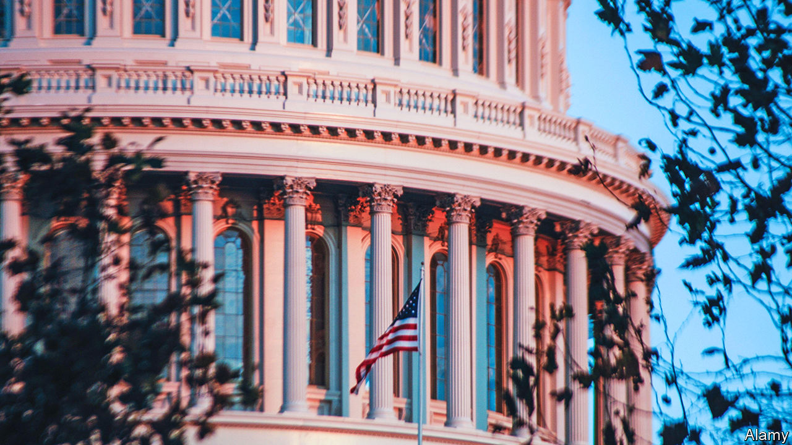

###### Budgetary dysfunction

# What America does after a debt-ceiling disaster 

##### Magical solutions will not get it far, leaving an agonising fallback 

 

> May 15th 2023 

America is once again in the throes of a debt-ceiling crisis. If Congress and the White House do not come to a deal, the government may run out of cash and be on the brink of a sovereign default in less than a fortnight. Most investors expect a last-minute compromise, as during past crises. So does President Joe Biden. Yet positions on each side of the aisle look entrenched: Republicans want big spending cuts; Democrats are resisting. Thus the White House must also consider its break-glass options. If there is no agreement, what would Mr Biden do?

There are two broad kinds of workarounds that the Biden administration could use to manage the fallout from a debt-ceiling disaster. One is magical, the other messy and neither appealing.

Both would render the debt ceiling moot—at least in theory. An idea that has captured the imagination of many wonks, owing to its novelty, is a trillion-dollar coin. The Treasury can mint commemorative coins of any denomination. The suggestion, first advanced on a financial blog in 2010, is that it should mint a very valuable coin, deposit it in the government’s account at the Federal Reserve and draw on it to pay for everything from military salaries to scientific research. The government would no longer need borrowing approval from Congress. Indeed, it would no longer need to borrow from public markets.

Another idea is that the White House could deploy the 14th amendment of the constitution, which states that the validity of American government debt “shall not be questioned”. The Biden administration could issue an executive order citing the 14th and directing the Treasury to resume issuing bonds. So long as it were upheld in court, the White House would, in effect, have branded the debt ceiling as unconstitutional, giving itself a free hand.


A final magical solution would involve financial engineering. The debt ceiling specifically targets the face value of debt. At current yields, the Treasury can borrow money for two years at an annual rate of about 4%. But what if it offered bonds with coupons of, say, 100%? In this case it could issue a bond with a face value roughly 1/25th that of a bond with a 4% yield but raise the same amount from investors (who would pay a giant premium to the face value, bringing the bond’s true yield in line with the market rate). As the Treasury rolled over existing debts into high-coupon, low face-value bonds, it would acquire plenty of room under the debt ceiling, allowing it to resume borrowing.

These magical workarounds are all clever. Yet they also share the same basic defects. They are, to varying degrees, ruses and loopholes that do not seem befitting of American government bonds, the world’s most important financial asset. It would be unsettling to think that Treasuries—a benchmark for interest rates and a haven for investors the world over—could be underpinned by a commemorative coin. Janet Yellen, the treasury secretary, has dismissed the option as a “gimmick”.

Although gimmickry would be better than the American government reneging on its debts, there is another objection to such magical solutions: each would be subject to legal challenge, sowing uncertainty in markets. Some experts think the administration could win a 14th-amendment case. But that is far from certain in a Supreme Court with a conservative majority. Legal proceedings could extend beyond the moment, perhaps early in June, when the government runs out of money. Stuck in litigation, the magical solutions would struggle to prevent market freak-outs.

This would leave America with a messier, more painful workaround: the prioritisation of payments. The Treasury would set aside cash from its tax revenues to make interest payments. With whatever money is left over, it could meet some of its other obligations. Analysts at the Brookings Institution, a think-tank, estimate that the result would be a cut of one-quarter in the government’s non-interest expenditures, which would represent a remarkably harsh dose of austerity. If the government were to aim for one additional layer of prioritisation—making social-security payments to pensioners, plus covering interest on bonds—it would have to cut other expenditures by about one-third.

Officials at the Fed and the Treasury have already begun to plan for prioritisation, having drafted a blueprint during the debt-ceiling crisis in 2011. Even so, Treasury officials privately admit they are not confident prioritisation would function as intended. For the scheme to work, the government would have to continue to conduct regular bond sales, using the proceeds to pay off the principal from maturing bonds. This would require dealers to show up as frequently as four times a week to Treasury auctions, sometimes with billions of dollars on the line, and to play their part in the prioritisation tap-dance. What happens if they balk and deem that the environment is simply too uncertain?

The politics would also be treacherous. Putting bondholders ahead of civil servants, pensioners and soldiers “might not prove to be sustainable”, as Bill Dudley, then president of the New York Fed, drily noted during a planning discussion in 2011.

Despite all the evident flaws, prioritisation will almost certainly be the initial fallback if Congress does not lift the debt ceiling in time. “A few days of prioritisation may be what is needed to get both sides to blink,” says Daleep Singh, a former economic adviser to the Biden administration. “It would have big costs and that would hopefully crystallise minds in dc, provoking a deal.” Whatever the outcome, one conclusion is clear: this is no way to manage the world’s biggest economy. ■


