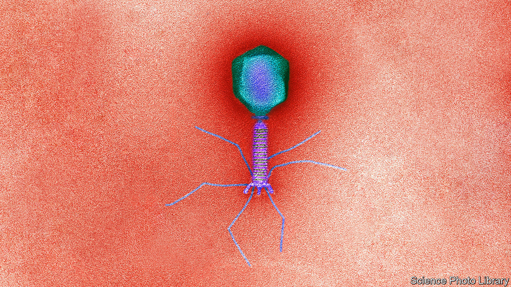

###### On bacteriophages, Bakhmut, Sir Keir Starmer, the Philippines, AI twaddle

# Letters to the editor 

##### A selection of correspondence 

 

> May 18th 2023 


Investing stages for phages

“” (May 6th) pointed out the growing danger of antimicrobial resistance and the need for government intervention. As antibiotics are a poor business proposition, private capital invests only minimally in their development. Unfortunately, bacteriophages, specialist viruses that kill bacteria and the subject of your piece, are subject to the same market forces, if not worse, since manufacturing costs and complexity are greater.

The notion of “funnelling cash into research” is helpful, but it is not enough. Governments must provide some pull incentive as well to correct for the market failure, in the form of an advance procurement, or advance market commitment. A good example is the incentives successfully offered for the development of covid-19 vaccines. My colleagues and I estimate that this reward need be of the order of $2bn for each new compound needed, perhaps $12bn for six compounds over the course of a decade. 

Britain has led the way in this direction with its “subscription” model financing drug firms for antibiotics. The American Congress is considering the PASTEUR Act to do something similar. These efforts should be supported.

Eric Evans

Senior fellow

Mossavar-Rahmani Centre for Business and Government

Harvard Kennedy School


 


Phages “are little known outside the former countries of the Soviet Union” you say (“”, May 6th). It would be better to say they are little known outside the former Iron Curtain. One of the best research institutes in phage therapy is the Hirszfeld Institute in Wroclaw, Poland. The first Polish articles to discuss phages were released in 1923 just four years after Félix d’Hérelle’s revolutionary discovery in Paris. Polish phage research had a worldwide impact. Irena Lipska’s work was well regarded in Brazil in the 1950s.

Jan Maurycy Uszko


 


The meaning of Bakhmut

It is true that Bakhmut has little objective strategic value (“”, May 6th). It is also true that it has become politically significant for both Kyiv and Moscow, and for some military commanders on each side, most notoriously Yevgeny Prigozhin, who heads the mercenary Wagner Group. Yet that does not mean that there are not good operational reasons for fighting for the town. If Russia wants to advance on Slovyansk and Kramatorsk, as it hoped in late 2022, it has to take Bakhmut in order to secure the crucial roads running through and around it. Having recognised its military significance, both sides have concentrated their forces on it, amplifying its operational importance by that very act. 

Carl von Clausewitz recognised that an objective can become important simply because armies converge on it: “…one must keep the dominant characteristics of both belligerents in mind. Out of these characteristics a certain centre of gravity develops, the hub of all power and movement, on which everything depends. That is the point against 

which all our energies should be directed.”

Anthony King

University of Warwick

 


What is Starmerism?

Despite all the analysis of the Labour Party we still have no clue about what Sir Keir Starmer really believes in (“”, April 29th). He has removed the Corbynite rump, without saying why he once supported Jeremy Corbyn. He won’t tell us what he believes our relationship with Europe should be post-Brexit. He criticised the government on immigration, but won’t face down Labour activists who want open borders. On women’s rights he has moved his position half a bum cheek, but only when his advisers told him he would lose the election if the mantra of “transwomen are women” became policy.

The last issue is the most instructive for what it tells us about Sir Keir. By the way he switched tack he shows himself to be nothing less, but also nothing more, than a lawyer. So was Tony Blair, but by 1997 we were also clear about his principles and, with the clunking fist of Gordon Brown beside him, we had a good idea of how a Labour government would work. 

Simon Diggins


 


Sir Keir’s book, “European Human Rights Law”, might not be “sizzling” (“”, April 29th), but when the Human Rights Act came out it heralded a paradigm shift in British legal practice and it was the bestselling law title for over a year. Two elements of the book presage the Starmerism that is beginning to emerge. First, the fact that he chose Legal Action Group, a small charity, as his publisher, rather than one of the big legal presses, what you term “stakeholderism”. And second, the book was organised by practice area rather than the act’s article-by-article approach, which was especially valuable for hard-pressed and under-resourced lawyers representing social-welfare law cases. This shows that Sir Keir is a pragmatic problem-solver. Britain’s current travails 

would benefit from his thoughtful thoroughness.

Sam Watson


 


Electric cars in South Africa

In sub-Saharan Africa we are only now starting to grapple with the transition to electric vehicles (, April 22nd). Consider South Africa. It assembles petrol cars for BMW, Renault Volkswagen and others. The factories are located in the poorest regions and support more than 500,000 jobs. Most of these vehicles are exported. But this boon to the economy will end when developed countries swing towards EVs. There is little impetus from a lacklustre government to incentivise the transition. The industry is thus driving towards a fatal cliff. South Africa needs electric-vehicle manufacturers, such as the Chinese, to open plants in Africa to produce these vehicles locally. More than 70% of trips in the region are by minibus in the informal sector, which is why we are looking at retrofitting some of the 250,000 minibuses in South Africa with electric propulsion.

But South Africa also has problems with its electricity grid, which operates at half its capacity. Electricity supply is patchy, which has caused substantial discontent and economic carnage. So what will happen when you the additional load of EVs is added to the grid? 

Given that those who can afford to buy EVs can also afford to install fast chargers, the impact of those vehicles will quickly slay a grid already on its knees. We should stop talking about EVs and rather talk about electric mobility instead. This is when the source of energy (solar, battery banks) are sold with, or at least subsidised with the vehicle. Vehicles cannot be seen in isolation anymore, they need to be viewed as part of a system, in which they deliver mobility, but require energy. 

M.J. (Thinus) Booysen

Professor in the internet of things

Stellenbosch University


 


Rebels in the Philippines

You glibly foretell the demise of the New People’s Army and brand the politics of the Communist Party of the Philippines as “idiotic” (“” May 6th). Fair enough. Yet the need to navigate a relationship to “the movement” centred on those organisations occupied two or three generations of the Philippines’ best and brightest and distorted the country’s intellectual life in lasting ways. Also lasting is the deep social inequality that drove so many talented and educated young Filipinos into the reds’ arms in the first place.

Michael Montesano


 


Generative garbage

Shortly after reading the By invitation from Yuval Noah Harari on artificial intelligence () I had an epiphany while scrolling through the labyrinth of LinkedIn and corporate blogs. They are the future déjà vu of a world dominated by generative AI. The mind-numbing, buzzword-infested content is caught in an eternal loop of superficiality, making me question if the authors are actually humans or the AI overlords that we’ve been warned about. These corporate types, armed with an arsenal of clichés and jargon, contribute to the growing mountain of shallow content with the same fervour as AI models churning out words, battling each other to produce lacklustre text. 

Adam Horne

Creative director

Berghs School of Communication 


Picky

As an long-time and avid reader of your august publication, I was surprised to see a similar slip repeated twice within a month (“”, April 1st; , April 29th). Leon Trotsky was not killed with an ice pick, but with an ice axe, which is now displayed in the International Spy Museum in Washington. We wouldn’t want aspiring mountaineers or aspiring assassins to inadvertently make the wrong purchase.

Nevin Hall


