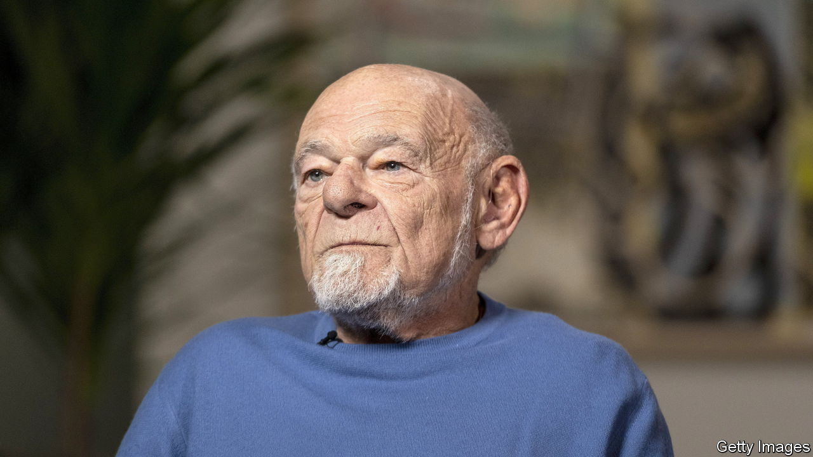

###### Zell-side analysis

# What properties would Sam Zell invest in next? 

##### One of America’s mightiest property tycoons died on May 19th, aged 81 

 

> May 25th 2023 

SAM ZELL called himself “the Grave Dancer”, even though, as he explained, his penchant for buying distressed assets “wasn’t so much dancing on graves as …raising the dead”. In the mid-1970s, when he coined this nickname, America’s property market was struggling. Mr Zell, who died on May 18th at the age of 81 and with a fortune of more than $5bn, had already made good money erecting and managing apartment buildings in small but growing cities. But after others cottoned on to the same opportunity, the market became saturated. Supply exceeded demand; property prices crashed. Undeterred, he bought flats, offices and retail space, often for pennies. As America’s economy boomed in the 1980s, their value soared. 

He danced on more graves after Black Monday in October 1987. With rents and occupancy rates falling, indebted property owners needed money, and turned to capital markets. He created a fund with Merrill Lynch, an investment bank, that raised capital from investors to buy distressed properties. Such real-estate investment trusts (REITs), which own, run or finance properties, date back to the 1960s. But it was Mr Zell who helped usher in their modern version, says Michael Knott of Green Street, a firm of real-estate analysts. 

Mr Zell was born to Polish-Jewish parents who narrowly escaped the Holocaust. He got his start in business early, buying  magazines in downtown Chicago, where he went to Hebrew school, for 50 cents and selling them to classmates in the suburb where he lived for $3. He wore jeans to work long before office-casual was a thing, and took motorcycle-riding trips around the world with a group of friends, “Zell’s Angels”. He explained his business philosophy as “If it ain’t fun, we don’t do it.” His timing was impeccable. In 2007 he sold his office-landlord business to Blackstone, a private-equity giant, for $39bn. A year later Lehman Brothers collapsed—and the commercial-property market with it.

Where would a young Mr Zell look to build his fortune today? Stephanie Wright of New York University thinks that, given his preference for easy-to-understand markets with limited competition, outdoor storage facilities could pique his interest. They are big but employ few people, meaning cities dislike them and limit their growth, even though demand remains robust. The same goes for parks of prefabricated homes, the business of the first company Mr Zell ever took public, in 1993. People still buy them, yet zoning laws restrict them. Once a house is installed on the property, homeowners rarely move it. On the rare occasions when one does, the developer still has the land and can put another home in its place.

Conventional wisdom argues for staying away from the office and retail assets that helped make Mr Zell a billionaire. American malls have long been written off for dead, bricks and mortar deemed to be no match for e-commerce. In the era of remote and hybrid work, leasing activity is slowing across most big American cities even as employment continues to rise, according to CBRE, a property manager. Office-vacancy rates are increasing—to 17.8% across America in the first three months of 2023, the highest level in 30 years. Even though some upscale malls and office buildings are thriving, many older and shabbier properties look destined for obsolescence. Yet to Mr Zell those failing assets may have looked the most attractive of all. For in failure, as any grave dancer knows, lies opportunity. ■


