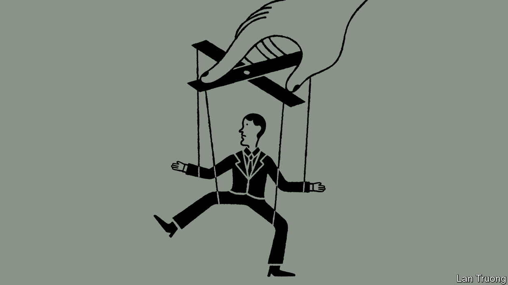

###### Banyan

# The strange tale of a prominent North Korean defector 

##### The rise and fall of Tae Yong Ho illustrates the weaknesses of both Korean societies 

 

> Jun 1st 2023 

Few political transformations are as dramatic as that of Tae Yong Ho. Until his defection in 2016, he was North Korea’s deputy ambassador in London. A video circulating online shows him earning applause from British fanboys of his country’s despotic regime by predicting that “the future will be of socialism”. Four years later he became the first defector directly elected to South Korea’s parliament. Representing the conservative People’s Power Party (PPP), he now predicts that the North Korean regime he once served “will inevitably collapse”.

Many of the 30,000 North Korean defectors living in the South struggle to get on. They lack the requisite training to be competitive in a first-world economy. The psychological scars most carry from Kim Jong Un’s totalitarian regime make their transition harder. A North Korean accent, which most defectors retain, is not a plus in South Korea’s cut-throat job market. The unemployment rate among the defectors is twice the national average. In this context Mr Tae’s success has made him an emblem of the meritocratic society that South Korea aspires to be. Yet a recent stumble, which has seen him suspended from his party, has upset that happy image.

As a North Korean high-flyer he was a rare prize for the South from the start. Mr Tae was a product of what passes for a middle-class family in North Korea and studied in China, then Pyongyang University of Foreign Studies, where North Korean diplomats learn their trade. His wife is the grand-daughter of an anti-Japanese partisan. This granted him entry to the elite tiers of North Korea’s rigid caste system, where such revolutionary credentials matter greatly.

He was first posted as a diplomat to Denmark and Sweden, where he begged European governments to send North Korea relief from its self-induced famine. During his spell in London, he once took Mr Kim’s elder brother to a concert by Eric Clapton, a guitarist adored by baby-boomers among the North Korean elite as elsewhere. Such star billing persuaded the ppp, South Korea’s then ruling conservative party, to welcome Mr Tae’s defection warmly, despite its inveterate hostility towards Northern officialdom. The fact that he was denounced by the Kim regime as a “threepenny clown” and “hideous human scum” perhaps reassured it.

After a brief spell working in a government think-tank, Mr Tae further raised his profile by working with ngos to help less fortunate North Korean refugees. Many defectors, and those who work to support them, hoped he would become their champion. He chose instead to run as the conservative candidate for a seat in Gangnam, an affluent district of Seoul.

Under South Korea’s former government, run by the Democratic Party (DP), which favours friendlier relations with the North, Mr Tae became the PPP’s chief attack dog. For who better to lambast the government for being soft on North Korea than a penitent ex-servant of Mr Kim? After the ppp came to power last year, under Yoon Suk-yeol, Mr Tae was rewarded for his belligerence; he was voted onto the party’s governing council. But allegations of graft, defaming the DP and falsely claiming that an uprising suppressed by the South Korean government in 1947-49 was instigated by Kim Il Sung, North Korea’s founder, have put him in hot water with party disciplinarians. Despite resigning from the council to show contrition, he has been suspended from his party for three months. 

A cynic might suggest these allegations seal Mr Tae’s graduation from North Korean stooge to South Korean power-broker. Maligning opponents and graft allegations are almost de rigueur for South Korean politicos. In fact, though his punishment was relatively light, Mr Tae’s treatment suggests he is subject to closer scrutiny than his colleagues. There were also previous indications of this. It is normal for South Korean politicians to drive their subordinates hard; when Mr Tae does it there is talk of his “Pyongyang style”. His historical revisionism was widely attributed to his bad North Korean education. 

Southern attitudes towards North Korean refugees are always politicised. Because the DP wants to improve relations with the North, it tends to ignore the defectors who are living proof of the Kim regime’s viciousness. Because the PPP sees the North as its enemy, it highlights their complaints to serve its cause. Mr Tae’s career illustrates both traits. And also a third. North Korean defectors are never fully embraced by South Korea’s clannish and judgmental society, no matter how high they may rise.■


